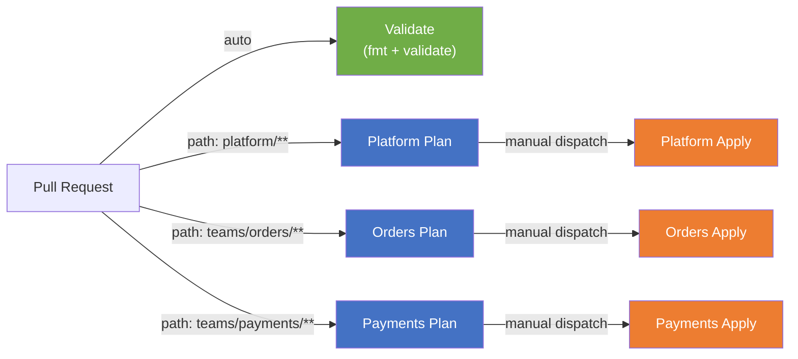

# Private Confluent Cloud Kafka + AKS — Terraform POC

## What This Is

A proof-of-concept that provisions a **private** Confluent Cloud Kafka cluster (Dedicated tier, PrivateLink) with an AKS cluster — fully automated via Terraform. No public endpoints. Secrets stored in Azure Key Vault. Split-architecture: platform team deploys infrastructure, app teams deploy topics/ACLs from inside the VNet.

<!-- DIAGRAM PLACEHOLDER: Insert a simplified architecture overview image here -->
<!-- Save as: docs/assets/architecture-hero.png — a clean, high-level visual for the README -->
<!--  -->

```
Data Flow:  AKS Pod → Key Vault (get creds) → DNS (resolve FQDN) → Private EP → PrivateLink → Kafka
```

---

## How to Read This Repository

> Follow the numbered sections below. Each links to detailed documentation.

### Phase 1: Understand the Plan

| Step | Document | What You'll Learn |
|:----:|----------|-------------------|
| 1 | [Scope & Objectives](docs/01-planning/scope-and-objectives.md) | What's in scope, success criteria, constraints |

### Phase 2: Understand the Design

| Step | Document | What You'll Learn |
|:----:|----------|-------------------|
| 2 | [Architecture](docs/architecture.md) | Components, data flow, security overview |
| 3 | [Network Design](docs/02-design/network-design.md) | VNet topology, CIDR plan, DNS resolution, PrivateLink flow |
| 4 | [Security & Permissions](docs/02-design/security-and-permissions.md) | IAM roles, identity model, secret management |
| 5 | [Naming Conventions](docs/01-planning/naming-conventions.md) | Azure CAF + Confluent naming rules |
| 6 | [Design Decisions (ADRs)](docs/02-design/decisions/) | Why Dedicated tier, PrivateLink, Workload Identity, RBAC, CAF |
| 7 | [Terraform Modules](docs/03-implementation/terraform-modules.md) | Module reference, dependency graph, variable strategy |
| 8 | [Resource Details](docs/03-implementation/resource-details.md) | Full resource inventory, names, SKUs, costs |

### Phase 3: Execute & Verify

| Step | Document | What You'll Learn |
|:----:|----------|-------------------|
| 9 | [Runbook](docs/04-runsteps-and-verification/runbook.md) | Prerequisites (A-F) → Deploy (1-5) → Verify (V1-V8) |
| 10 | [CI/CD Runbook](docs/04-runsteps-and-verification/cicd.md) | GitHub Actions workflows (optional for POC) |

### Phase 4: Observe & Improve

| Step | Document | What You'll Learn |
|:----:|----------|-------------------|
| 11 | [Issues & Resolutions](docs/05-observations/issues-and-resolutions.md) | Problems encountered and how we solved them |
| 12 | [Future Improvements](docs/05-observations/future-improvements.md) | Out-of-scope items for production |

### Summary & Presentation

| Document | Audience |
|----------|----------|
| [Executive Summary](docs/executive-summary.md) | Management — 1-page overview |
| [Presentation](docs/presentation.md) | Reviewers — standalone deck (export to PPTX/PDF) |
---

## Repository Structure

```
├── README.md                              ← You are here (navigation hub)
├── context.md                             ← Original POC brief
├── CHANGELOG.md                           ← Implementation change log
├── .github/workflows/                     ← CI/CD pipelines
│   ├── _terraform-plan.yml                ← Reusable: fmt → init → validate → plan → PR comment
│   ├── _terraform-apply.yml               ← Reusable: init → apply
│   ├── terraform-plan-platform.yml        ← PR: platform plan
│   ├── terraform-apply-platform.yml       ← Manual: platform apply
│   ├── terraform-plan-orders.yml          ← PR: orders plan (self-hosted)
│   ├── terraform-apply-orders.yml         ← Manual: orders apply (self-hosted)
│   ├── terraform-plan-payments.yml        ← PR: payments plan (self-hosted)
│   └── terraform-apply-payments.yml       ← Manual: payments apply (self-hosted)
├── terraform/
│   ├── platform/                          ← Platform team (GitHub-hosted runner)
│   │   ├── main.tf                        ← Module composition (confluent + networking + AKS + KV)
│   │   ├── variables.tf                   ← Input variables (with validations)
│   │   ├── outputs.tf                     ← Stack outputs
│   │   ├── locals.tf                      ← CAF naming + tags
│   │   ├── platform-poc.tfvars            ← POC environment config
│   │   ├── backend-poc.hcl                ← POC backend config (state key + storage)
│   │   ├── providers.tf                   ← Provider configuration
│   │   ├── versions.tf                    ← Required providers + versions
│   │   └── backend.tf                     ← Partial backend (values from backend-*.hcl)
│   ├── teams/
│   │   ├── orders/                        ← Orders team (self-hosted runner in VNet)
│   │   │   ├── main.tf                    ← Reads KV, calls confluent-app module
│   │   │   ├── variables.tf, providers.tf, versions.tf, backend.tf
│   │   │   ├── orders-poc.tfvars          ← POC environment config
│   │   │   └── backend-poc.hcl            ← POC backend config
│   │   └── payments/                      ← Payments team (self-hosted runner in VNet)
│   │       ├── main.tf
│   │       ├── variables.tf, providers.tf, versions.tf, backend.tf
│   │       ├── payments-poc.tfvars        ← POC environment config
│   │       └── backend-poc.hcl            ← POC backend config
│   ├── modules/
│   │   ├── confluent/                     ← Platform: cluster + network (management API)
│   │   ├── confluent-app/                 ← App teams: topics + SA + ACLs (data plane)
│   │   ├── networking/                    ← VNet, PE, DNS
│   │   ├── aks/                           ← AKS cluster + node pools
│   │   └── keyvault/                      ← Secret storage
│   └── legacy/poc/                        ← Legacy single-deployment (pre-split, reference only)
└── docs/
    ├── 01-planning/                       ← Scope, naming
    ├── 02-design/                         ← Network, security, ADRs
    │   └── decisions/                     ← Architecture Decision Records (001–009)
    ├── 03-implementation/                 ← Terraform module reference
    ├── 04-runsteps-and-verification/      ← Runbook + CI/CD + evidence
    ├── 05-observations/                   ← Issues, improvements
    ├── architecture.md                    ← Component design + data flow
    ├── presentation.md                    ← Standalone presentation (Marp)
    ├── executive-summary.md               ← Management summary
    └── assets/                            ← Diagrams + screenshots
```

---

## Quick Start (for experienced users)

```bash
# === Step 1: Platform deployment (GitHub-hosted runner or local) ===
cd terraform/platform

# Set sensitive vars
export TF_VAR_confluent_cloud_api_key="your-key"
export TF_VAR_confluent_cloud_api_secret="your-secret"
export TF_VAR_azure_subscription_id="your-subscription-id"

# Deploy platform (cluster, VNet, PE, AKS, Key Vault)
terraform init -backend-config=backend-poc.hcl
terraform plan -var-file=platform-poc.tfvars -out=tfplan
terraform apply tfplan

# === Step 2: App team deployment (self-hosted runner in VNet) ===
cd ../teams/orders

export TF_VAR_key_vault_id="<keyvault-resource-id-from-step-1>"
# (same Confluent + Azure vars as above)

# Deploy topics + SA + ACLs (data plane — requires VNet access)
terraform init -backend-config=backend-poc.hcl
terraform plan -var-file=orders-poc.tfvars -out=tfplan
terraform apply tfplan
```

> **First time?** Start with [Prerequisites](docs/04-runsteps-and-verification/runbook.md#prerequisites--bootstrap) — there are one-time setup steps before this works.
> **Why two steps?** See [ADR-009](docs/02-design/decisions/009-monorepo-platform-teams-split.md) — topics use the Kafka data plane (PrivateLink-only), which requires the PE to exist first.

---

## CI/CD Pipeline


```mermaid
graph LR
    PR["Pull Request"] -->|auto| V["Validate<br>(fmt + validate)"]
    PR -->|path: platform/**| PP["Platform Plan"]
    PR -->|path: teams/orders/**| OP["Orders Plan"]
    PR -->|path: teams/payments/**| PAP["Payments Plan"]
    PP -->|manual dispatch| PA["Platform Apply"]
    OP -->|manual dispatch| OA["Orders Apply"]
    PAP -->|manual dispatch| PAA["Payments Apply"]
    
    style V fill:#70AD47,color:#fff
    style PP fill:#4472C4,color:#fff
    style OP fill:#4472C4,color:#fff
    style PAP fill:#4472C4,color:#fff
    style PA fill:#ED7D31,color:#fff
    style OA fill:#ED7D31,color:#fff
    style PAA fill:#ED7D31,color:#fff
```

| Workflow | Trigger | Runner | Action |
|----------|---------|--------|--------|
| [_terraform-plan](.github/workflows/_terraform-plan.yml) | Reusable template | _(from caller)_ | fmt → init → validate → plan → PR comment |
| [_terraform-apply](.github/workflows/_terraform-apply.yml) | Reusable template | _(from caller)_ | init → apply |
| [terraform-plan-platform](.github/workflows/terraform-plan-platform.yml) | PR (platform/** changes) | `ubuntu-latest` | Calls _terraform-plan |
| [terraform-apply-platform](.github/workflows/terraform-apply-platform.yml) | Manual dispatch | `ubuntu-latest` | Calls _terraform-apply |
| [terraform-plan-orders](.github/workflows/terraform-plan-orders.yml) | PR (teams/orders/** changes) | `self-hosted` | Calls _terraform-plan |
| [terraform-apply-orders](.github/workflows/terraform-apply-orders.yml) | Manual dispatch | `self-hosted` | Calls _terraform-apply |
| [terraform-plan-payments](.github/workflows/terraform-plan-payments.yml) | PR (teams/payments/** changes) | `self-hosted` | Calls _terraform-plan |
| [terraform-apply-payments](.github/workflows/terraform-apply-payments.yml) | Manual dispatch | `self-hosted` | Calls _terraform-apply |

> App team workflows run on a **self-hosted runner** (AKS pod inside VNet) because topic/ACL creation uses the Kafka data plane API, which is only reachable via PrivateLink.

---

## Cleanup

```bash
# Destroy app teams first (they depend on platform KV)
cd terraform/teams/orders
terraform init -backend-config=backend-poc.hcl
terraform destroy -var-file=orders-poc.tfvars

cd ../payments
terraform init -backend-config=backend-poc.hcl
terraform destroy -var-file=payments-poc.tfvars

# Then destroy platform
cd ../../platform
terraform init -backend-config=backend-poc.hcl
terraform destroy -var-file=platform-poc.tfvars
```

> ⚠️ Dedicated Kafka costs ~$1.50/hr. Teardown immediately after verification.

---

## Security Highlights

| Control | Implementation |
|---------|---------------|
| No public Kafka endpoint | PrivateLink-only (Dedicated tier) |
| No public AKS API | `private_cluster_enabled = true` |
| Secrets in Key Vault | RBAC auth, purge protection, deny-by-default ACL |
| No secrets in code | `TF_VAR_*` env vars + GitHub Secrets |
| Least-privilege ACLs | Topic-level WRITE/READ only, prefixed consumer group |
| Sensitive outputs | 5 outputs marked `sensitive = true` |

> Full details: [Security & Permissions](docs/02-design/security-and-permissions.md)
