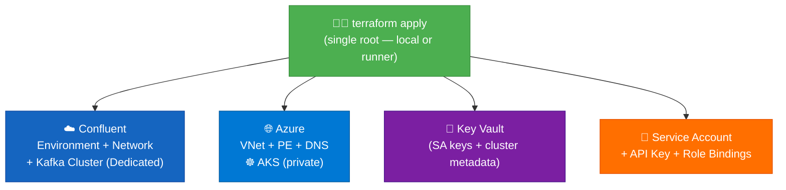
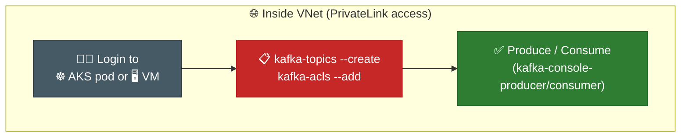
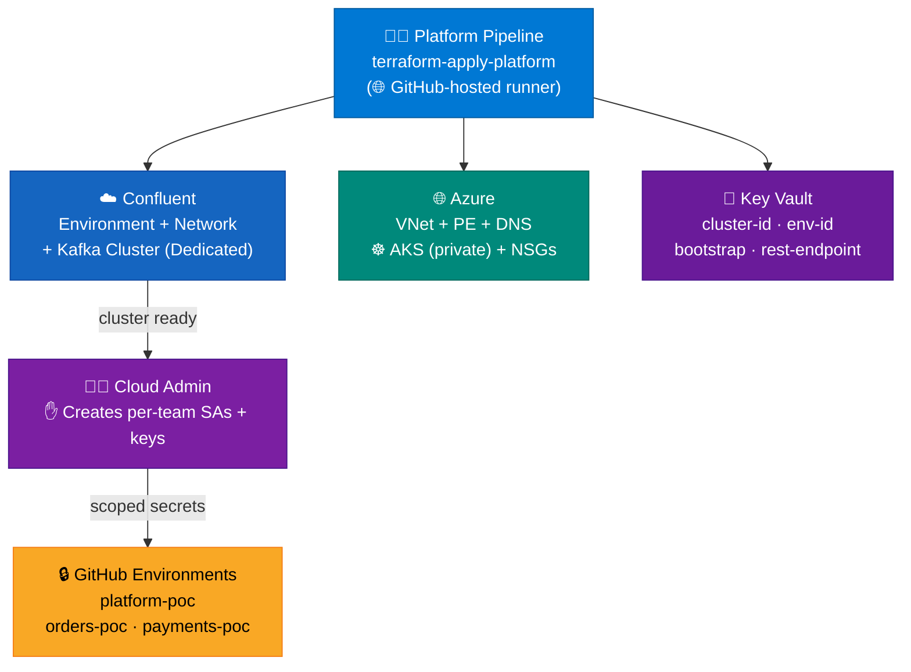
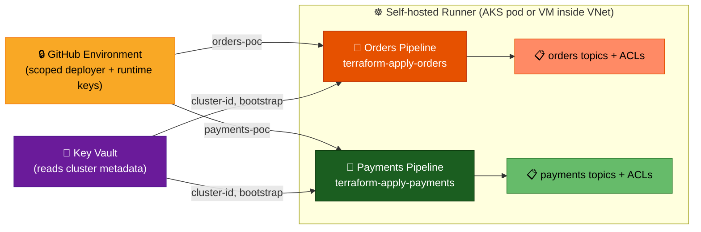
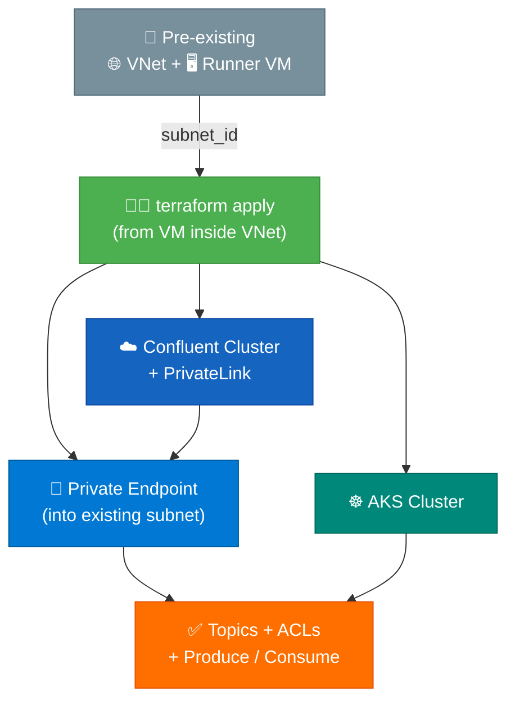

# Deployment Approaches

> 🎯 Same goal, different paths: **Private Kafka + AKS + Topics + Produce/Consume — zero public exposure.**

---

## Approach 1: Single Deployment

> 🏷️ **Branch:** `main` — One `terraform apply` creates all infra, then login to AKS pod or VM inside VNet to create topics + verify produce/consume.

---

### 🧑‍💻 Terraform Apply



### ✋ Manual — From AKS Pod or VM (inside VNet)



<details>
<summary>📖 Why topics are manual</summary>

The Kafka REST API (data plane) is PrivateLink-only — no public endpoint. Terraform running locally or on a GitHub-hosted runner can't reach it. Topics must be created from inside the VNet using `kafka-topics` CLI.

</details>

<details>
<summary>📂 Repo Layout</summary>

```
📦 terraform-confluent-cloud-aks-poc/
├── 📂 terraform/
│   └── 📂 environments/
│       └── 📂 poc/               ← Single root (everything here)
│           ├── main.tf
│           ├── variables.tf
│           ├── poc.tfvars
│           └── backend.tf
│   └── 📂 modules/
│       ├── 📂 aks/
│       ├── 📂 confluent/         ← Cluster + SA + role bindings
│       ├── 📂 keyvault/
│       └── 📂 networking/
└── 📂 docs/
```

</details>

<details>
<summary>📖 Pros / Cons</summary>

| ✅ Pros | ❌ Cons |
|------|------|
| Simplest — one `terraform apply` + CLI | Single blast radius |
| No secret passing between stages | No team isolation |
| Fast for demo | Topics = ✋ manual from pod/VM |
| No CI/CD needed | Cannot scale to multiple teams |
| | New team = manual run |

</details>

---

## Approach 2: Split Architecture (Platform + App Teams)

> 🏷️ **Branch:** `demo-split-architecture` — Platform deploys infra first, then each app team deploys its own topics + ACLs via separate pipeline.

---

### 🧑‍💻 Platform Team



### 👥 App Teams (Orders / Payments)



### 📂 Repo Layout

> **Option A: Monorepo** ✅ Current

```
📦 terraform-confluent-cloud-aks-poc/
├── 📂 terraform/
│   ├── 📂 platform/              ← 🧑‍💻 Platform team
│   ├── 📂 teams/
│   │   ├── 📂 orders/            ← 👥 Orders team
│   │   └── 📂 payments/          ← 👥 Payments team
│   └── 📂 modules/               ← Shared modules
├── 📂 .github/workflows/         ← All pipelines
└── 📂 docs/
```

<details>
<summary>📖 Option B: Separate repo per team</summary>

```
📦 infra-platform/                ← 🧑‍💻 Platform team repo
├── 📂 terraform/
│   ├── main.tf
│   ├── platform-poc.tfvars
│   └── 📂 modules/ (aks, confluent, keyvault, networking)
└── 📂 .github/workflows/

📦 infra-orders/                  ← 👥 Orders team repo
├── 📂 terraform/
│   ├── main.tf
│   ├── orders-poc.tfvars
│   └── 📂 modules/ (confluent-app)
└── 📂 .github/workflows/

📦 infra-payments/                ← 👥 Payments team repo
├── 📂 terraform/
│   ├── main.tf
│   ├── payments-poc.tfvars
│   └── 📂 modules/ (confluent-app)
└── 📂 .github/workflows/
```

| ✅ Max isolation — team owns full repo | ❌ Module duplication across repos |

</details>

<details>
<summary>📖 Option C: Monorepo + for_each (platform-controlled)</summary>

```
📦 terraform-confluent-cloud-aks-poc/
├── 📂 terraform/
│   ├── 📂 platform/              ← 🧑‍💻 Platform team
│   ├── 📂 teams/                 ← Single root, loops over teams
│   │   ├── main.tf               ← for_each var.teams
│   │   └── teams-poc.tfvars      ← All teams in one file
│   └── 📂 modules/
└── 📂 .github/workflows/         ← One team pipeline (loops)
```

```hcl
# teams-poc.tfvars
teams = {
  orders   = { topics = ["orders"],   consumer_group_prefix = "orders" }
  payments = { topics = ["payments"], consumer_group_prefix = "payments" }
}
```

| ✅ Easy to add teams (add to list) | ❌ Shared state — one team's change affects all |

</details>

<details>
<summary>📖 Option D: Monorepo + config-only (teams submit YAML)</summary>

```
📦 terraform-confluent-cloud-aks-poc/
├── 📂 terraform/
│   ├── 📂 platform/              ← 🧑‍💻 Platform team
│   └── 📂 teams/                 ← Platform owns TF
│       ├── main.tf               ← Reads YAML, creates resources
│       └── 📂 configs/           ← 👥 Teams only touch this
│           ├── orders.yaml
│           └── payments.yaml
└── 📂 .github/workflows/
```

```yaml
# configs/orders.yaml
team: orders
topics:
  - name: orders
    partitions: 3
consumer_group_prefix: orders
```

| ✅ Teams need zero TF knowledge | ❌ No team autonomy — platform is bottleneck |

</details>

<details>
<summary>📖 Details: what each side creates</summary>

**Platform (~20 resources):**

| Resource | Purpose |
|----------|---------|
| ☁️ Confluent Environment + Network + Cluster | Kafka with PrivateLink |
| 🌐 VNet + Subnets + NSGs | Network boundary |
| 🔗 Private Endpoint + DNS Zone | Kafka FQDN → private IP |
| ☸️ AKS Cluster (private) | Workloads + self-hosted runner |
| 🔐 Key Vault (4 secrets) | Cluster metadata for teams |

**Each app team (~5 resources):**

| Resource | Scoped To |
|----------|-----------|
| 📋 Kafka Topic(s) | `<team>*` prefix only |
| 🔒 ACL: Producer | WRITE on own topics |
| 🔒 ACL: Consumer | READ on own topics |
| 🔒 ACL: Consumer Group | READ on `<team>-*` groups |

</details>

<details>
<summary>📖 Details: team isolation (ResourceOwner → 403)</summary>

Each team's deployer SA has `ResourceOwner` scoped to its prefix only (`orders*` / `payments*`). If the orders deployer tries to create `payments-events` topic → Confluent returns **403**. Enforced at three levels: Confluent RBAC, Terraform `startswith` validation, CODEOWNERS review.

</details>

<details>
<summary>📖 Details: pipelines + GitHub Environments</summary>

| Pipeline | GitHub Environment | Runner | Creates |
|----------|-------------------|--------|---------|
| `terraform-apply-platform` | `platform-poc` | `ubuntu-latest` | Cluster, VNet, PE, AKS, KV |
| `terraform-apply-orders` | `orders-poc` | `self-hosted` | Topics `orders*`, ACLs |
| `terraform-apply-payments` | `payments-poc` | `self-hosted` | Topics `payments*`, ACLs |

</details>

---

## Approach 3: Pre-existing VNet + Runner VM

> 🏷️ VNet + runner VM already exist. Terraform plugs PE into existing subnet → deploys everything in one go.

🏢 Enterprise provides VNet + 🖥️ Runner VM → 🧑‍💻 `terraform apply` from VM → creates PE + Kafka + AKS + topics.



<details>
<summary>📂 Repo Layout</summary>

```
📦 terraform-confluent-cloud-aks-poc/
├── 📂 terraform/
│   └── 📂 environments/
│       └── 📂 poc/               ← Single root (runs from VM)
│           ├── main.tf           ← Includes topics + ACLs
│           ├── variables.tf
│           ├── poc.tfvars
│           └── backend.tf
│   └── 📂 modules/
│       ├── 📂 confluent/         ← Cluster + SA + topics + ACLs
│       ├── 📂 keyvault/
│       └── 📂 networking/        ← Uses existing VNet (data source)
└── 📂 docs/
```

> No AKS module needed if cluster already exists. No `.github/workflows/` — runs directly from VM.

</details>

<details>
<summary>📖 Pros / Cons</summary>

| ✅ Pros | ❌ Cons |
|------|------|
| Mirrors real enterprise | Requires pre-provisioned VNet + VM |
| Runner has VNet access — no chicken-and-egg | More manual setup upfront |
| Single `terraform apply` — topics included | VM = extra cost |
| No self-hosted runner complexity | VNet must be pre-sized |
| | New team = re-run apply |

</details>

<details>
<summary>📖 Why this works for topics</summary>

Since `terraform apply` runs from a VM **inside the VNet**, it can reach the Kafka REST API (data plane) via PrivateLink. No need for a separate pod step — topics and ACLs are created by Terraform directly.

</details>

---

## Comparison Matrix

| | 1️⃣ Single | 2️⃣ Split (Platform + Teams) | 3️⃣ Existing VNet |
|--|:--:|:--:|:--:|
| **Complexity** | 🟢 Low | 🟡 Medium | 🟢 Low |
| **Team Isolation** | ❌ None | ✅ Strong | ❌ None |
| **RBAC Demo** | ❌ | ✅ | ❌ |
| **Self-Serve** | — | ✅ | — |
| **State Files** | 1 | 3 | 1 |
| **✋ Manual Steps** | Topics from pod/VM | SAs + keys | None |
| **Topics Created By** | ✋ CLI from AKS pod/VM | 🧑‍💻 Terraform (self-hosted runner) | 🧑‍💻 Terraform (from VM) |
| **Topics Known Upfront** | ✅ Yes (hardcoded) | ❌ No (teams add over time) | ✅ Yes (hardcoded) |
| **New Team Onboarding** | 🟡 Manual run | 🟢 Add folder + pipeline | 🟡 Re-run apply |
| **Production-Ready** | ❌ | ✅ | 🟡 |
| **POC Goal** | ✅ | ✅ | ✅ |

> 🏗️ **This POC implements:** Approach 1 (`main`) + Approach 2 (`demo-split-architecture`).
> 
> Approach 2 sub-options (same repo vs separate repo, `for_each` vs per-team folder, config-only) are documented in the tables above.

---

## Related

- [Architecture](../architecture.md)
- [Scope & Objectives](../01-planning/scope-and-objectives.md)
- [Security & Permissions](security-and-permissions.md)
- [CI/CD Runbook](../04-runsteps-and-verification/cicd.md)
