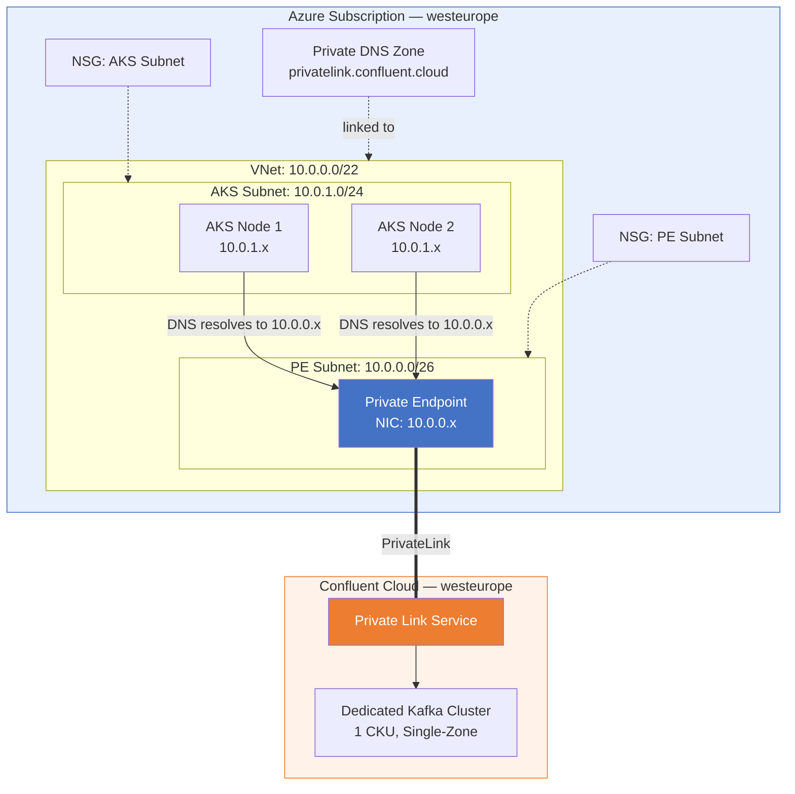
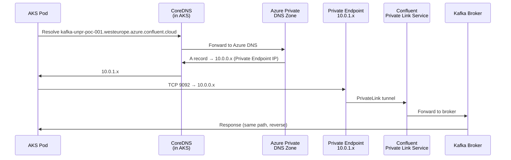
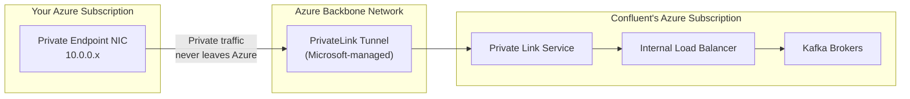

# Network Design

## Overview

All traffic between AKS and Confluent Kafka stays private — no packets traverse the public internet. This is achieved through Azure PrivateLink, which creates a private endpoint in the VNet that maps to Confluent's Private Link Service.

---

## Network Topology

<!-- DIAGRAM PLACEHOLDER: Insert a visual network topology diagram here showing VNet, subnets, PE, DNS, and Confluent Cloud connection -->
<!-- Suggested tool: draw.io, Visio, or Lucidchart -->
<!-- Save as: docs/assets/network-topology.png -->



---

## IP Address Plan

| Component | CIDR | Usable IPs | Purpose |
|-----------|------|:----------:|---------|
| **VNet** | `10.0.0.0/22` | 1,019 | Address space for all subnets |
| **PE Subnet** | `10.0.0.0/26` | 59 | Private Endpoint NICs |
| **AKS Subnet** | `10.0.1.0/24` | 251 | AKS node pool (Azure CNI — 1 IP per pod) |
| **AKS Service CIDR** | `10.1.0.0/16` | — | Kubernetes ClusterIP services (not routable on VNet) |
| **AKS DNS Service IP** | `10.1.0.10` | — | CoreDNS within the cluster |

### IP Capacity Planning — Why These Sizes?

With **Azure CNI**, every pod consumes a real VNet IP. The formula is:

```
IPs needed = (nodes × max_pods_per_node) + nodes + Azure_reserved(5)
```

#### AKS Subnet Sizing (`/24` = 251 usable)

| Scenario | Nodes | Max Pods/Node | IPs Needed | Fits in /24? |
|----------|:-----:|:---:|:---:|:---:|
| **POC (current)** | 3 (1 system + 2 user) | 30 | 3 + 90 + 5 = **98** | ✅ |
| **Moderate scale** | 8 nodes | 30 | 8 + 240 + 5 = **253** | ⚠️ Tight |
| **Production** | 10+ nodes | 30 | 315+ | ❌ Need /22 or /21 |

**POC decision:** `/24` gives **~2.5x buffer** over current usage (98 IPs / 251 available). Sufficient for POC (1-5 nodes). For production, expand to `/22` (1,019 IPs) or `/21` (2,046 IPs).

#### PE Subnet Sizing (`/26` = 59 usable)

| Scenario | PEs Needed | Why |
|----------|:---:|-----|
| **POC (current)** | 1 | Single Confluent PE |
| **Production** | 5-10 | Confluent (multi-zone) + Key Vault PE + Storage PE + ACR PE + SQL PE |
| **Enterprise** | 20-50 | All PaaS services via PE |

**POC decision:** `/26` (59 IPs) is right-sized for a POC with 1 PE and leaves room for production growth. Even with 50 Private Endpoints, a `/26` handles it. If enterprise needs exceed 59, expand to `/24`.

#### VNet Sizing (`/22` = 1,019 usable)

| Question | Answer |
|----------|--------|
| Is `/22` enough for POC? | Yes — PE subnet (/26 = 59) + AKS subnet (/24 = 251) = 310 IPs used, well within 1,019. |
| Why not `/16`? | POC scope doesn't justify 65K IPs. `/22` keeps the design tight and realistic. |
| Production expansion? | Re-address to `/20` or `/16` when moving to production with more subnets. |

**Current subnet layout within `/22`:**

| Subnet | CIDR | Usable IPs | Used By |
|--------|------|:----------:|--------|
| PE Subnet | `10.0.0.0/26` | 59 | Private Endpoint |
| _Reserved_ | `10.0.0.64/26` – `10.0.0.192/26` | — | Future PEs, Bastion |
| AKS Subnet | `10.0.1.0/24` | 251 | AKS nodes + pods |
| _Remaining_ | `10.0.2.0/23` | 507 | Future expansion |

**Production note:** When expanding to production, resize VNet to `/20` or `/16` to accommodate Bastion, App Gateway, additional PE subnets, and larger AKS pool.

---

## DNS Resolution Flow



### DNS Components

| Component | Value | Purpose |
|-----------|-------|---------|
| **Private DNS Zone** | `privatelink.confluent.cloud` | Override public DNS for Confluent FQDN |
| **A Record** | `<cluster-id>.<region>` → PE IP | Maps Kafka FQDN to private endpoint |
| **VNet Link** | DNS Zone ↔ VNet | Enables resolution from within the VNet |
| **AKS CoreDNS** | Default upstream | Forwards non-cluster queries to Azure DNS |

### Why Private DNS Zone?

Without it, AKS pods would resolve the Kafka FQDN to a **public** IP — which would fail because the cluster has no public endpoint. The Private DNS zone intercepts the resolution and returns the Private Endpoint's **private** IP.

---

## PrivateLink Architecture



### PrivateLink Connection Lifecycle

| Stage | Status | Action Needed |
|-------|--------|---------------|
| 1. Terraform creates PE | `Pending` | Confluent must approve |
| 2. Confluent approves | `Approved` | Automatic or manual in Console |
| 3. Connection active | `Connected` | Traffic flows |

> **Note:** Terraform sends the request with `is_manual_connection = true` and a request message. Approval may be automatic for Dedicated clusters, or may require manual approval in Confluent Console → Networking → Private Link.

---

## Network Security Groups (NSGs)

### PE Subnet NSG

Default rules only — no custom rules needed. The Private Endpoint is a read-only NIC that Azure manages. Outbound is controlled by the PrivateLink service.

### AKS Subnet NSG

Default rules only for POC. In production, consider:

| Rule | Direction | Source | Destination | Port | Action |
|------|-----------|--------|-------------|------|--------|
| Allow Kafka | Outbound | AKS Subnet | PE Subnet | 9092 | Allow |
| Allow HTTPS | Outbound | AKS Subnet | PE Subnet | 443 | Allow |
| Allow Key Vault | Outbound | AKS Subnet | AzureKeyVault | 443 | Allow |
| Deny Internet | Outbound | AKS Subnet | Internet | * | Deny |

> **POC simplification:** Default NSG rules allow all VNet-internal traffic. Custom rules are a production hardening step.

---

## Connectivity Matrix

| Source | Destination | Protocol | Port | Path | Purpose |
|--------|-------------|----------|:----:|------|---------|
| AKS Pod | Kafka Broker | SASL_SSL | 9092 | VNet → PE → PrivateLink → Confluent | Produce/consume messages |
| AKS Pod | Key Vault | HTTPS | 443 | VNet → Azure Backbone | Read secrets (API key, endpoint) |
| AKS Pod | Azure DNS | DNS | 53 | VNet → Azure DNS | Resolve Kafka FQDN via Private DNS Zone |
| Terraform | Confluent API | HTTPS | 443 | Internet | Provision Confluent resources |
| Terraform | Azure ARM | HTTPS | 443 | Internet | Provision Azure resources |
| GitHub Actions | Azure ARM | HTTPS | 443 | Internet | CI/CD pipeline |

---

## Design Decisions

| Decision | Choice | Rationale | ADR |
|----------|--------|-----------|-----|
| Connectivity method | PrivateLink | No public exposure, Azure backbone, Confluent-supported | [ADR-002](decisions/002-privatelink-connectivity.md) |
| AKS CNI plugin | Azure CNI | Required for VNet-integrated pods, native IP allocation | — |
| Network policy | Calico | Industry standard, supports Kubernetes NetworkPolicy | — |
| Single vs Multi-zone PE | Single zone | POC simplicity; multi-zone is production concern | — |

---

## Production Considerations

| Area | POC State | Production Recommendation |
|------|-----------|--------------------------|
| PE redundancy | Single-zone PE | Multi-zone PEs (one per AZ) |
| NSG rules | Default (allow all VNet) | Explicit allow-list per service |
| Network Watcher | Not configured | Enable flow logs + traffic analytics |
| DDoS Protection | Not configured | Enable Standard plan on VNet |
| Firewall | None | Azure Firewall or NVA for egress control |
| Private AKS API | Enabled | Add Bastion or VPN for management access |
