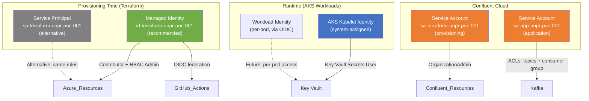
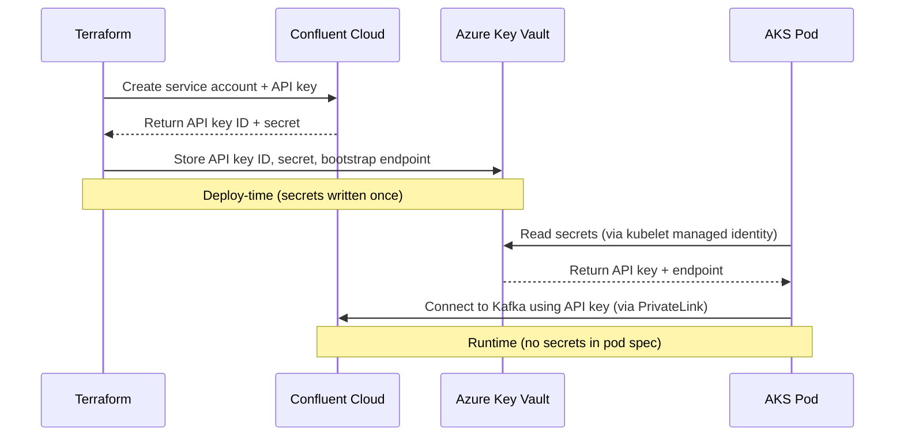

# Security & Permissions Design

## Principles

1. **Least Privilege** — Every identity gets only the permissions it needs
2. **No Public Exposure** — Kafka has no public endpoint; AKS API is private
3. **Secrets in Vault** — No credentials in code, state output, or CI logs
4. **RBAC over Access Policies** — Key Vault uses Azure RBAC, not legacy access policies
5. **Workload Identity** — AKS pods authenticate to Azure services without stored credentials

---

## Identity Model

<!-- DIAGRAM PLACEHOLDER: Insert an identity/access flow diagram here -->
<!-- Suggested tool: draw.io or Visio -->
<!-- Save as: docs/assets/identity-model.png -->

---

## Identities & Their Permissions

### 1. Terraform Managed Identity (Provisioning — Recommended)

**Identity:** `id-terraform-unpr-poc-001` (User-Assigned Managed Identity)
**Used by:** Terraform CLI / GitHub Actions (via OIDC federation)
**Authentication:** OIDC token exchange — **no secrets stored anywhere**

| Azure Role | Scope | Why Needed |
|------------|-------|------------|
| `Contributor` | Subscription | Create/manage all Azure resources (RG, VNet, AKS, KV, PE, DNS) |
| `Role Based Access Control Administrator` | Subscription (with condition) | Assign Key Vault RBAC roles only (Secrets Officer for deployer, Secrets User for AKS) |

> **Why Managed Identity over Service Principal?**
> - **No client secret** — MI never generates a password. No secret to store, rotate, or leak.
> - **OIDC federation** — GitHub Actions authenticates via token exchange, no static credentials.
> - **Least privilege** — ABAC condition restricts role assignment to only Key Vault Secrets Officer and Secrets User. Cannot escalate to Owner, Contributor, or any other role.
>
> **Alternative:** A Service Principal with OIDC (`sp-terraform-unpr-poc-001`) also works, but SP creation generates a password that exists until explicitly deleted — even if unused with OIDC.

### 2. Confluent Terraform Service Account (Provisioning)

**Identity:** `sa-terraform-unpr-poc-001` (Confluent Cloud Service Account)
**Used by:** Confluent Terraform provider
**Authentication:** Cloud API key + secret

| Confluent Role | Scope | Why Needed |
|----------------|-------|------------|
| `OrganizationAdmin` | Organization | Create environments, networks, clusters, SAs, API keys, topics, ACLs |

> **Security note:** OrganizationAdmin is broad. In production, use granular roles like `EnvironmentAdmin` per environment.

### 3. Application Service Account (Runtime — Confluent)

**Identity:** `sa-app-unpr-poc-001` (Confluent Cloud Service Account)
**Created by:** Terraform (confluent module)
**Authentication:** Cluster-scoped API key (stored in Key Vault)

| ACL | Resource Type | Resource Name | Pattern | Operation |
|-----|--------------|---------------|---------|-----------|
| ALLOW | TOPIC | `orders` | LITERAL | WRITE |
| ALLOW | TOPIC | `orders` | LITERAL | READ |
| ALLOW | TOPIC | `payments` | LITERAL | WRITE |
| ALLOW | TOPIC | `payments` | LITERAL | READ |
| ALLOW | GROUP | `poc-` | PREFIXED | READ |

> **Least privilege:** This SA can ONLY produce/consume on these 2 topics and read consumer groups with the `poc-` prefix. No admin operations, no other topics.

### 4. AKS Kubelet Identity (Runtime — Azure)

**Identity:** System-assigned Managed Identity (created by AKS)
**Used by:** AKS kubelet (node-level operations)

| Azure Role | Scope | Why Needed |
|------------|-------|------------|
| `Key Vault Secrets User` | Key Vault | Read secrets (API key, endpoint) |

> **No stored credentials:** The kubelet identity is automatically managed by Azure. No secrets to rotate.

### 5. Terraform Deployer (Key Vault Bootstrap)

**Identity:** Current `azurerm` provider identity (SP or MI)
**Used by:** Terraform during `apply`

| Azure Role | Scope | Why Needed |
|------------|-------|------------|
| `Key Vault Secrets Officer` | Key Vault | Write secrets during provisioning |

> This role is assigned by Terraform itself (using the `Role Based Access Control Administrator` role with ABAC condition) so that Terraform can write secrets into the vault it just created.

---

## Secret Management

### Deploy-Time Secrets (Terraform)

| Secret | How It's Provided | Where It's Used |
|--------|-------------------|-----------------|
| `ARM_CLIENT_ID` | GitHub Secret → env var | Azure provider auth (Managed Identity client ID) |
| `ARM_TENANT_ID` | GitHub Secret → env var | Azure provider auth |
| `ARM_SUBSCRIPTION_ID` | GitHub Secret → env var | Azure provider auth |
| `ARM_USE_OIDC` | GitHub Variable → env var | Enables OIDC token exchange (no secret needed) |
| `CONFLUENT_CLOUD_API_KEY` | GitHub Secret → `TF_VAR_*` | Confluent provider auth |
| `CONFLUENT_CLOUD_API_SECRET` | GitHub Secret → `TF_VAR_*` | Confluent provider auth |

> **No `ARM_CLIENT_SECRET`.** Managed Identity + OIDC federation eliminates all Azure secrets.

### Runtime Secrets (Application)

| Secret | Stored In | Accessed By | Method |
|--------|-----------|-------------|--------|
| Confluent API Key ID | Key Vault: `confluent-api-key-id` | AKS pods | Kubelet identity → KV RBAC |
| Confluent API Key Secret | Key Vault: `confluent-api-key-secret` | AKS pods | Kubelet identity → KV RBAC |
| Kafka Bootstrap Endpoint | Key Vault: `kafka-bootstrap-endpoint` | AKS pods | Kubelet identity → KV RBAC |

### Secret Flow

---

## Key Vault Security Configuration

| Setting | Value | Rationale |
|---------|-------|-----------|
| SKU | Standard | Sufficient for secret storage |
| Authorization | RBAC | Granular, auditable, Azure-native ([ADR-004](decisions/004-keyvault-rbac-over-access-policies.md)) |
| Purge Protection | Enabled | Prevents permanent secret deletion |
| Soft Delete Retention | 7 days | Minimum for POC; 90 days in production |
| Network ACL Default | Deny | Only allow listed IPs + Azure services |
| Network ACL Bypass | AzureServices | Allows Terraform (via ARM) and AKS (via backbone) |

---

## Terraform Sensitive Outputs

Variables and outputs marked `sensitive = true` to prevent leaking in CLI/CI logs:

| Output | Module | Why Sensitive |
|--------|--------|---------------|
| `api_key_secret` | confluent | API key secret value |
| `cluster_bootstrap_endpoint` | confluent | Private Kafka endpoint address |
| `cluster_rest_endpoint` | confluent | Private REST API URL |
| `kube_config_raw` | aks | Full cluster credentials |
| `secret_uris` | keyvault | Reveals vault paths and secret names |

---

## Security Checklist

| # | Control | Status | Evidence |
|---|---------|:------:|----------|
| 1 | Kafka has no public endpoint | ✅ | PrivateLink-only cluster |
| 2 | AKS API server is private | ✅ | `private_cluster_enabled = true` |
| 3 | Secrets in Key Vault, not in code | ✅ | 3 secrets stored in KV |
| 4 | Key Vault uses RBAC (not access policies) | ✅ | `enable_rbac_authorization = true` |
| 5 | AKS uses managed identity (no stored creds) | ✅ | System-assigned MI |
| 6 | Terraform sensitive outputs marked | ✅ | 5 outputs marked sensitive |
| 7 | NSGs on all subnets | ✅ | PE + AKS subnets have NSGs |
| 8 | TLS enforced on state storage | ✅ | `min-tls-version TLS1_2` |
| 9 | State storage has no public blob access | ✅ | `allow-blob-public-access false` |
| 10 | CI/CD secrets not in code | ✅ | GitHub Secrets / `TF_VAR_*` env vars |

---

## Production Hardening (Out of Scope for POC)

| Enhancement | Description |
|-------------|-------------|
| Scope roles to resource group | Don't use subscription-level Contributor |
| OIDC for CI/CD | ✅ Already implemented — MI + OIDC federation, no `ARM_CLIENT_SECRET` |
| Workload Identity per pod | Per-service Key Vault access (not kubelet-level) |
| Secret rotation | Automated API key rotation with Key Vault events |
| Azure Policy | Enforce naming, tagging, network rules |
| Sentinel / OPA | Policy-as-code gates in CI/CD pipeline |
| Disable AKS local accounts | Enforce Entra ID-only auth |
| Key Vault private endpoint | Access KV only via VNet (no public) |
| Confluent RBAC granularity | Replace OrganizationAdmin with scoped roles |
