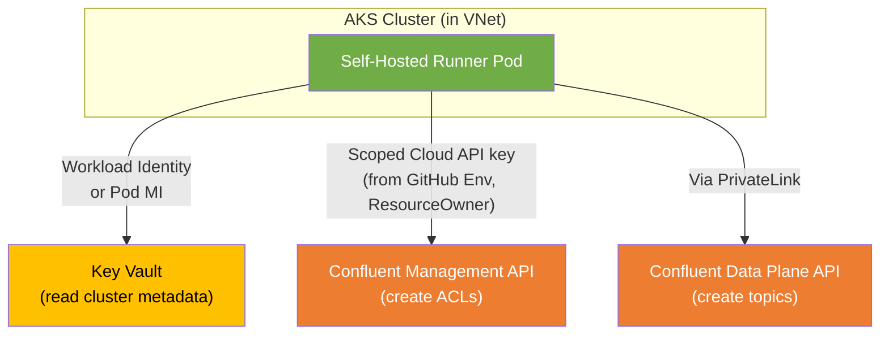
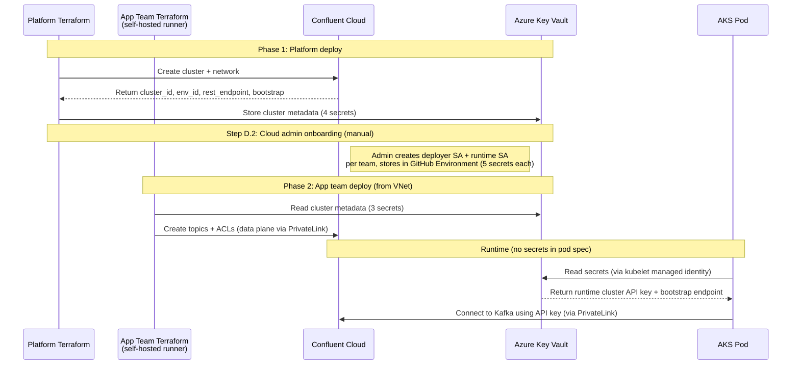

# Security & Permissions Design

## Principles

1. **Least Privilege** — Every identity gets only the permissions it needs
2. **No Public Exposure** — Kafka has no public endpoint; AKS API is private
3. **Secrets in Vault** — No credentials in code, state output, or CI logs
4. **RBAC over Access Policies** — Key Vault uses Azure RBAC, not legacy access policies
5. **Workload Identity** — AKS pods authenticate to Azure services without stored credentials

---

## Identity Model

<!-- DIAGRAM PLACEHOLDER: Insert an identity/access flow diagram here -->
<!-- Suggested tool: draw.io or Visio -->
<!-- Save as: docs/assets/identity-model.png -->

```mermaid
graph TD
    subgraph Provisioning["Provisioning Time (Terraform)"]
        MI["Managed Identity<br>id-terraform-unpr-poc-001<br>(platform deployments)"]
        SP["Service Principal<br>sp-terraform-unpr-poc-001<br>(alternative)"]
        SHR["Self-Hosted Runner<br>AKS pod in VNet<br>(app team deployments)"]
    end
    
    subgraph Runtime["Runtime (AKS Workloads)"]
        KI["AKS Kubelet Identity<br>(system-assigned)"]
        WI["Workload Identity<br>(per-pod, via OIDC)"]
    end
    
    subgraph Confluent_IDs["Confluent Cloud"]
        CSA["Service Account<br>sa-terraform-unpr-poc-001<br>(platform provisioning)"]
        DSA["Deployer SAs<br>sa-deployer-orders/payments-poc-001<br>(ResourceOwner on team prefix)"]
        OSA["Runtime SA<br>sa-app-orders-poc-001"]
        PSA["Runtime SA<br>sa-app-payments-poc-001"]
    end
    
    MI -->|Contributor + RBAC Admin| Azure_Resources
    MI -->|OIDC federation| GitHub_Actions
    SP -.->|Alternative: same roles| Azure_Resources
    SHR -->|"KV Secrets User<br>(read only)"| KV[Key Vault]
    SHR -->|"PrivateLink path"| Kafka_DataPlane["Kafka Data Plane<br>(topics, ACLs)"]
    DSA -->|"ResourceOwner<br>(prefix-scoped)"| Kafka_DataPlane
    CSA -->|OrganizationAdmin| Confluent_Resources
    OSA -->|"ACLs: orders topics"| Kafka
    PSA -->|"ACLs: payments topics"| Kafka
    KI -->|Key Vault Secrets User| KV
    WI -.->|Future: per-pod access| KV
    
    style MI fill:#70AD47,color:#fff
    style SP fill:#808080,color:#fff
    style SHR fill:#4472C4,color:#fff
    style KI fill:#4472C4,color:#fff
    style CSA fill:#ED7D31,color:#fff
    style OSA fill:#ED7D31,color:#fff
    style PSA fill:#ED7D31,color:#fff
```

---

## Identities & Their Permissions

### 1. Terraform Managed Identity (Platform Provisioning — Recommended)

**Identity:** `id-terraform-unpr-poc-001` (User-Assigned Managed Identity)
**Used by:** Platform Terraform via GitHub-hosted runner (OIDC federation), also by self-hosted runner for app team deployments
**Authentication:** OIDC token exchange — **no secrets stored anywhere**

| Azure Role | Scope | Why Needed | Used By |
|------------|-------|------------|---------|
| `Contributor` | Subscription | Create/manage all Azure resources (RG, VNet, AKS, KV, PE, DNS) | Platform |
| `Role Based Access Control Administrator` | Subscription (with condition) | Assign Key Vault RBAC roles (Secrets Officer for deployer, Secrets User for AKS) | Platform |
| `Key Vault Secrets Officer` | Key Vault | Write cluster metadata secrets during platform deploy | Platform only |

> **Why Managed Identity over Service Principal?**
> - **No client secret** — MI never generates a password. No secret to store, rotate, or leak.
> - **OIDC federation** — GitHub Actions authenticates via token exchange, no static credentials.
> - **Least privilege** — ABAC condition restricts role assignment to only Key Vault Secrets Officer and Secrets User. Cannot escalate to Owner, Contributor, or any other role.
>
> **Alternative:** A Service Principal with OIDC (`sp-terraform-unpr-poc-001`) also works, but SP creation generates a password that exists until explicitly deleted — even if unused with OIDC.

### 2. Confluent Terraform Service Account (Platform Provisioning)

**Identity:** `sa-terraform-unpr-poc-001` (Confluent Cloud Service Account)
**Used by:** Platform Terraform only — creates environment, network, cluster
**Authentication:** Confluent Cloud API key (`CONFLUENT_CLOUD_API_KEY` / `CONFLUENT_CLOUD_API_SECRET` from GitHub Secrets)

| Confluent Role | Scope | Why Needed |
|----------------|-------|------------|
| `OrganizationAdmin` | Organization | Create environments, networks, clusters |

> **Security note:** OrganizationAdmin is broad but only used by the platform deployment. App teams never see this key. See [ADR-010](decisions/010-scoped-confluent-api-keys.md).

### 2b. App-Team Deployer Service Account (Provisioning — Confluent)

**Identity:** Per-team — `sa-deployer-orders-poc-001`, `sa-deployer-payments-poc-001` (Confluent Cloud Service Accounts)
**Created by:** Cloud admin (manual, per team onboarding — see [Runbook Step D.2](../04-runsteps-and-verification/runbook.md))
**Used by:** App team Terraform deployments — creates topics and ACLs only
**Authentication:** Cloud API key stored in GitHub Environment secret (`CONFLUENT_CLOUD_API_KEY` / `CONFLUENT_CLOUD_API_SECRET` in `<team>-poc`)

| Confluent Role | Scope | Why Needed |
|----------------|-------|------------|
| `ResourceOwner` | `Topic:<team>*` (PREFIXED) | Create/manage topics matching team prefix |
| `ResourceOwner` | `Group:<team>*` (PREFIXED) | Manage consumer group ACLs matching team prefix |

> **What it cannot do:**
> - Create topics outside team prefix (Confluent returns 403)
> - Create service accounts or API keys (org-level only)
> - Delete or modify the environment, network, or cluster
>
> **Per-team isolation:** Each team has its own deployer SA and GitHub Environment. Confluent RBAC enforces prefix at the API level — not just Terraform validation. Teams cannot see each other's Cloud API keys.
>
> **Defence in depth:** Prefix isolation is enforced at three levels: Confluent RBAC (ResourceOwner → 403), Terraform validation (`startswith`), and CODEOWNERS review.

### 3. Application Service Account (Runtime — Confluent)

**Identity:** Per-team Confluent Cloud Service Account (e.g., `sa-app-orders-poc-001`, `sa-app-payments-poc-001`)
**Created by:** Cloud admin (manual, same onboarding step — [Runbook Step D.2](../04-runsteps-and-verification/runbook.md))
**Authentication:** Cluster-scoped API key (stored in GitHub Environment secret as `CONFLUENT_RUNTIME_API_KEY` / `CONFLUENT_RUNTIME_API_SECRET`)

| ACL | Resource Type | Resource Name | Pattern | Operation |
|-----|--------------|---------------|---------|-----------|
| ALLOW | TOPIC | `orders` | LITERAL | WRITE |
| ALLOW | TOPIC | `orders` | LITERAL | READ |
| ALLOW | GROUP | `orders-` | PREFIXED | READ |

> **Least privilege:** Each team's SA can ONLY produce/consume on that team's topics. The orders SA has no access to payments topics and vice versa. ACLs are created by the app team deployment from inside the VNet (data plane API via PrivateLink).

### 4. AKS Kubelet Identity (Runtime — Azure)

**Identity:** System-assigned Managed Identity (created by AKS)
**Used by:** AKS kubelet (node-level operations)

| Azure Role | Scope | Why Needed |
|------------|-------|------------|
| `Key Vault Secrets User` | Key Vault | Read secrets (API key, endpoint) |

> **No stored credentials:** The kubelet identity is automatically managed by Azure. No secrets to rotate.

### 5. Terraform Deployer (Key Vault Bootstrap)

**Identity:** Current `azurerm` provider identity (SP or MI)
**Used by:** Terraform during `apply`

| Azure Role | Scope | Why Needed |
|------------|-------|------------|
| `Key Vault Secrets Officer` | Key Vault | Write secrets during provisioning |

> This role is assigned by Terraform itself (using the `Role Based Access Control Administrator` role with ABAC condition) so that Terraform can write secrets into the vault it just created.

### 6. Self-Hosted Runner (App Team Deployments)

**Identity:** AKS pod running GitHub Actions runner agent
**Used by:** App team Terraform workflows (`terraform/teams/orders/`, `terraform/teams/payments/`)
**Why needed:** Topic and ACL creation uses the Kafka data plane API, which is only accessible via PrivateLink from inside the VNet

```mermaid
graph TD
    subgraph AKS["AKS Cluster (in VNet)"]
        Runner["Self-Hosted Runner Pod"]
    end
    
    Runner -->|"Workload Identity<br>or Pod MI"| KV["Key Vault<br>(read cluster metadata)"]
    Runner -->|"Scoped Cloud API key<br>(from GitHub Env, ResourceOwner)"| MGMT["Confluent Management API<br>(create ACLs)"]
    Runner -->|"Via PrivateLink"| DATA["Confluent Data Plane API<br>(create topics)"]
    
    style Runner fill:#70AD47,color:#fff
    style KV fill:#FFC000,color:#000
    style MGMT fill:#ED7D31,color:#fff
    style DATA fill:#ED7D31,color:#fff
```

| Requirement | How It's Met |
|-------------|-------------|
| Network access to Kafka REST API | Pod runs in AKS subnet → routed to PE → PrivateLink → Confluent |
| Azure Key Vault read | Workload Identity (OIDC) or kubelet MI → `Key Vault Secrets User` role |
| Confluent Cloud auth | Per-team scoped Cloud API key from GitHub Environment (`CONFLUENT_CLOUD_API_KEY`) — ResourceOwner on team prefix, NOT OrganizationAdmin |
| Terraform state access | MI → Storage Account IAM (same deployer identity) |
| GitHub Actions registration | Runner token from GitHub → registered as self-hosted runner |

> **Key Vault RBAC for app teams:** The self-hosted runner identity needs `Key Vault Secrets User` to **read** platform secrets (cluster_id, rest_endpoint). Per-team Confluent credentials (deployer key, runtime SA, cluster API key) are stored in GitHub Environment secrets — not Key Vault.

---

## Secret Management

### Deploy-Time Secrets (Terraform)

| Secret | How It's Provided | Where It's Used |
|--------|-------------------|-----------------|
| `ARM_CLIENT_ID` | GitHub Secret → env var | Azure provider auth (Managed Identity client ID) |
| `ARM_TENANT_ID` | GitHub Secret → env var | Azure provider auth |
| `ARM_SUBSCRIPTION_ID` | GitHub Secret → env var | Azure provider auth |
| `ARM_USE_OIDC` | GitHub Variable → env var | Enables OIDC token exchange (no secret needed) |
| `CONFLUENT_CLOUD_API_KEY` | GitHub Secret → `TF_VAR_*` | Confluent provider auth — **platform only** (OrganizationAdmin) |
| `CONFLUENT_CLOUD_API_SECRET` | GitHub Secret → `TF_VAR_*` | Confluent provider auth — **platform only** |
| `KEY_VAULT_ID` | GitHub Secret → `TF_VAR_*` | App teams: Key Vault resource ID |

> **No `ARM_CLIENT_SECRET`.** Managed Identity + OIDC federation eliminates all Azure secrets.
>
> **App teams do NOT use `CONFLUENT_CLOUD_API_KEY` from repo-level GitHub Secrets.** Each team’s GitHub Environment (`orders-poc`, `payments-poc`) has its own scoped Cloud API key (`ResourceOwner`), stored by cloud admin during onboarding. See [ADR-010](decisions/010-scoped-confluent-api-keys.md).

### Runtime Secrets (Application)

| Secret | Stored In | Written By | Accessed By | Method |
|--------|-----------|------------|-------------|--------|
| Confluent Cluster ID | Key Vault: `confluent-cluster-id` | Platform | App teams (Terraform) | Deployer MI → KV RBAC |
| Confluent Environment ID | Key Vault: `confluent-environment-id` | Platform | App teams (Terraform) | Deployer MI → KV RBAC |
| Kafka REST Endpoint | Key Vault: `confluent-rest-endpoint` | Platform | App teams (Terraform) | Deployer MI → KV RBAC |
| Kafka Bootstrap Endpoint | Key Vault: `confluent-bootstrap` | Platform | AKS pods | Kubelet identity → KV RBAC |
| Team Deployer Cloud API Key | GitHub Env: `CONFLUENT_CLOUD_API_KEY` | Cloud admin (manual) | App teams (Terraform provider) | GitHub Environment scoping |
| Team Deployer Cloud API Secret | GitHub Env: `CONFLUENT_CLOUD_API_SECRET` | Cloud admin (manual) | App teams (Terraform provider) | GitHub Environment scoping |
| Runtime SA ID | GitHub Env: `CONFLUENT_RUNTIME_SA_ID` | Cloud admin (manual) | App teams (Terraform — ACL principal) | GitHub Environment scoping |
| Runtime Cluster API Key | GitHub Env: `CONFLUENT_RUNTIME_API_KEY` | Cloud admin (manual) | App teams (Terraform) + AKS pods | GitHub Environment + KV for pods |
| Runtime Cluster API Secret | GitHub Env: `CONFLUENT_RUNTIME_API_SECRET` | Cloud admin (manual) | App teams (Terraform) + AKS pods | GitHub Environment + KV for pods |

### Secret Flow

```mermaid
sequenceDiagram
    participant PTF as Platform Terraform
    participant ATF as App Team Terraform<br>(self-hosted runner)
    participant CF as Confluent Cloud
    participant KV as Azure Key Vault
    participant AKS as AKS Pod

    Note over PTF,KV: Phase 1: Platform deploy
    PTF->>CF: Create cluster + network
    CF-->>PTF: Return cluster_id, env_id, rest_endpoint, bootstrap
    PTF->>KV: Store cluster metadata (4 secrets)

    Note over PTF,KV: Step D.2: Cloud admin onboarding (manual)
    Note right of CF: Admin creates deployer SA + runtime SA<br>per team, stores in GitHub Environment (5 secrets each)

    Note over ATF,KV: Phase 2: App team deploy (from VNet)
    ATF->>KV: Read cluster metadata (3 secrets)
    ATF->>CF: Create topics + ACLs (data plane via PrivateLink)

    Note over AKS,CF: Runtime (no secrets in pod spec)
    AKS->>KV: Read secrets (via kubelet managed identity)
    KV-->>AKS: Return runtime cluster API key + bootstrap endpoint
    AKS->>CF: Connect to Kafka using API key (via PrivateLink)
```

---

## Key Vault Security Configuration

| Setting | Value | Rationale |
|---------|-------|-----------|
| SKU | Standard | Sufficient for secret storage |
| Authorization | RBAC | Granular, auditable, Azure-native ([ADR-004](decisions/004-keyvault-rbac-over-access-policies.md)) |
| Purge Protection | Enabled | Prevents permanent secret deletion |
| Soft Delete Retention | 7 days | Minimum for POC; 90 days in production |
| Network ACL Default | Deny | Only allow listed IPs + Azure services |
| Network ACL Bypass | AzureServices | Allows Terraform (via ARM) and AKS (via backbone) |

---

## Terraform Sensitive Outputs

Variables and outputs marked `sensitive = true` to prevent leaking in CLI/CI logs:

| Output | Module | Why Sensitive |
|--------|--------|---------------|
| `cluster_bootstrap_endpoint` | confluent | Private Kafka endpoint address |
| `cluster_rest_endpoint` | confluent | Private REST API URL |
| `kube_config_raw` | aks | Full cluster credentials |
| `secret_uris` | keyvault | Reveals vault paths and secret names |

---

## Security Checklist

| # | Control | Status | Evidence |
|---|---------|:------:|----------|
| 1 | Kafka has no public endpoint | ✅ | PrivateLink-only cluster |
| 2 | AKS API server is private | ✅ | `private_cluster_enabled = true` |
| 3 | Secrets in Key Vault / GitHub Env, not in code | ✅ | 4 platform secrets in KV + per-team credentials in GitHub Environment |
| 4 | Key Vault uses RBAC (not access policies) | ✅ | `enable_rbac_authorization = true` |
| 5 | AKS uses managed identity (no stored creds) | ✅ | System-assigned MI |
| 6 | Terraform sensitive outputs marked | ✅ | 5 outputs marked sensitive |
| 7 | NSGs on all subnets | ✅ | PE + AKS subnets have NSGs |
| 8 | TLS enforced on state storage | ✅ | `min-tls-version TLS1_2` |
| 9 | State storage has no public blob access | ✅ | `allow-blob-public-access false` |
| 10 | CI/CD secrets not in code | ✅ | GitHub Secrets / `TF_VAR_*` env vars |
| 11 | Per-team state isolation | ✅ | Separate state files (platform, app-orders, app-payments) |
| 12 | Per-team SA + ACLs | ✅ | Each team has own SA, can only access own topics |
| 13 | App deployments run from private network | ✅ | Self-hosted runner on AKS (VNet-routed to data plane) |

---

## Production Hardening (Out of Scope for POC)

| Enhancement | Description |
|-------------|-------------|
| Scope roles to resource group | Don't use subscription-level Contributor |
| OIDC for CI/CD | ✅ Already implemented — MI + OIDC federation, no `ARM_CLIENT_SECRET` |
| Workload Identity per pod | Per-service Key Vault access (not kubelet-level) |
| Secret rotation | Automated API key rotation with Key Vault events |
| Azure Policy | Enforce naming, tagging, network rules |
| Sentinel / OPA | Policy-as-code gates in CI/CD pipeline |
| Disable AKS local accounts | Enforce Entra ID-only auth |
| Key Vault private endpoint | Access KV only via VNet (no public) |
| Confluent RBAC granularity | Replace OrganizationAdmin with scoped roles |
