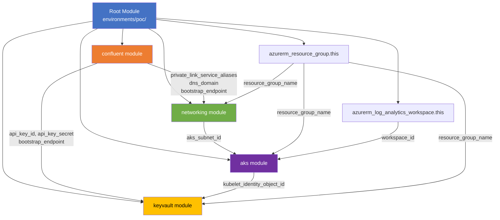
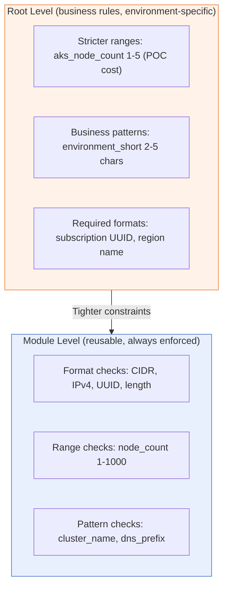

# Terraform Module Reference

> Technical reference for all Terraform modules used in this POC.

---

## Module Dependency Graph



### Execution Order

Terraform resolves dependencies automatically, but the logical order is:

1. **Resource Group** + **Log Analytics** (Azure infrastructure base)
2. **Confluent Module** (environment → network → PL access → cluster → SA → API key → topics → ACLs)
3. **Networking Module** (VNet → subnets → NSGs → PE → DNS) — depends on Confluent's PrivateLink aliases
4. **AKS Module** (cluster → node pools) — depends on networking subnet
5. **Key Vault Module** (vault → RBAC → secrets) — depends on Confluent outputs + AKS identity

---

## Module: `confluent`

**Path:** `terraform/modules/confluent/`
**Purpose:** Provisions all Confluent Cloud resources for private Kafka access.

### Resources Created (in dependency order)

| # | Resource | Type | Purpose |
|---|----------|------|---------|
| 1 | `confluent_environment.this` | Environment | Logical grouping (stream governance: ESSENTIALS) |
| 2 | `confluent_network.this` | Network | PRIVATELINK network in target region + AZs |
| 3 | `confluent_private_link_access.this` | PL Access | Grants your Azure subscription access |
| 4 | `confluent_kafka_cluster.this` | Cluster | Dedicated, single-zone, N CKUs |
| 5 | `confluent_service_account.app` | Service Account | Application identity |
| 6 | `confluent_api_key.app` | API Key | Cluster-scoped credentials for the SA |


### Key Inputs

| Variable | Type | Description |
|----------|------|-------------|
| `environment_name` | string | Display name for the environment |
| `cluster_name` | string | Display name for the Kafka cluster |
| `confluent_region` | string | Cloud region (e.g., `westeurope`) |
| `cku_count` | number | Dedicated cluster units (default: 1) |
| `azure_subscription_id` | string | Your subscription — allowed through PrivateLink |
| `service_account_name` | string | SA display name |

### Key Outputs

| Output | Sensitive | Description |
|--------|:---------:|-------------|
| `environment_id` | No | Confluent environment ID |
| `cluster_id` | No | Kafka cluster ID |
| `cluster_bootstrap_endpoint` | **Yes** | Bootstrap server address |
| `api_key_id` | No | API key identifier |
| `api_key_secret` | **Yes** | API key secret value |
| `private_link_service_aliases` | No | Map of zone → PLS alias (consumed by networking) |
| `confluent_dns_domain` | No | DNS domain for private DNS zone |
---

## Module: `networking`

**Path:** `terraform/modules/networking/`
**Purpose:** Azure VNet infrastructure + PrivateLink endpoint to Confluent.

### Resources Created

| # | Resource | Type | Purpose |
|---|----------|------|---------|
| 1 | `azurerm_virtual_network.this` | VNet | Main network |
| 2 | `azurerm_subnet.private_endpoints` | Subnet | Hosts Private Endpoint NICs |
| 3 | `azurerm_subnet.aks` | Subnet | Hosts AKS node pool |
| 4 | `azurerm_network_security_group.pe` | NSG | PE subnet security rules |
| 5 | `azurerm_network_security_group.aks` | NSG | AKS subnet security rules |
| 6 | `azurerm_subnet_network_security_group_association.pe` | Association | PE subnet ↔ NSG |
| 7 | `azurerm_subnet_network_security_group_association.aks` | Association | AKS subnet ↔ NSG |
| 8 | `azurerm_private_endpoint.confluent` | Private Endpoint | PrivateLink connection to Confluent |
| 9 | `azurerm_private_dns_zone.confluent` | DNS Zone | `privatelink.confluent.cloud` |
| 10 | `azurerm_private_dns_zone_virtual_network_link.confluent` | VNet Link | DNS zone ↔ VNet |
| 11 | `azurerm_private_dns_a_record.confluent_bootstrap` | A Record | Bootstrap FQDN → PE IP |

### Key Inputs

| Variable | Type | Description |
|----------|------|-------------|
| `vnet_name` | string | VNet display name (from CAF) |
| `vnet_address_space` | list(string) | VNet CIDR (default: `["10.0.0.0/22"]`) |
| `pe_subnet_prefix` | string | PE subnet CIDR |
| `aks_subnet_prefix` | string | AKS subnet CIDR |
| `confluent_private_link_service_aliases` | map(string) | Zone → PLS alias from Confluent module |
| `confluent_pe_zone` | string | Which zone's alias to use (default: `"1"`) |
| `confluent_dns_record_name` | string | DNS A record name for bootstrap |

### Key Outputs

| Output | Description |
|--------|-------------|
| `vnet_id` | VNet resource ID |
| `pe_subnet_id` | PE subnet resource ID |
| `aks_subnet_id` | AKS subnet resource ID (consumed by AKS module) |
| `private_endpoint_ip` | Private IP of the PE NIC |

---

## Module: `aks`

**Path:** `terraform/modules/aks/`
**Purpose:** Private AKS cluster with workload identity and dual node pools.

### Resources Created

| # | Resource | Type | Purpose |
|---|----------|------|---------|
| 1 | `azurerm_kubernetes_cluster.this` | AKS Cluster | Main cluster + system node pool |
| 2 | `azurerm_kubernetes_cluster_node_pool.user` | Node Pool | Application workload nodes |

### Architecture

```
AKS Cluster
├── System Node Pool (1 node, CriticalAddonsOnly taint)
│   └── CoreDNS, kube-proxy, metrics-server
└── User Node Pool (N nodes, label: workload=application)
    └── Application pods (Kafka producers/consumers)
```

### Key Inputs

| Variable | Type | Default | Description |
|----------|------|---------|-------------|
| `cluster_name` | string | — | Cluster name (1-63 chars, validated) |
| `kubernetes_version` | string | `"1.29"` | K8s version (major.minor) |
| `node_count` | number | `2` | User node pool size (module: 1-1000; POC root: 1-5) |
| `vm_size` | string | `"Standard_D2s_v5"` | Node VM SKU |
| `subnet_id` | string | — | AKS subnet from networking module |
| `private_cluster_enabled` | bool | `false` | Private API server |
| `automatic_upgrade_channel` | string | `"patch"` | Auto-upgrade strategy |

### Key Outputs

| Output | Sensitive | Description |
|--------|:---------:|-------------|
| `cluster_name` | No | AKS cluster name |
| `kube_config_raw` | **Yes** | Full kubeconfig |
| `kubelet_identity_object_id` | No | MI object ID for Key Vault RBAC |
| `oidc_issuer_url` | No | OIDC issuer for Workload Identity |

---

## Module: `keyvault`

**Path:** `terraform/modules/keyvault/`
**Purpose:** Generic secret storage with RBAC access control.

### Resources Created

| # | Resource | Type | Purpose |
|---|----------|------|---------|
| 1 | `azurerm_key_vault.this` | Key Vault | Secret storage |
| 2 | `azurerm_role_assignment.deployer_secrets_officer` | RBAC | Terraform deployer → Secrets Officer |
| 3 | `azurerm_role_assignment.secrets_user` | RBAC | Reader principals → Secrets User (`for_each`) |
| 4 | `azurerm_key_vault_secret.this` | Secrets | Store secret map (`for_each`) |

### Design: Generic, Not Confluent-Specific

The Key Vault module accepts a generic `secrets` map and `reader_principal_ids` list — it has **no knowledge of Confluent**. The root module composes:

```hcl
module "keyvault" {
  secrets = {
    "confluent-api-key-id"       = module.confluent.api_key_id
    "confluent-api-key-secret"   = module.confluent.api_key_secret
    "kafka-bootstrap-endpoint"   = module.confluent.cluster_bootstrap_endpoint
  }
  reader_principal_ids = [module.aks.kubelet_identity_object_id]
}
```

### Key Inputs

| Variable | Type | Description |
|----------|------|-------------|
| `vault_name` | string | Globally unique vault name (from CAF) |
| `secrets` | map(string) | Secret name → value map (sensitive) |
| `reader_principal_ids` | list(string) | Principal IDs for Secrets User role |
| `allowed_ip_ranges` | list(string) | Management IPs for network ACL |

### Key Outputs

| Output | Sensitive | Description |
|--------|:---------:|-------------|
| `vault_uri` | No | Vault URI |
| `vault_name` | No | Vault name |
| `secret_uris` | **Yes** | Map of secret name → versionless URI |

---

## Variable Validation Strategy



**Principle:** Format checks live in modules (single source of truth). Root only adds stricter business constraints. No duplicate validations.
