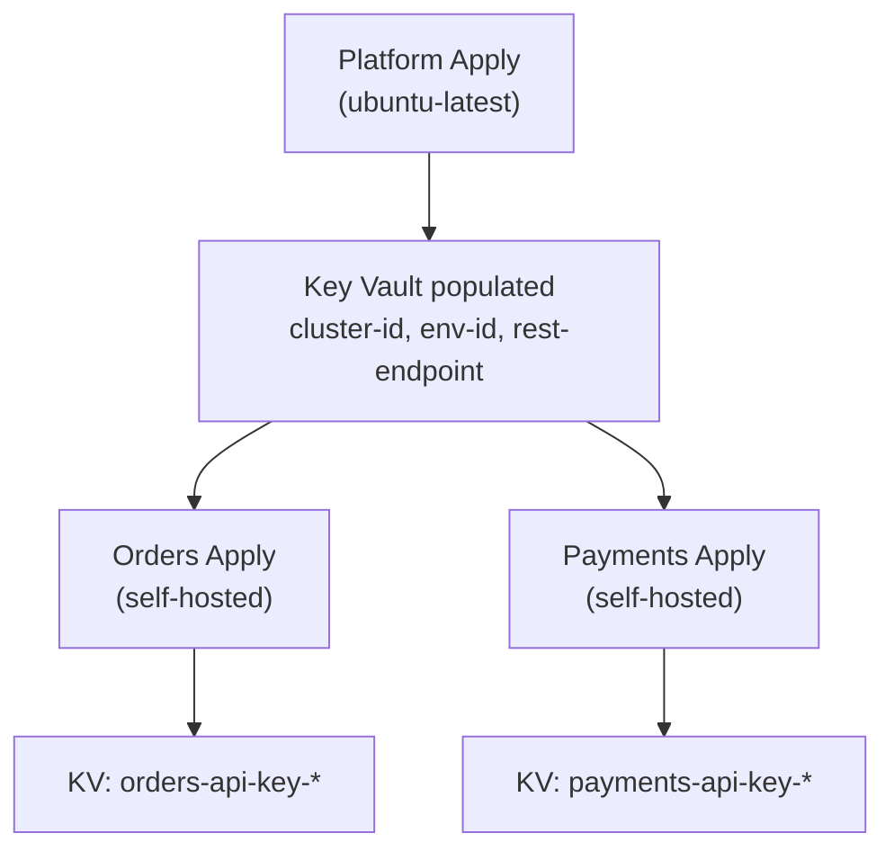
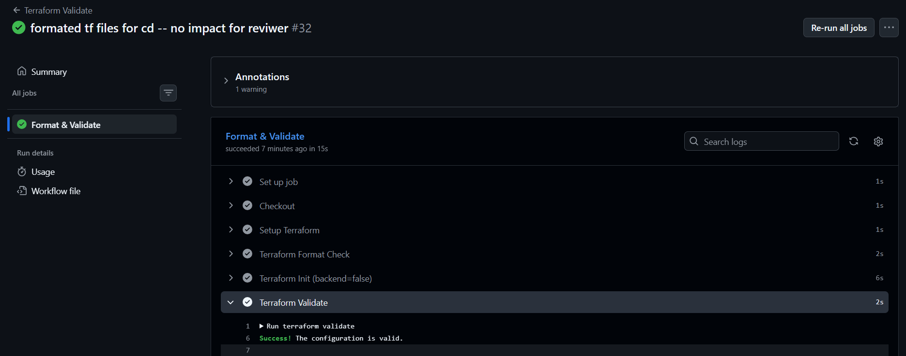
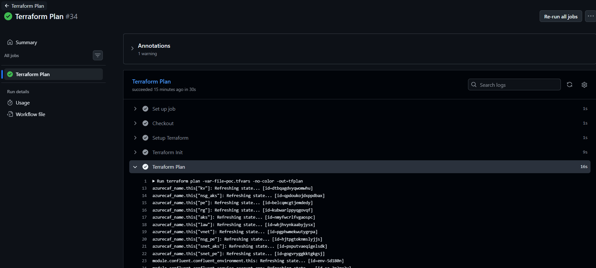

# CI/CD Runbook (GitHub Actions)

> **Optional for POC.** This documents how to run the same deployment via GitHub Actions instead of manual `az CLI`.
> For the manual runbook (recommended for POC), see [Runbook](runbook.md).

---

## Prerequisites (same as manual)

All prerequisites from [Runbook §Prerequisites](runbook.md#prerequisites--bootstrap) must be completed first. Additionally:

1. Push code to a GitHub repository
2. Configure repository secrets (Step E from Runbook)

---

## GitHub Secrets Configuration

Go to: Repository → Settings → Secrets and variables → Actions

| Secret Name | Value | Source |
|-------------|-------|--------|
| `ARM_CLIENT_ID` | Managed Identity client ID | Runbook Step B.1 |
| `ARM_TENANT_ID` | Azure tenant ID | `az account show --query tenantId` |
| `ARM_SUBSCRIPTION_ID` | Azure subscription ID | `az account show --query id` |
| `CONFLUENT_CLOUD_API_KEY` | Confluent Cloud API key | Runbook Step D |
| `CONFLUENT_CLOUD_API_SECRET` | Confluent Cloud API secret | Runbook Step D |
| `KEY_VAULT_ID` | Key Vault resource ID (after platform deploy) | Platform output |

Also add `ARM_USE_OIDC=true` as a **repository variable** (Settings → Variables → Actions), not a secret.

> **No `ARM_CLIENT_SECRET` needed.** MI + OIDC handles Azure authentication with zero stored secrets.

---

## Workflow Architecture

All workflows use **reusable templates** to eliminate duplication:

| File | Type | What It Does |
|------|------|-------------|
| `_terraform-plan.yml` | Template | fmt → init → validate → plan → PR comment |
| `_terraform-apply.yml` | Template | init → apply |
| `terraform-plan-platform.yml` | Caller | Passes platform inputs → template |
| `terraform-apply-platform.yml` | Caller | Passes platform inputs → template |
| `terraform-plan-orders.yml` | Caller | Passes orders inputs → template (self-hosted) |
| `terraform-apply-orders.yml` | Caller | Passes orders inputs → template (self-hosted) |
| `terraform-plan-payments.yml` | Caller | Passes payments inputs → template (self-hosted) |
| `terraform-apply-payments.yml` | Caller | Passes payments inputs → template (self-hosted) |

Each caller passes: `working_directory`, `var_file` (e.g., `platform-poc.tfvars`), `backend_config` (e.g., `backend-poc.hcl`), `runner`, and `plan_label`. All callers use `secrets: inherit`.

> **Adding an environment:** Add `dev` to the `options: [poc]` list in each caller. Create matching `*-dev.tfvars` and `backend-dev.hcl` files.

---

## Workflow 1: Platform Plan

**Trigger:** Automatic on PR (when `terraform/platform/**` or `terraform/modules/confluent/**`, `networking/**`, `aks/**`, `keyvault/**` changes)
**Runner:** `ubuntu-latest` (GitHub-hosted — management API is public)
**What it does:** fmt check → `terraform init -backend-config=backend-<env>.hcl` → validate → `terraform plan -var-file=platform-<env>.tfvars` → posts plan as PR comment

**Expected result:**
- Plan shows ~20 resources to create (cluster, VNet, PE, AKS, KV)
- PR comment with plan output

**Actual result:**
```
(paste plan summary or screenshot)
```

<!-- SCREENSHOT: docs/assets/cicd-platform-plan.png -->

---

## Workflow 2: Platform Apply

**Trigger:** Manual dispatch (Actions → "Terraform Apply: Platform" → type `"apply"`)
**Runner:** `ubuntu-latest`
**What it does:** `terraform apply -var-file=platform-<env>.tfvars -auto-approve`

**Steps:**
1. Go to Actions → "Terraform Apply: Platform" → Run workflow
2. Type `apply` in the confirmation field
3. Click "Run workflow"

**Expected result:**
- Platform resources created (cluster, VNet, PE, AKS, KV)
- Key Vault populated with cluster metadata secrets
- Exit code 0

**Actual result:**
```
(paste apply summary or screenshot)
```

<!-- SCREENSHOT: docs/assets/cicd-platform-apply.png -->

---

## Workflow 3: App Team Plan (Orders / Payments)

**Trigger:** Automatic on PR (when `terraform/teams/orders/**` or `terraform/modules/confluent-app/**` changes)
**Runner:** `self-hosted` (AKS pod inside VNet — required for data plane access)
**What it does:** `terraform plan -var-file=orders-<env>.tfvars` + posts plan as PR comment

**Expected result:**
- Plan shows ~7 resources to create per team (SA, API key, topics, ACLs)
- PR comment with plan output

> **Important:** Platform must be deployed first. App team plan/apply will fail if Key Vault secrets don't exist yet.

**Actual result:**
```
(paste plan summary or screenshot)
```

<!-- SCREENSHOT: docs/assets/cicd-app-plan.png -->

---

## Workflow 4: App Team Apply (Orders / Payments)

**Trigger:** Manual dispatch (Actions → "Terraform Apply: Orders" or "Terraform Apply: Payments" → type `"apply"`)
**Runner:** `self-hosted` (AKS pod inside VNet)
**What it does:** `terraform apply -var-file=orders-<env>.tfvars -auto-approve`

**Steps:**
1. Go to Actions → "Terraform Apply: Orders" → Run workflow
2. Type `apply` in the confirmation field
3. Click "Run workflow"

**Expected result:**
- Topics, SA, API key, ACLs created
- API key stored in Key Vault (for AKS pods)
- Exit code 0

**Actual result:**
```
(paste apply summary or screenshot)
```

<!-- SCREENSHOT: docs/assets/cicd-app-apply.png -->

---

## Deployment Order



> Platform **must** be applied before any app team. App teams are independent of each other and can run in parallel.

---

## Cleanup (manual)

**Destroy order matters** — app teams first, then platform:

```bash
# 1. Destroy app teams (from self-hosted runner)
cd terraform/teams/orders
terraform init -backend-config=backend-poc.hcl
terraform destroy -var-file=orders-poc.tfvars

cd ../payments
terraform init -backend-config=backend-poc.hcl
terraform destroy -var-file=payments-poc.tfvars

# 2. Destroy platform (from any runner)
cd ../../platform
terraform init -backend-config=backend-poc.hcl
terraform destroy -var-file=platform-poc.tfvars
```

---

## Verification via CI/CD

Most verification steps (V1-V8) require `az aks command invoke` and interactive commands — these are best done **manually** after the CI/CD apply completes. See [Runbook §Verification](runbook.md#verification-steps).

| Verifiable in CI/CD | How |
|---------------------|-----|
| Terraform outputs (V1) | Add `terraform output` step after apply |
| PE status (V2) | Add `az network private-endpoint list` step |
| Key Vault secrets (V5) | Add `az keyvault secret list` step |
| AKS nodes (V4) | Add `az aks command invoke` step |
| Produce/consume (V6-V7) | ❌ Too complex for pipeline — do manually |

---

## Comparison: Manual vs CI/CD

| Aspect | Manual (Runbook) | CI/CD (This doc) |
|--------|:----------------:|:----------------:|
| Best for | POC demo, debugging, verification | Production delivery, team workflows |
| Prerequisites | Same | Same + GitHub Secrets |
| Execution | Local terminal | GitHub Actions |
| Verification | Full (V1-V8) | Partial (outputs + basic checks) |
| Screenshots | Terminal output | GitHub Actions UI |
| Teardown | `terraform destroy` locally | Same (not automated) |

---

## Terraform Apply Summary

**Command:**
```bash
terraform apply tfplan
```

**Expected resource count:** ~20-25 resources

<!-- SCREENSHOT PLACEHOLDER: Full terraform apply output -->
<!-- Save as: docs/assets/terraform-apply-summary.png -->

| Metric | Value |
|--------|-------|
| Resources created | _(fill in)_ |
| Apply duration | _(fill in)_ |
| Warnings | _(fill in)_ |
| Errors | 0 |

---

## Cleanup Verification

**Command:**
```bash
terraform destroy -var-file=poc.tfvars
```

**Expected:** All resources destroyed, state clean.

<!-- SCREENSHOT PLACEHOLDER -->
<!-- Save as: docs/assets/terraform-destroy.png -->

---

## Prerequisites Evidence (Manual — az CLI)

> Screenshots proving prerequisites were created before `terraform apply`.

### A. TF State Backend

**Commands executed:**
```bash
az group create --name rg-tfstate-unpr-poc-001 --location westeurope
az storage account create --name sttfstateunprpoc001 --resource-group rg-tfstate-unpr-poc-001 --location westeurope --sku Standard_LRS --min-tls-version TLS1_2 --allow-blob-public-access false
az storage container create --name tfstate --account-name sttfstateunprpoc001
```

<!-- SCREENSHOT PLACEHOLDER: az CLI output showing RG + storage account + container created -->
<!-- Save as: docs/assets/prereq-tfstate-backend.png -->
<!--  -->

**Existing proof:** [image.png](../assets/image.png), [image-1.png](../assets/image-1.png), [image-2.png](../assets/image-2.png)

---

### B. Service Principal + Role Assignments

**Commands executed:**
```bash
az ad sp create-for-rbac --name "sp-terraform-unpr-poc-001" --role Contributor --scopes /subscriptions/<sub-id>
az role assignment create --assignee <appId> --role "Role Based Access Control Administrator" --scope /subscriptions/<sub-id> \
  --condition "((!(ActionMatches{'Microsoft.Authorization/roleAssignments/write'})) OR (@Request[Microsoft.Authorization/roleAssignments:RoleDefinitionId] ForAnyOfAnyValues:GuidEquals {b86a8fe4-44ce-4948-aee5-eccb2c155cd7, 4633458b-17de-408a-b874-0445c86b69e6}))" \
  --condition-version "2.0"
```

<!-- SCREENSHOT PLACEHOLDER: az CLI output showing SP creation + role assignments -->
<!-- Save as: docs/assets/prereq-service-principal.png -->

---

### C. Managed Identity (alternative)

**Command executed:**
```bash
az identity create --name id-terraform-unpr-poc-001 --resource-group rg-tfstate-unpr-poc-001 --location westeurope
```

<!-- SCREENSHOT PLACEHOLDER: az CLI output showing MI creation -->
<!-- Save as: docs/assets/prereq-managed-identity.png -->

---

### D. Azure Provider Registration

**Command executed:**
```bash
az provider register --namespace Microsoft.ContainerService
az provider register --namespace Microsoft.KeyVault
az provider register --namespace Microsoft.Network
az provider register --namespace Microsoft.Storage
```

<!-- SCREENSHOT PLACEHOLDER -->
<!-- Save as: docs/assets/prereq-providers.png -->

---

### E. Confluent Cloud Setup

- Service account created: `sa-terraform-unpr-poc-001`
- Role assigned: `OrganizationAdmin`
- API key generated

<!-- SCREENSHOT PLACEHOLDER: Confluent Console showing SA + API key -->
<!-- Save as: docs/assets/prereq-confluent-sa.png -->

---

## CI/CD Evidence (GitHub Actions)

> Screenshots proving the pipeline works end-to-end.

### Validate Workflow

**Trigger:** Push to `main` or PR with `terraform/**` changes
**Evidence needed:**



<!-- SCREENSHOT PLACEHOLDER -->
<!-- Save as: docs/assets/cicd-validate.png -->

---

### Plan Workflow

**Trigger:** Pull request with `terraform/**` changes and Manual dispatch
**Evidence needed:**


<!-- SCREENSHOT PLACEHOLDER -->
<!-- Save as: docs/assets/cicd-plan-run.png -->
<!-- Save as: docs/assets/cicd-plan-pr-comment.png -->

---

### Apply Workflow

**Trigger:** Manual dispatch with `"apply"` confirmation
**Evidence needed:**


---

## Execution Methods Comparison

| Step | Manual (az CLI) | GitHub Actions |
|------|:---------------:|:--------------:|
| Prerequisites | ✅ Done manually | N/A (one-time setup) |
| `terraform init` | ✅ Local terminal | ✅ In pipeline |
| `terraform plan` | ✅ Local terminal | ✅ Auto on PR, Manual dispatch |
| `terraform apply` | ✅ Local terminal |  Manual dispatch |
| Verification (V1-V10) | ✅ az CLI commands | Partial (outputs only) |
| `terraform destroy` | ✅ Local terminal | ✅ Manual dispatch |

> **Both methods produce the same infrastructure.** Manual is used for debugging and verification. CI/CD is the production delivery mechanism.
