# Runbook: Private Confluent Kafka + AKS POC

## Quick Reference

| Phase | Step | Description |
|-------|------|-------------|
| **Prerequisites** | [Step A](#step-a-azure--create-terraform-state-backend) | Create Terraform state backend (RG, Storage Account, Container) |
| | [Step B](#step-b-azure--create-managed-identity-for-terraform) | Create Managed Identity + RBAC (+ OIDC federation if CI/CD) |
| | [Step C](#step-c-azure--register-required-providers) | Register Azure resource providers |
| | [Step D](#step-d-confluent-cloud--organization--api-key-setup) | Confluent Cloud org & API key setup |
| | [Step E & F](#step-e--f-cicd-pipeline-secrets-optional--cicd-only) | _(Optional)_ GitHub / Azure DevOps pipeline secrets |
| **Execution** | [Step 1](#step-1-configure-variables) | Configure variables |
| | [Step 2](#step-2-initialize-terraform) | `terraform init` |
| | [Step 3](#step-3-plan) | `terraform plan` |
| | [Step 4](#step-4-apply) | `terraform apply` |
| | [Step 5](#step-5-accept-private-link-connection-if-manual) | Accept Private Link connection |
| **Verification** | [V0](#v0-bootstrap-resources) | Bootstrap: RG, Storage, MI, RBAC |
| | [V1–V9](#v1-confluent-resources) | Confluent, Networking, AKS, Key Vault, End-to-end |
| **Cleanup** | [Cleanup](#cleanup) | `terraform destroy` |

---

## Prerequisites & Bootstrap

> **All steps below are one-time setup BEFORE running `terraform apply`.**

### Tools Required
- Terraform >= 1.5.0 (`terraform version`)
- Azure CLI >= 2.50 (`az version`)
- kubectl (`az aks install-cli`)
- Confluent CLI (optional, for verification)

---

### Step A: Azure — Create Terraform State Backend

> **These are shared resources** — one TF state backend serves ALL services (kafka, postgres, redis, etc.). That's why the name uses `terraform`, not a service name.

```bash
# Login to Azure
az login
az account set --subscription "poc"    # ← Use your POC subscription name or ID

# Create resource group for TF state
# Naming: rg-<purpose>-<team>-<env>-<suffix>
az group create \
  --name rg-tfstate-unpr-poc-001 \
  --location westeurope

# Create storage account (must be globally unique)
# Naming: st<purpose><team><env><suffix>  (3-24 chars, lowercase + numbers only)
az storage account create \
  --name sttfstateunprpoc001 \
  --resource-group rg-tfstate-unpr-poc-001 \
  --location westeurope \
  --sku Standard_LRS \
  --min-tls-version TLS1_2 \
  --allow-blob-public-access false

# Enable blob versioning (for state file recovery)
az storage account blob-service-properties update \
  --account-name sttfstateunprpoc001 \
  --resource-group rg-tfstate-unpr-poc-001 \
  --enable-versioning true

# Create blob container
az storage container create \
  --name sc-tfstate-unpr-poc-001 \
  --account-name sttfstateunprpoc001
```

---

### Step B: Azure — Create Managed Identity for Terraform

> **Why Managed Identity?** Unlike a Service Principal, a Managed Identity has **no client secret** to store, rotate, or leak. Azure handles credential management automatically. Combined with OIDC federation for CI/CD, this is a **zero-secret** approach for Azure authentication.
>
> **Note:** A Service Principal with OIDC can also work (see [Alternative: Service Principal](#alternative-service-principal) below), but Managed Identity is preferred because there's no password generated at all — not even during creation.

#### Step B.1: Create User-Assigned Managed Identity

```bash
# Create user-assigned managed identity
# Naming: CAF pattern → id-<purpose>-<env>-<instance>
az identity create \
  --name id-terraform-unpr-poc-001 \
  --resource-group rg-tfstate-unpr-poc-001 \
  --location westeurope

# Get principal ID and client ID (needed for role assignment + provider config)
MI_PRINCIPAL_ID=$(az identity show \
  --name id-terraform-unpr-poc-001 \
  --resource-group rg-tfstate-unpr-poc-001 \
  --query principalId -o tsv)

MI_CLIENT_ID=$(az identity show \
  --name id-terraform-unpr-poc-001 \
  --resource-group rg-tfstate-unpr-poc-001 \
  --query clientId -o tsv)

echo "Principal ID: $MI_PRINCIPAL_ID"   # → for role assignments
echo "Client ID:    $MI_CLIENT_ID"       # → ARM_CLIENT_ID for Terraform
```

#### Step B.2: Assign Roles (Least Privilege)

```bash
# Contributor — create/manage all Azure resources (RG, VNet, AKS, KV, PE, DNS)
az role assignment create \
  --assignee $MI_PRINCIPAL_ID \
  --role Contributor \
  --scope /subscriptions/<subscription-id>

# Role Based Access Control Administrator — assign Key Vault RBAC roles ONLY
# ABAC condition: restricts to Key Vault Secrets Officer + Secrets User roles
# This means the MI CANNOT assign Owner, Contributor, or escalate privileges
az role assignment create \
  --assignee $MI_PRINCIPAL_ID \
  --role "Role Based Access Control Administrator" \
  --scope /subscriptions/<subscription-id> \
  --condition "(
    (
      !(ActionMatches{'Microsoft.Authorization/roleAssignments/write'})
    )
    OR
    (
      @Request[Microsoft.Authorization/roleAssignments:RoleDefinitionId] ForAnyOfAnyValues:GuidEquals {b86a8fe4-44ce-4948-aee5-eccb2c155cd7, 4633458b-17de-408a-b874-0445c86b69e6}
    )
  )" \
  --condition-version "2.0"
```

> **Role IDs in the condition:**
> - `b86a8fe4-...` = Key Vault Secrets Officer (deployer writes secrets during apply)
> - `4633458b-...` = Key Vault Secrets User (AKS reads secrets at runtime)

#### Step B.3: Setup OIDC Federation for GitHub Actions (Optional — CI/CD only)

<details>
<summary><strong>Expand only if running Terraform via CI/CD (GitHub Actions or Azure DevOps)</strong></summary>

```bash
# Get the MI resource ID
MI_RESOURCE_ID=$(az identity show \
  --name id-terraform-unpr-poc-001 \
  --resource-group rg-tfstate-unpr-poc-001 \
  --query id -o tsv)

# Create federated credential for GitHub Actions (main branch)
az identity federated-credential create \
  --name github-actions-main \
  --identity-name id-terraform-unpr-poc-001 \
  --resource-group rg-tfstate-unpr-poc-001 \
  --issuer "https://token.actions.githubusercontent.com" \
  --subject "repo:GouthamKumar4/terraform-confluent-cloud-aks-poc:ref:refs/heads/main" \
  --audiences "api://AzureADTokenExchange"

# Create federated credential for pull requests (for terraform plan on PRs)
az identity federated-credential create \
  --name github-actions-pr \
  --identity-name id-terraform-unpr-poc-001 \
  --resource-group rg-tfstate-unpr-poc-001 \
  --issuer "https://token.actions.githubusercontent.com" \
  --subject "repo:GouthamKumar4/terraform-confluent-cloud-aks-poc:pull_request" \
  --audiences "api://AzureADTokenExchange"
```

#### Summary: What You Get

| Property | Value | Used For |
|----------|-------|----------|
| `ARM_CLIENT_ID` | MI Client ID (from B.1) | GitHub Secret |
| `ARM_TENANT_ID` | `az account show --query tenantId` | GitHub Secret |
| `ARM_SUBSCRIPTION_ID` | `az account show --query id` | GitHub Secret |
| `ARM_USE_OIDC` | `true` | GitHub Variable (not secret) |

**No `ARM_CLIENT_SECRET` needed.** The OIDC token exchange handles authentication automatically.

---

#### Alternative: Service Principal

> If Managed Identity is not feasible (e.g., no self-hosted runner, no Azure compute for CI/CD), a Service Principal with OIDC federation works similarly:

```bash
# Create SP
az ad sp create-for-rbac \
  --name "sp-terraform-unpr-poc-001" \
  --role Contributor \
  --scopes /subscriptions/<subscription-id>

# Assign RBAC Admin (same ABAC condition as MI above)
az role assignment create \
  --assignee <appId> \
  --role "Role Based Access Control Administrator" \
  --scope /subscriptions/<subscription-id> \
  --condition "(
    (
      !(ActionMatches{'Microsoft.Authorization/roleAssignments/write'})
    )
    OR
    (
      @Request[Microsoft.Authorization/roleAssignments:RoleDefinitionId] ForAnyOfAnyValues:GuidEquals {b86a8fe4-44ce-4948-aee5-eccb2c155cd7, 4633458b-17de-408a-b874-0445c86b69e6}
    )
  )" \
  --condition-version "2.0"

# Setup OIDC (same concept — federated credential on the app registration)
APP_OBJECT_ID=$(az ad app show --id <appId> --query id -o tsv)
az ad app federated-credential create \
  --id $APP_OBJECT_ID \
  --parameters '{
    "name": "github-actions-main",
    "issuer": "https://token.actions.githubusercontent.com",
    "subject": "repo:GouthamKumar4/terraform-confluent-cloud-aks-poc:ref:refs/heads/main",
    "audiences": ["api://AzureADTokenExchange"]
  }'
```

> **Why MI is preferred over SP:** Service Principal creation generates a password (`ARM_CLIENT_SECRET`) that must be stored and rotated. Even with OIDC, the password exists until explicitly removed. Managed Identity never has a password.

</details>

---

### Step C: Azure — Register Required Providers

```bash
az provider register --namespace Microsoft.ContainerService
az provider register --namespace Microsoft.KeyVault
az provider register --namespace Microsoft.Network
az provider register --namespace Microsoft.Storage

# Verify registration
az provider show --namespace Microsoft.ContainerService --query "registrationState"
```

---

### Step D: Confluent Cloud — Organization & API Key Setup

1. **Create Confluent Cloud account** (if not exists):
   - Go to https://confluent.cloud → Sign up

2. **Create a service account for Terraform** (recommended over personal credentials):
   - Confluent Console → Accounts & access → Service accounts → Add service account
   - Name: `sa-terraform-unpr-poc-001`
   - Description: "Terraform automation — manages environments, clusters, topics"

3. **Assign OrganizationAdmin role** to the service account:
   - Accounts & access → Role bindings → Add role binding
   - Principal: `sa-terraform-unpr-poc-001`
   - Role: `OrganizationAdmin`
   - This allows Terraform to create environments, networks, clusters, service accounts, API keys, topics, ACLs

4. **Generate Cloud API key** for the service account:
   - Confluent Console → API keys → Add key → **Cloud resource management** (organization-scoped)
   - Select: Service account `sa-terraform-unpr-poc-001`
   - Name/Description: `apikey-terraform-unpr-poc-001`
   - Scope: **Global (org-level)** — required for Terraform to manage environments, networks, clusters, topics
   - **Save both Key and Secret** — the secret is shown only once!
   - These become `TF_VAR_confluent_cloud_api_key` and `TF_VAR_confluent_cloud_api_secret`

5. **(Optional) Create user groups** for team access:
   - Accounts & access → Groups → Add group
   - Assign roles per environment/cluster after Terraform creates them

---

### Step E & F: CI/CD Pipeline Secrets (Optional — CI/CD only)

<details>
<summary><strong>Expand only if setting up GitHub Actions or Azure DevOps pipelines</strong></summary>

#### Step E: GitHub — Configure Repository Secrets

Go to GitHub → Repository → Settings → Secrets and variables → Actions → New repository secret:

| Secret Name | Value | Source |
|-------------|-------|--------|
| `ARM_CLIENT_ID` | Managed Identity client ID | Step B.1 output |
| `ARM_TENANT_ID` | Azure tenant ID | `az account show --query tenantId` |
| `ARM_SUBSCRIPTION_ID` | Azure subscription ID | `az account show --query id` |
| `CONFLUENT_CLOUD_API_KEY` | Confluent Cloud API key | Step D output |
| `CONFLUENT_CLOUD_API_SECRET` | Confluent Cloud API secret | Step D output |

Also add `ARM_USE_OIDC=true` as a **repository variable** (not secret).

> **No `ARM_CLIENT_SECRET` needed.** Managed Identity + OIDC federation handles authentication with zero stored Azure secrets.

---

#### Step F: Azure DevOps — Alternative Setup (if not using GitHub)

1. Create a service connection (type: Azure Resource Manager → Workload Identity federation)
2. Add variable group with:
   - `ARM_CLIENT_ID`, `ARM_TENANT_ID`, `ARM_SUBSCRIPTION_ID` (from service connection)
   - `CONFLUENT_CLOUD_API_KEY`, `CONFLUENT_CLOUD_API_SECRET` (as secrets)
3. Pipeline uses `AzureCLI@2` task which auto-sets `ARM_*` env vars

</details>

---

## Execution Steps

### Step 1: Configure Variables
```bash
cd terraform/environments/poc
```

Non-sensitive values are already in `poc.tfvars` (committed to repo).

Set sensitive variables via environment:
```bash
export TF_VAR_confluent_cloud_api_key="<your-confluent-api-key>"
export TF_VAR_confluent_cloud_api_secret="<your-confluent-api-secret>"
export TF_VAR_azure_subscription_id="<your-subscription-id>"
```

### Step 2: Initialize Terraform
```bash
terraform init
```
Expected: Backend configured, providers downloaded.

### Step 3: Plan
```bash
terraform plan -var-file=poc.tfvars -out=tfplan
```
Expected: ~20-25 resources to create. Review plan for correctness.

### Step 4: Apply
```bash
terraform apply tfplan
```
Expected: All resources created. Note outputs.

### Step 5: Accept Private Link Connection (if manual)
In some setups, the Private Link connection needs approval on the Confluent side:
- Check Confluent Console → Networking → Private Link
- Or wait for auto-approval if configured
### Step 6: Create Kafka Topics (from Private Network)

> **Why not via Terraform?** The Confluent Kafka REST API (used by `confluent_kafka_topic`) is a **data-plane** operation that goes through the PrivateLink endpoint. This endpoint is only reachable from inside the VNet — not from your local machine or CI runner. This is [by design](https://github.com/confluentinc/terraform-provider-confluent/tree/master/examples/configurations/dedicated-privatelink-azure-kafka-acls) per Confluent's official guidance.
>
> **Role bindings (ACLs) ARE created via Terraform** — they use the Cloud management API (public), not the Kafka REST API.
>
> **Options for topic creation:**
> | Method | Works from local machine? | Recommended for |
> |--------|---------------------------|------------------|
> | AKS pod with kafka-topics CLI | No (runs inside VNet via `az aks command invoke`) | POC, automation |
> | Confluent Cloud UI | Yes (if Resource Metadata Access enabled) | Viewing only |
> | CI/CD from VNet runner | No (requires VNet compute) | Production |

#### 6.1 Set Variables
```bash
RG_NAME=$(terraform output -raw resource_group_name)
AKS_NAME=$(terraform output -raw aks_cluster_name)
API_KEY_ID=$(az keyvault secret show --vault-name kv-unpr-poc-001 --name confluent-api-key-id --query value -o tsv)
API_KEY_SECRET=$(az keyvault secret show --vault-name kv-unpr-poc-001 --name confluent-api-key-secret --query value -o tsv)
BOOTSTRAP=$(az keyvault secret show --vault-name kv-unpr-poc-001 --name kafka-bootstrap-endpoint --query value -o tsv)
```

#### 6.2 Deploy Kafka Tools Pod
```bash
az aks command invoke \
  --resource-group "$RG_NAME" \
  --name "$AKS_NAME" \
  --command "kubectl run kafka-setup --image=confluentinc/cp-kafka:7.6.0 --restart=Never --command -- sleep 3600"

# Wait for pod to be ready
az aks command invoke \
  --resource-group "$RG_NAME" \
  --name "$AKS_NAME" \
  --command "kubectl wait --for=condition=Ready pod/kafka-setup --timeout=120s"
```

#### 6.3 Create Topics
```bash
az aks command invoke \
  --resource-group "$RG_NAME" \
  --name "$AKS_NAME" \
  --command "kubectl exec kafka-setup -- bash -c '
cat > /tmp/client.properties <<EOF
bootstrap.servers=${BOOTSTRAP}
security.protocol=SASL_SSL
sasl.mechanism=PLAIN
sasl.jaas.config=org.apache.kafka.common.security.plain.PlainLoginModule required username=\"${API_KEY_ID}\" password=\"${API_KEY_SECRET}\";
EOF

echo \"--- Creating orders topic ---\"
kafka-topics --create --topic orders --partitions 3 --replication-factor 3 \
  --if-not-exists --command-config /tmp/client.properties \
  --bootstrap-server ${BOOTSTRAP}

echo \"--- Creating payments topic ---\"
kafka-topics --create --topic payments --partitions 3 --replication-factor 3 \
  --if-not-exists --command-config /tmp/client.properties \
  --bootstrap-server ${BOOTSTRAP}

echo \"--- Listing topics ---\"
kafka-topics --list --command-config /tmp/client.properties \
  --bootstrap-server ${BOOTSTRAP}
'"
```

**Expected:**
```
--- Creating orders topic ---
Created topic orders.
--- Creating payments topic ---
Created topic payments.
--- Listing topics ---
orders
payments
```

#### 6.4 Verify Produce & Consume
```bash
az aks command invoke \
  --resource-group "$RG_NAME" \
  --name "$AKS_NAME" \
  --command "kubectl exec kafka-setup -- bash -c '
cat > /tmp/client.properties <<EOF
bootstrap.servers=${BOOTSTRAP}
security.protocol=SASL_SSL
sasl.mechanism=PLAIN
sasl.jaas.config=org.apache.kafka.common.security.plain.PlainLoginModule required username=\"${API_KEY_ID}\" password=\"${API_KEY_SECRET}\";
EOF

echo \"--- Producing 3 test messages to orders ---\"
echo -e \"test-message-1\ntest-message-2\ntest-message-3\" | \
  kafka-console-producer --topic orders \
  --bootstrap-server ${BOOTSTRAP} \
  --producer.config /tmp/client.properties 2>&1
echo \"Producer exit: \$?\"

echo \"--- Consuming from orders ---\"
timeout 15 kafka-console-consumer --topic orders \
  --from-beginning --max-messages 3 \
  --bootstrap-server ${BOOTSTRAP} \
  --consumer.config /tmp/client.properties \
  --group poc-verify 2>&1
echo \"Consumer exit: \$?\"
'"
```

**Expected:**
```
--- Producing 3 test messages to orders ---
Producer exit: 0
--- Consuming from orders ---
test-message-1
test-message-2
test-message-3
Processed a total of 3 messages
Consumer exit: 0
```

#### 6.5 Cleanup Setup Pod
```bash
az aks command invoke \
  --resource-group "$RG_NAME" \
  --name "$AKS_NAME" \
  --command "kubectl delete pod kafka-setup --ignore-not-found"
```

#### ACLs / Role Bindings

> **Already created by Terraform** (Step 4). The service account `sa-app-unpr-poc-001` has:
> - `DeveloperRead` on topics `orders` and `payments` (consume)
> - `DeveloperWrite` on topics `orders` and `payments` (produce)
> - `DeveloperRead` on consumer groups prefixed with `poc-`
>
> These use the Confluent Cloud RBAC management API (public endpoint), so Terraform creates them directly — no PrivateLink needed.

---

## Verification Steps
---

## Verification Steps

> Each test includes the command, expected result, and space for actual output/screenshot evidence.
>
> **Where to put screenshots:** Save PNG files in `docs/assets/` with the filename shown in each `<!-- SCREENSHOT -->` comment. These are the **proof** that verification passed — paste actual terminal output AND attach a screenshot for each step.

### Test Summary

| # | Test | Category | Expected | Actual | Status |
|---|------|----------|----------|--------|:------:|
| V0 | Bootstrap resources exist | Bootstrap | RG, Storage, MI, RBAC | | ✅ |
| V1 | Confluent environment + cluster + topics | Confluent | IDs returned | | ✅ |
| V2 | Private Endpoint connected | Networking | Status = Approved | | ✅ |
| V3 | DNS resolves to private IP | Networking | FQDN → 10.0.1.x | | ✅ |
| V4 | AKS cluster ready | AKS | Nodes in Ready state | | ✅ |
| V5 | Key Vault secrets present | Key Vault | 3 secrets listed | | ✅ |
| V6 | List & describe topics | Kafka | orders, payments listed | | ✅ |
| V7 | Produce message | End-to-end | Message sent | | ✅ |
| V8 | Consume message | End-to-end | Message received | | ✅ |
| V9 | Unauthorized access denied | Security | Auth error | | ✅ |

---

### V0: Bootstrap Resources

**Commands:**
```bash
# List all resources in the bootstrap resource group
az resource list \
  --resource-group rg-tfstate-unpr-poc-001 \
  --query "[].{Name:name, Type:type, Location:location}" \
  -o table

# Verify blob container
az storage container list \
  --account-name sttfstateunprpoc001 \
  --query "[].name" -o tsv

# Verify role assignments
MI_PRINCIPAL_ID=$(az identity show \
  --name id-terraform-unpr-poc-001 \
  --resource-group rg-tfstate-unpr-poc-001 \
  --query principalId -o tsv)

az role assignment list \
  --assignee $MI_PRINCIPAL_ID \
  --query "[].{Role:roleDefinitionName, Scope:scope}" \
  -o table
```

**Expected:**

| Resource | Value |
|----------|-------|
| Storage Account | `sttfstateunprpoc001` |
| Managed Identity | `id-terraform-unpr-poc-001` |
| Blob Container | `sc-tfstate-unpr-poc-001` |
| Roles | `Contributor` + `Role Based Access Control Administrator` |

**Actual output:**

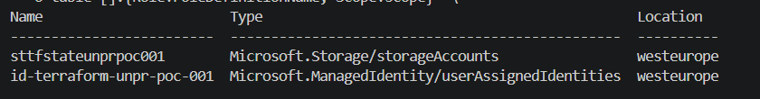
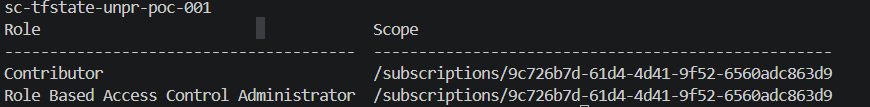

<!-- SCREENSHOT: docs/assets/v0-bootstrap-resources.png -->
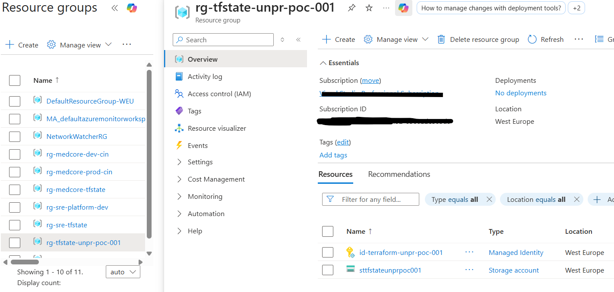
> **Portal:** Open `rg-tfstate-unpr-poc-001` → screenshot showing Storage Account + Managed Identity.

---

### V1: Verify Confluent Resources

**Commands:**
```bash
terraform output confluent_environment_id
terraform output confluent_cluster_id
terraform output confluent_topic_names
```

**Expected:** Environment ID (e.g., `env-xxxxx`), Cluster ID (e.g., `lkc-xxxxx`), Topics: `["orders", "payments"]`

**Actual output:**
```
"env-5d180n"
"lkc-gqp3z9n"
[
  "orders",
  "payments",
]
```

<!-- SCREENSHOT: docs/assets/v1-confluent-resources.png -->
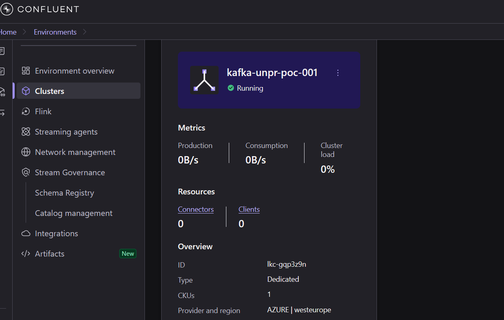
---
### V4: AKS Cluster

Check in portal AKS cluster is provisioned
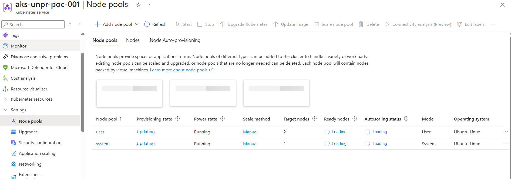
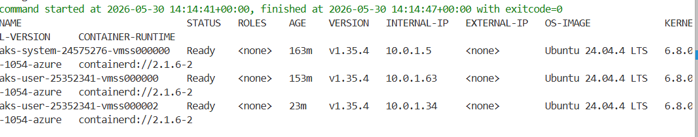

### V5: Key Vault Secrets

**Command:**
```bash
KV_URI=$(terraform output -raw keyvault_uri)

az keyvault secret list --id $KV_URI --query "[].name" -o tsv
```

**Expected:**
```
confluent-api-key-id
confluent-api-key-secret
kafka-bootstrap-endpoint
```

**Actual output:**

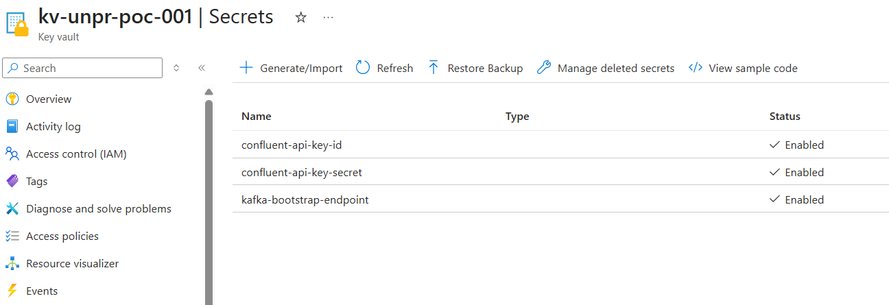

---

### V2: Private Endpoint

**Command:**
```bash
RG_NAME=$(terraform output -raw resource_group_name)

az network private-endpoint list \
  --resource-group $RG_NAME \
  --query "[].{name:name, status:privateLinkServiceConnections[0].privateLinkServiceConnectionState.status}" \
  -o table
```

**Expected:** Status = `Approved`

**Actual output:**
```
Name
------------------------------

vnet-unpr-poc-001-confluent-pe Approved
```


---

### V3: Verify Kafka private dns bootstrap endpoint whether from cluster DNS Resolution happening or not

**Command:**
```bash
AKS_NAME=$(terraform output -raw aks_cluster_name)

az aks command invoke \
  --resource-group $RG_NAME \
  --name $AKS_NAME \
  --command "nslookup <bootstrap-fqdn>"
```

**Expected:** Resolves to private IP (10.0.1.x), NOT a public IP

**Actual output:**

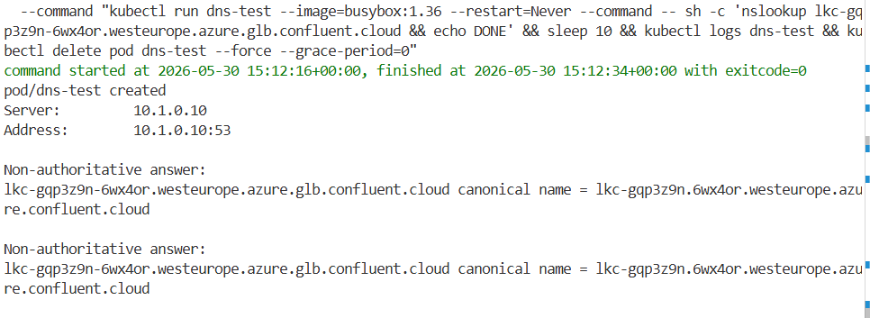

---

### V6: List & Describe Topics

**Command:**
```bash
az aks command invoke \
  --resource-group "$RG_NAME" \
  --name "$AKS_NAME" \
  --command "kubectl exec kafka-setup -- bash -c '
cat > /tmp/client.properties <<EOF
bootstrap.servers=${BOOTSTRAP}
security.protocol=SASL_SSL
sasl.mechanism=PLAIN
sasl.jaas.config=org.apache.kafka.common.security.plain.PlainLoginModule required username=\"${API_KEY_ID}\" password=\"${API_KEY_SECRET}\";
EOF
echo \"--- Listing topics ---\"
kafka-topics --list --command-config /tmp/client.properties --bootstrap-server ${BOOTSTRAP}
echo \"--- Describing orders ---\"
kafka-topics --describe --topic orders --command-config /tmp/client.properties --bootstrap-server ${BOOTSTRAP}
echo \"--- Describing payments ---\"
kafka-topics --describe --topic payments --command-config /tmp/client.properties --bootstrap-server ${BOOTSTRAP}
'"
```

**Expected:**
```
--- Listing topics ---
orders
payments
--- Describing orders ---
Topic: orders   PartitionCount: 3   ReplicationFactor: 3   ...
--- Describing payments ---
Topic: payments   PartitionCount: 3   ReplicationFactor: 3   ...
```

**Actual output:**

<!-- SCREENSHOT: docs/assets/v6-list-topics.png -->
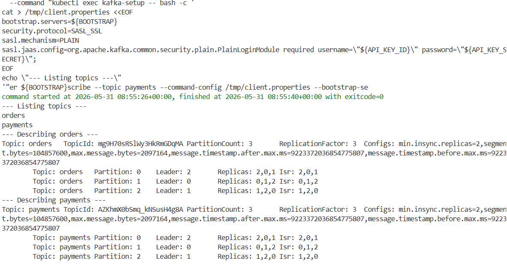

---

### V7: Produce Messages

**Command:**
```bash
az aks command invoke \
  --resource-group "$RG_NAME" \
  --name "$AKS_NAME" \
  --command "kubectl exec kafka-setup -- bash -c '
cat > /tmp/client.properties <<EOF
bootstrap.servers=${BOOTSTRAP}
security.protocol=SASL_SSL
sasl.mechanism=PLAIN
sasl.jaas.config=org.apache.kafka.common.security.plain.PlainLoginModule required username=\"${API_KEY_ID}\" password=\"${API_KEY_SECRET}\";
EOF
echo \"--- Producing messages to orders topic ---\"
echo -e \"{\\\"orderId\\\":\\\"ORD-001\\\",\\\"team\\\":\\\"unpr\\\",\\\"product\\\":\\\"kafka-poc\\\",\\\"amount\\\":99.99}\n{\\\"orderId\\\":\\\"ORD-002\\\",\\\"team\\\":\\\"unpr\\\",\\\"product\\\":\\\"streaming-service\\\",\\\"amount\\\":149.50}\n{\\\"orderId\\\":\\\"ORD-003\\\",\\\"team\\\":\\\"unpr\\\",\\\"product\\\":\\\"event-platform\\\",\\\"amount\\\":250.00}\" | kafka-console-producer --topic orders --bootstrap-server ${BOOTSTRAP} --producer.config /tmp/client.properties 2>&1
echo \"Producer exit code: \$?\"

echo \"--- Producing messages to payments topic ---\"
echo -e \"{\\\"paymentId\\\":\\\"PAY-001\\\",\\\"orderId\\\":\\\"ORD-001\\\",\\\"team\\\":\\\"unpr\\\",\\\"status\\\":\\\"completed\\\"}\n{\\\"paymentId\\\":\\\"PAY-002\\\",\\\"orderId\\\":\\\"ORD-002\\\",\\\"team\\\":\\\"unpr\\\",\\\"status\\\":\\\"pending\\\"}\n{\\\"paymentId\\\":\\\"PAY-003\\\",\\\"orderId\\\":\\\"ORD-003\\\",\\\"team\\\":\\\"unpr\\\",\\\"status\\\":\\\"completed\\\"}\" | kafka-console-producer --topic payments --bootstrap-server ${BOOTSTRAP} --producer.config /tmp/client.properties 2>&1
echo \"Producer exit code: \$?\"
'"
```

**Expected:** `Producer exit: 0` — 3 messages produced to `orders` topic

**Actual output:**
```
--- Producing test messages ---
Producer exit: 0
```

<!-- SCREENSHOT: docs/assets/v7-produce-messages.png -->
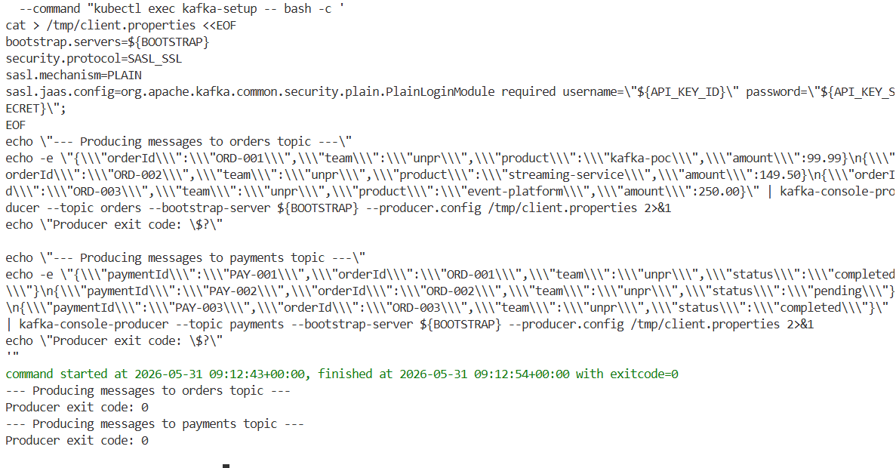
---

### V8: Consume Messages

**Command:**
```bash
az aks command invoke \
  --resource-group "$RG_NAME" \
  --name "$AKS_NAME" \
  --command "kubectl exec kafka-setup -- bash -c '
cat > /tmp/client.properties <<EOF
bootstrap.servers=${BOOTSTRAP}
security.protocol=SASL_SSL
sasl.mechanism=PLAIN
sasl.jaas.config=org.apache.kafka.common.security.plain.PlainLoginModule required username=\"${API_KEY_ID}\" password=\"${API_KEY_SECRET}\";
EOF
timeout 15 kafka-console-consumer --topic orders \
  --from-beginning --max-messages 3 \
  --bootstrap-server ${BOOTSTRAP} \
  --consumer.config /tmp/client.properties \
  --group poc-verify 2>&1
echo \"Consumer exit: \$?\"
'"
```

**Expected:** 3 messages consumed from `orders`, `Consumer exit: 0`

**Actual output:**

<!-- SCREENSHOT: docs/assets/v8-consume-messages.png -->
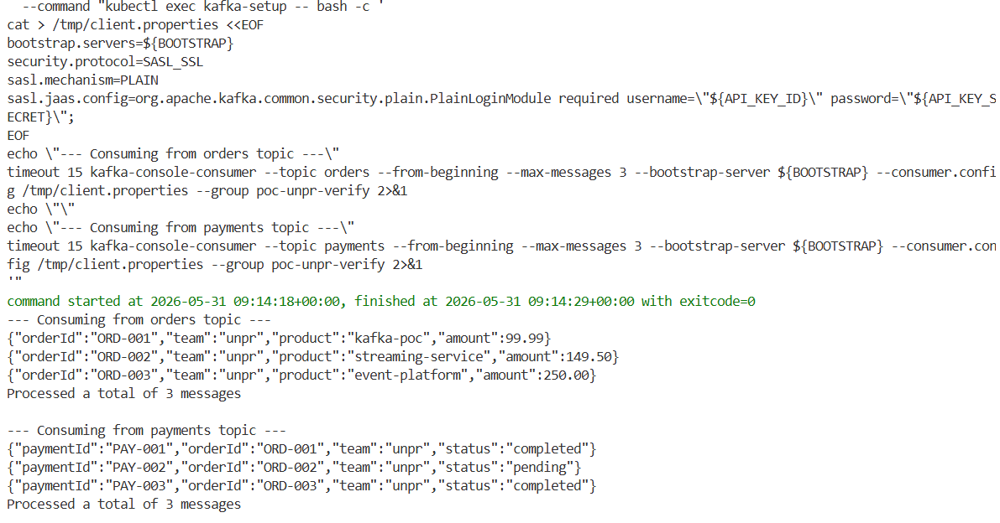
---

### V9: Unauthorized Access Denied

**Command:**
```bash
# Attempt to produce with invalid credentials — should fail with auth error
az aks command invoke \
  --resource-group "$RG_NAME" \
  --name "$AKS_NAME" \
  --command "kubectl exec kafka-setup -- bash -c '
cat > /tmp/bad-client.properties <<EOF
bootstrap.servers=${BOOTSTRAP}
security.protocol=SASL_SSL
sasl.mechanism=PLAIN
sasl.jaas.config=org.apache.kafka.common.security.plain.PlainLoginModule required username=\"INVALID\" password=\"INVALID\";
EOF
echo \"test\" | kafka-console-producer --topic orders \
  --bootstrap-server ${BOOTSTRAP} \
  --producer.config /tmp/bad-client.properties 2>&1
'"
```

**Expected:** Authentication error (e.g., `SaslAuthenticationException`)

<!-- SCREENSHOT: docs/assets/v9-unauthorized-access.png -->
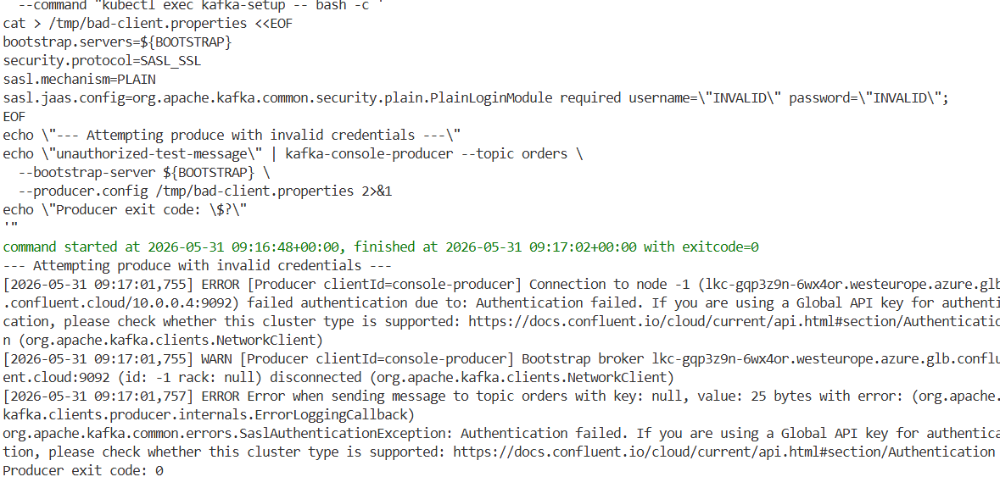
---

## Cleanup
```bash
cd terraform/environments/poc
terraform destroy -var-file=poc.tfvars
```
