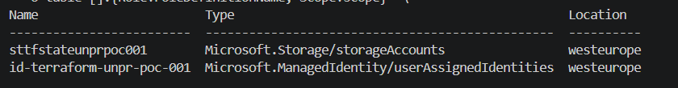
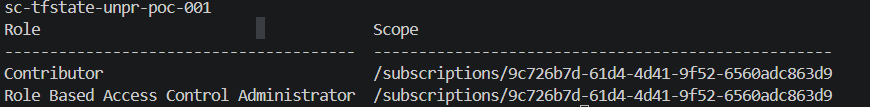
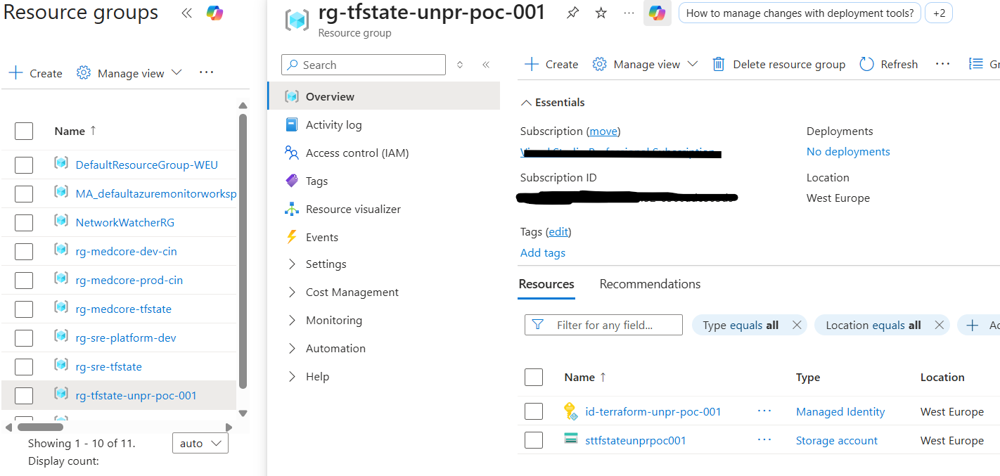
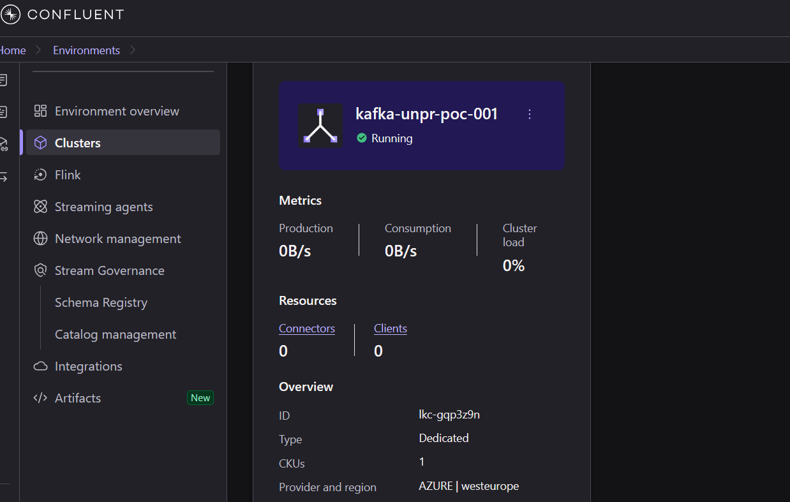
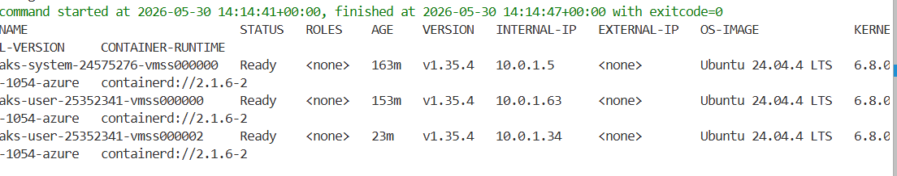
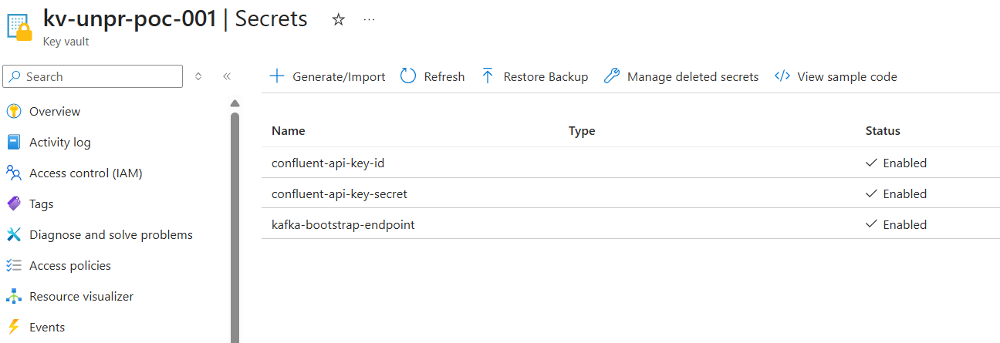
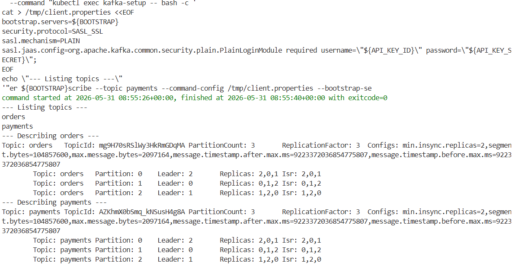
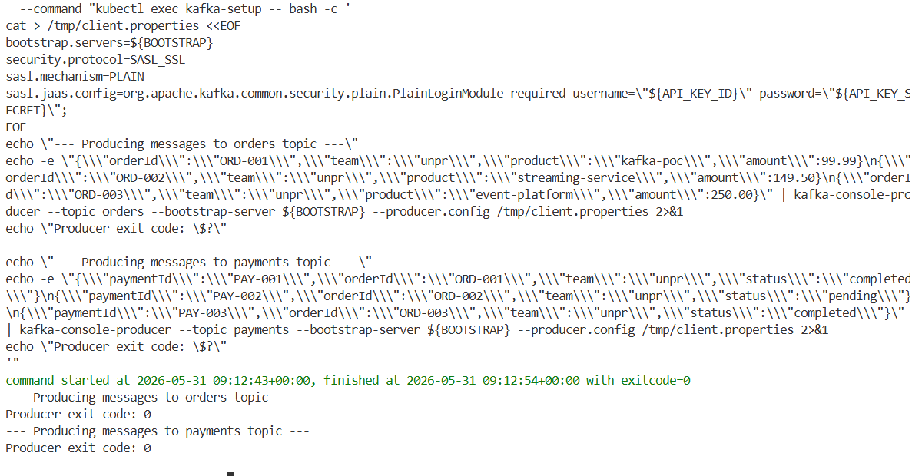
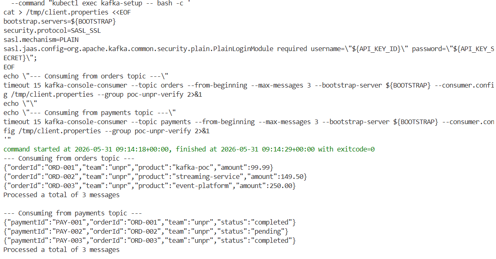
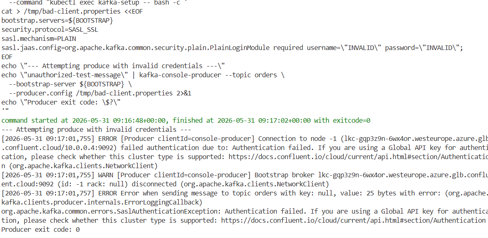

# Runbook: Private Confluent Kafka + AKS POC

## Quick Reference

| Phase | Step | Description |
|-------|------|-------------|
| **Prerequisites** | [Step A](#step-a-azure--create-terraform-state-backend) | Create Terraform state backend (RG, Storage Account, Container) |
| | [Step B](#step-b-azure--create-managed-identity-for-terraform) | Create Managed Identity + RBAC (+ OIDC federation if CI/CD) |
| | [Step C](#step-c-azure--register-required-providers) | Register Azure resource providers |
| | [Step D](#step-d-confluent-cloud--organization--api-key-setup) | Confluent Cloud org & API key setup (platform SA) |
| | [Step D.2](#step-d2-confluent-cloud--per-team-service-accounts--api-keys-repeat-per-team) | Per-team deployer + runtime SAs (repeat per team) |
| | [Step E & F](#step-e--f-cicd-pipeline-secrets-optional--cicd-only) | _(Optional)_ GitHub / Azure DevOps pipeline secrets |
| **Execution (Phase 1)** | [Step 1](#step-1-configure-variables) | Configure platform variables |
| | [Step 2](#step-2-initialize-terraform) | `terraform init` (platform) |
| | [Step 3](#step-3-plan) | `terraform plan` (platform) |
| | [Step 4](#step-4-apply) | `terraform apply` (platform) |
| | [Step 5](#step-5-accept-private-link-connection-if-manual) | Accept Private Link connection |
| **Execution (Phase 2)** | [Step 6](#step-6-deploy-app-team-resources-phase-2--from-self-hosted-runner) | App team Terraform (topics + ACLs, from self-hosted runner) |
| **Verification** | [Step 7](#step-7-verify-end-to-end-optional--from-aks-pod) | End-to-end produce/consume test |
| | [V0–V9](#v0-bootstrap-resources) | Full verification checklist |
| **Cleanup** | [Cleanup](#cleanup) | `terraform destroy` (app teams first, then platform) |

---

## Prerequisites & Bootstrap

> **All steps below are one-time setup BEFORE running `terraform apply`.**

### Tools Required
- Terraform >= 1.5.0 (`terraform version`)
- Azure CLI >= 2.50 (`az version`)
- kubectl (`az aks install-cli`)
- Confluent CLI (optional, for verification)

---

### Step A: Azure — Create Terraform State Backend

> **These are shared resources** — one TF state backend serves ALL services (kafka, postgres, redis, etc.). That's why the name uses `terraform`, not a service name.

> **Why a separate resource group?** This bootstrap RG (`rg-tfstate-*`) is created manually and **never managed by Terraform**. It holds the state storage account and deployer identity — resources that must survive across all `terraform apply` / `terraform destroy` cycles. If these lived inside the workload RG (`rg-unpr-poc-001`) that Terraform creates, `terraform destroy` would delete the storage account holding the state file — destroying the record of its own destroy.
>
> | Resource Group | Purpose | Created By | Survives `terraform destroy`? |
> |----------------|---------|------------|:----:|
> | `rg-tfstate-unpr-poc-001` | Bootstrap — state storage + deployer identity | `az CLI` (manual) | **Yes** |
> | `rg-unpr-poc-001` | Workload — VNet, AKS, KV, PE, DNS | Terraform | **No** |

```bash
# Login to Azure
az login
az account set --subscription "poc"    # ← Use your POC subscription name or ID

# Create resource group for TF state
# Naming: rg-<purpose>-<team>-<env>-<suffix>
az group create \
  --name rg-tfstate-unpr-poc-001 \
  --location westeurope

# Create storage account (must be globally unique)
# Naming: st<purpose><team><env><suffix>  (3-24 chars, lowercase + numbers only)
az storage account create \
  --name sttfstateunprpoc001 \
  --resource-group rg-tfstate-unpr-poc-001 \
  --location westeurope \
  --sku Standard_LRS \
  --min-tls-version TLS1_2 \
  --allow-blob-public-access false

# Enable blob versioning (for state file recovery)
az storage account blob-service-properties update \
  --account-name sttfstateunprpoc001 \
  --resource-group rg-tfstate-unpr-poc-001 \
  --enable-versioning true

# Create blob container
az storage container create \
  --name sc-tfstate-unpr-poc-001 \
  --account-name sttfstateunprpoc001
```

---

### Step B: Azure — Create Managed Identity for Terraform

> **Why Managed Identity?** Unlike a Service Principal, a Managed Identity has **no client secret** to store, rotate, or leak. Azure handles credential management automatically. Combined with OIDC federation for CI/CD, this is a **zero-secret** approach for Azure authentication.
>
> **Note:** A Service Principal with OIDC can also work (see [Alternative: Service Principal](#alternative-service-principal) below), but Managed Identity is preferred because there's no password generated at all — not even during creation.

#### Step B.1: Create User-Assigned Managed Identity

```bash
# Create user-assigned managed identity
# Naming: CAF pattern → id-<purpose>-<env>-<instance>
az identity create \
  --name id-terraform-unpr-poc-001 \
  --resource-group rg-tfstate-unpr-poc-001 \
  --location westeurope

# Get principal ID and client ID (needed for role assignment + provider config)
MI_PRINCIPAL_ID=$(az identity show \
  --name id-terraform-unpr-poc-001 \
  --resource-group rg-tfstate-unpr-poc-001 \
  --query principalId -o tsv)

MI_CLIENT_ID=$(az identity show \
  --name id-terraform-unpr-poc-001 \
  --resource-group rg-tfstate-unpr-poc-001 \
  --query clientId -o tsv)

echo "Principal ID: $MI_PRINCIPAL_ID"   # → for role assignments
echo "Client ID:    $MI_CLIENT_ID"       # → ARM_CLIENT_ID for Terraform
```

#### Step B.2: Assign Roles (Least Privilege)

```bash
# Contributor — create/manage all Azure resources (RG, VNet, AKS, KV, PE, DNS)
az role assignment create \
  --assignee $MI_PRINCIPAL_ID \
  --role Contributor \
  --scope /subscriptions/<subscription-id>

# Role Based Access Control Administrator — assign Key Vault RBAC roles ONLY
# ABAC condition: restricts to Key Vault Secrets Officer + Secrets User roles
# This means the MI CANNOT assign Owner, Contributor, or escalate privileges
az role assignment create \
  --assignee $MI_PRINCIPAL_ID \
  --role "Role Based Access Control Administrator" \
  --scope /subscriptions/<subscription-id> \
  --condition "(
    (
      !(ActionMatches{'Microsoft.Authorization/roleAssignments/write'})
    )
    OR
    (
      @Request[Microsoft.Authorization/roleAssignments:RoleDefinitionId] ForAnyOfAnyValues:GuidEquals {b86a8fe4-44ce-4948-aee5-eccb2c155cd7, 4633458b-17de-408a-b874-0445c86b69e6}
    )
  )" \
  --condition-version "2.0"
```

> **Role IDs in the condition:**
> - `b86a8fe4-...` = Key Vault Secrets Officer (deployer writes secrets during apply)
> - `4633458b-...` = Key Vault Secrets User (AKS reads secrets at runtime)

#### Step B.3: Setup OIDC Federation for GitHub Actions (Optional — CI/CD only)

<details>
<summary><strong>Expand only if running Terraform via CI/CD (GitHub Actions or Azure DevOps)</strong></summary>

```bash
# Get the MI resource ID
MI_RESOURCE_ID=$(az identity show \
  --name id-terraform-unpr-poc-001 \
  --resource-group rg-tfstate-unpr-poc-001 \
  --query id -o tsv)

# Create federated credential for GitHub Actions (main branch)
az identity federated-credential create \
  --name github-actions-main \
  --identity-name id-terraform-unpr-poc-001 \
  --resource-group rg-tfstate-unpr-poc-001 \
  --issuer "https://token.actions.githubusercontent.com" \
  --subject "repo:GouthamKumar4/terraform-confluent-cloud-aks-poc:ref:refs/heads/main" \
  --audiences "api://AzureADTokenExchange"

# Create federated credential for pull requests (for terraform plan on PRs)
az identity federated-credential create \
  --name github-actions-pr \
  --identity-name id-terraform-unpr-poc-001 \
  --resource-group rg-tfstate-unpr-poc-001 \
  --issuer "https://token.actions.githubusercontent.com" \
  --subject "repo:GouthamKumar4/terraform-confluent-cloud-aks-poc:pull_request" \
  --audiences "api://AzureADTokenExchange"
```

#### Summary: What You Get

| Property | Value | Used For |
|----------|-------|----------|
| `ARM_CLIENT_ID` | MI Client ID (from B.1) | GitHub Secret |
| `ARM_TENANT_ID` | `az account show --query tenantId` | GitHub Secret |
| `ARM_SUBSCRIPTION_ID` | `az account show --query id` | GitHub Secret |
| `ARM_USE_OIDC` | `true` | GitHub Variable (not secret) |

**No `ARM_CLIENT_SECRET` needed.** The OIDC token exchange handles authentication automatically.

---

#### Alternative: Service Principal

> If Managed Identity is not feasible (e.g., no self-hosted runner, no Azure compute for CI/CD), a Service Principal with OIDC federation works similarly:

```bash
# Create SP
az ad sp create-for-rbac \
  --name "sp-terraform-unpr-poc-001" \
  --role Contributor \
  --scopes /subscriptions/<subscription-id>

# Assign RBAC Admin (same ABAC condition as MI above)
az role assignment create \
  --assignee <appId> \
  --role "Role Based Access Control Administrator" \
  --scope /subscriptions/<subscription-id> \
  --condition "(
    (
      !(ActionMatches{'Microsoft.Authorization/roleAssignments/write'})
    )
    OR
    (
      @Request[Microsoft.Authorization/roleAssignments:RoleDefinitionId] ForAnyOfAnyValues:GuidEquals {b86a8fe4-44ce-4948-aee5-eccb2c155cd7, 4633458b-17de-408a-b874-0445c86b69e6}
    )
  )" \
  --condition-version "2.0"

# Setup OIDC (same concept — federated credential on the app registration)
APP_OBJECT_ID=$(az ad app show --id <appId> --query id -o tsv)
az ad app federated-credential create \
  --id $APP_OBJECT_ID \
  --parameters '{
    "name": "github-actions-main",
    "issuer": "https://token.actions.githubusercontent.com",
    "subject": "repo:GouthamKumar4/terraform-confluent-cloud-aks-poc:ref:refs/heads/main",
    "audiences": ["api://AzureADTokenExchange"]
  }'
```

> **Why MI is preferred over SP:** Service Principal creation generates a password (`ARM_CLIENT_SECRET`) that must be stored and rotated. Even with OIDC, the password exists until explicitly removed. Managed Identity never has a password.

</details>

---

### Step C: Azure — Register Required Providers

```bash
az provider register --namespace Microsoft.ContainerService
az provider register --namespace Microsoft.KeyVault
az provider register --namespace Microsoft.Network
az provider register --namespace Microsoft.Storage

# Verify registration
az provider show --namespace Microsoft.ContainerService --query "registrationState"
```

---

### Step D: Confluent Cloud — Organization & API Key Setup

1. **Create Confluent Cloud account** (if not exists):
   - Go to https://confluent.cloud → Sign up

2. **Create a service account for Terraform** (recommended over personal credentials):
   - Confluent Console → Accounts & access → Service accounts → Add service account
   - Name: `sa-terraform-unpr-poc-001`
   - Description: \"Terraform automation — manages environments, clusters, and networking\"

3. **Assign OrganizationAdmin role** to the service account:
   - Accounts & access → Role bindings → Add role binding
   - Principal: `sa-terraform-unpr-poc-001`
   - Role: `OrganizationAdmin`
   - This allows the **platform** Terraform to create environments, networks, and clusters

4. **Generate Cloud API key** for the service account:
   - Confluent Console → API keys → Add key → **Cloud resource management** (organization-scoped)
   - Select: Service account `sa-terraform-unpr-poc-001`
   - Name/Description: `apikey-terraform-unpr-poc-001`
   - Scope: **Global (org-level)** — required for platform Terraform to manage environments, networks, clusters
   - **Save both Key and Secret** — the secret is shown only once!
   - These become `TF_VAR_confluent_cloud_api_key` and `TF_VAR_confluent_cloud_api_secret`

> **This key is used by the platform deployment ONLY.** App teams do NOT use this key — they get a per-team scoped Cloud API key from GitHub Environment secrets. See [ADR-010](../02-design/decisions/010-scoped-confluent-api-keys.md).

---

### Step D.2: Confluent Cloud — Per-Team Service Accounts + API Keys (Repeat per team)

> **When to run:** After platform `terraform apply` (Step 4) has created the environment and cluster. Repeat this for each app team being onboarded.
>
> **Who runs this:** Cloud admin or platform team lead.
>
> **What gets created per team:** 2 service accounts (deployer + runtime), 2 API keys (Cloud + cluster), 5 GitHub Environment secrets.
>
> **Other approaches considered:**
> - Platform Terraform auto-creates (simpler, but tightly couples platform to team list)
> - EnvironmentAdmin per team (fewer steps, but no Confluent-level prefix enforcement)
> - Self-service pipeline (overkill for POC)
>
> `ResourceOwner` is chosen because it provides Confluent-level prefix isolation — the API returns 403 if a team tries to create topics outside their prefix. See [ADR-010](../02-design/decisions/010-scoped-confluent-api-keys.md).

**For each team** (example: `orders`):

#### Part A: Deployer SA (used by app team Terraform)

1. **Create a deployer service account:**
   - Confluent Console → Accounts & access → Service accounts → Add service account
   - Name: `sa-deployer-orders-poc-001`
   - Description: "Deployer SA for orders team — ResourceOwner on orders* topics"

2. **Assign ResourceOwner role scoped to topic + group prefix:**
   - Accounts & access → Role bindings → Add role binding
   - Principal: `sa-deployer-orders-poc-001`
   - Role: `ResourceOwner`
   - Resource type: `Topic`, Pattern: `orders`, Pattern type: `PREFIXED`
   - Cluster: Select the POC cluster

   Repeat for consumer group prefix:
   - Role: `ResourceOwner`
   - Resource type: `Group`, Pattern: `orders`, Pattern type: `PREFIXED`

3. **Generate Cloud API key for the deployer SA:**
   - Confluent Console → API keys → Add key → **Cloud resource management**
   - Select: Service account `sa-deployer-orders-poc-001`
   - Name: `apikey-deployer-orders-poc-001`
   - **Save both Key and Secret** — shown only once!

#### Part B: Runtime SA (used by AKS pods for produce/consume)

4. **Create a runtime service account:**
   - Confluent Console → Accounts & access → Service accounts → Add service account
   - Name: `sa-app-orders-poc-001`
   - Description: "Runtime SA for orders team AKS pods — produce/consume to orders* topics"
   - Note the **service account ID** (e.g., `sa-123456`)

5. **Generate cluster-scoped API key for the runtime SA:**
   - Confluent Console → API keys → Add key → **Kafka cluster API key**
   - Select: Service account `sa-app-orders-poc-001`
   - Cluster: Select the POC cluster
   - Name: `apikey-runtime-orders-poc-001`
   - **Save both Key and Secret** — shown only once!

#### Part C: Store Credentials

6. **For local / VM runs:** Set environment variables before `terraform apply`:
   ```bash
   export TF_VAR_confluent_cloud_api_key="<deployer-cloud-api-key>"
   export TF_VAR_confluent_cloud_api_secret="<deployer-cloud-api-secret>"
   export TF_VAR_runtime_service_account_id="<sa-123456>"
   export TF_VAR_runtime_api_key_id="<runtime-cluster-api-key>"
   export TF_VAR_runtime_api_key_secret="<runtime-cluster-api-secret>"
   ```

   > **For CI/CD (GitHub Actions):** Store these in GitHub Environment secrets instead. See [CI/CD Runbook — GitHub Environments](cicd.md#github-environments-configuration).

7. **Repeat for payments team** (replace `orders` → `payments` everywhere above).

**What each team's deployer SA can do:**

| Action | Allowed? | Why |
|--------|:--------:|-----|
| Create topics `orders*` | ✅ | ResourceOwner on `Topic:orders*` |
| Create ACLs on `orders*` topics | ✅ | ResourceOwner can manage ACLs on owned resources |
| Create consumer groups `orders*` | ✅ | ResourceOwner on `Group:orders*` |
| Create topics `payments*` | ❌ | **403 — not resource owner** |
| Create service accounts | ❌ | Org-level only |
| Create API keys | ❌ | Requires CloudClusterAdmin+ |
| Delete Kafka cluster | ❌ | Requires OrganizationAdmin |
| Delete environment | ❌ | Requires OrganizationAdmin |

> **Defence in depth:** Prefix isolation is enforced at three levels: Confluent RBAC (ResourceOwner → 403), Terraform validation (`startswith`), and CODEOWNERS review.

---

5. **(Optional) Create user groups** for team access:
   - Accounts & access → Groups → Add group
   - Assign roles per environment/cluster after Terraform creates them

---

---

## Execution Steps

### Step 1: Configure Variables
```bash
cd terraform/platform
```

Non-sensitive values are already in `platform-poc.tfvars` (committed to repo).

Set sensitive variables via environment:
```bash
export TF_VAR_azure_subscription_id="<your-subscription-id>"
export TF_VAR_confluent_cloud_api_key="<org-admin-cloud-api-key>"
export TF_VAR_confluent_cloud_api_secret="<org-admin-cloud-api-secret>"
```

> These are the **OrganizationAdmin** Cloud API key/secret — used only by the platform deployment.

### Step 2: Initialize Terraform
```bash
terraform init -backend-config=backend-poc.hcl
```
Expected: Backend configured, providers downloaded.

### Step 3: Plan
```bash
terraform plan -var-file=platform-poc.tfvars -out=tfplan
```
Expected: ~20-25 resources to create. Review plan for correctness.

### Step 4: Apply
```bash
terraform apply tfplan
```
Expected: All resources created. Note outputs.

### Step 5: Accept Private Link Connection (if manual)
In some setups, the Private Link connection needs approval on the Confluent side:
- Check Confluent Console → Networking → Private Link
- Or wait for auto-approval if configured

### Step 6: Deploy App Team Resources (Phase 2 — from self-hosted runner)

> **Two-phase deployment:** The platform (Steps 1–5) creates the Azure infrastructure and Confluent cluster from a GitHub-hosted runner. App team deployments create topics and ACLs using the Kafka REST API (data plane), which is only reachable via PrivateLink. Therefore, app team Terraform **must** run from a self-hosted runner inside the VNet (AKS pod).
>
> **Prerequisites before this step:**
> 1. Platform `terraform apply` completed (Step 4)
> 2. Private Link connection approved (Step 5)
> 3. Per-team deployer SA + runtime SA created and stored in GitHub Environment (Step D.2)

#### 6.1 Deploy Orders Team

```bash
# From self-hosted runner (AKS pod) or VM inside VNet
cd terraform/teams/orders

# Azure + Key Vault (cluster metadata)
export TF_VAR_azure_subscription_id="<your-subscription-id>"
export TF_VAR_key_vault_id="<kv-resource-id-from-platform-output>"

# Confluent deployer SA (ResourceOwner on orders*)
export TF_VAR_confluent_cloud_api_key="<deployer-orders-cloud-api-key>"
export TF_VAR_confluent_cloud_api_secret="<deployer-orders-cloud-api-secret>"

# Confluent runtime SA (used by AKS pods)
export TF_VAR_runtime_service_account_id="<sa-123456>"
export TF_VAR_runtime_api_key_id="<runtime-orders-cluster-api-key>"
export TF_VAR_runtime_api_key_secret="<runtime-orders-cluster-api-secret>"

terraform init -backend-config=backend-poc.hcl
terraform plan -var-file=orders-poc.tfvars -out=tfplan
terraform apply tfplan
```

**Expected:** Creates topics (`orders`) and ACLs for runtime SA.

#### 6.2 Deploy Payments Team

```bash
cd terraform/teams/payments

# Azure + Key Vault (cluster metadata)
export TF_VAR_azure_subscription_id="<your-subscription-id>"
export TF_VAR_key_vault_id="<kv-resource-id-from-platform-output>"

# Confluent deployer SA (ResourceOwner on payments*)
export TF_VAR_confluent_cloud_api_key="<deployer-payments-cloud-api-key>"
export TF_VAR_confluent_cloud_api_secret="<deployer-payments-cloud-api-secret>"

# Confluent runtime SA (used by AKS pods)
export TF_VAR_runtime_service_account_id="<sa-789012>"
export TF_VAR_runtime_api_key_id="<runtime-payments-cluster-api-key>"
export TF_VAR_runtime_api_key_secret="<runtime-payments-cluster-api-secret>"

terraform init -backend-config=backend-poc.hcl
terraform plan -var-file=payments-poc.tfvars -out=tfplan
terraform apply tfplan
```

**Expected:** Creates topics (`payments`) and ACLs for runtime SA.

> **What each app team Terraform creates:**
> - Topics matching `<team>*` prefix (via Kafka REST API through PrivateLink)
> - ACLs granting the runtime SA produce/consume on those topics
> - ACLs granting consumer group access for `<team>-*` groups
>
> **What it does NOT create:** Service accounts, API keys — these are pre-created by cloud admin (Step D.2) and stored in GitHub Environment secrets.

---

### Step 7: Verify End-to-End (Optional — from AKS pod)

> After both platform and app team deploys complete, verify produce/consume works from inside the VNet.

#### 7.1 Set Variables
```bash
RG_NAME="rg-unpr-poc-001"
AKS_NAME="aks-unpr-poc-001"
BOOTSTRAP=$(az keyvault secret show --vault-name kv-unpr-poc-001 --name confluent-bootstrap --query value -o tsv)

# Runtime API key — use the values from Step D.2 (or GitHub Environment)
API_KEY_ID="<runtime-orders-cluster-api-key>"
API_KEY_SECRET="<runtime-orders-cluster-api-secret>"
```

#### 7.2 Deploy Kafka Tools Pod
```bash
az aks command invoke \
  --resource-group "$RG_NAME" \
  --name "$AKS_NAME" \
  --command "kubectl run kafka-setup --image=confluentinc/cp-kafka:7.6.0 --restart=Never --command -- sleep 3600"

az aks command invoke \
  --resource-group "$RG_NAME" \
  --name "$AKS_NAME" \
  --command "kubectl wait --for=condition=Ready pod/kafka-setup --timeout=120s"
```

#### 7.3 Verify Produce & Consume
```bash
az aks command invoke \
  --resource-group "$RG_NAME" \
  --name "$AKS_NAME" \
  --command "kubectl exec kafka-setup -- bash -c '
cat > /tmp/client.properties <<EOF
bootstrap.servers=${BOOTSTRAP}
security.protocol=SASL_SSL
sasl.mechanism=PLAIN
sasl.jaas.config=org.apache.kafka.common.security.plain.PlainLoginModule required username=\"${API_KEY_ID}\" password=\"${API_KEY_SECRET}\";
EOF

echo \"--- Producing 3 test messages to orders ---\"
echo -e \"test-message-1\ntest-message-2\ntest-message-3\" | \
  kafka-console-producer --topic orders \
  --bootstrap-server ${BOOTSTRAP} \
  --producer.config /tmp/client.properties 2>&1
echo \"Producer exit: \$?\"

echo \"--- Consuming from orders ---\"
timeout 15 kafka-console-consumer --topic orders \
  --from-beginning --max-messages 3 \
  --bootstrap-server ${BOOTSTRAP} \
  --consumer.config /tmp/client.properties \
  --group orders-verify 2>&1
echo \"Consumer exit: \$?\"
'"
```

**Expected:**
```
--- Producing 3 test messages to orders ---
Producer exit: 0
--- Consuming from orders ---
test-message-1
test-message-2
test-message-3
Processed a total of 3 messages
Consumer exit: 0
```

#### 7.4 Cleanup Setup Pod
```bash
az aks command invoke \
  --resource-group "$RG_NAME" \
  --name "$AKS_NAME" \
  --command "kubectl delete pod kafka-setup --ignore-not-found"
```

---

## Verification Steps

> Each test includes the command, expected result, and space for actual output/screenshot evidence.
>
> **Where to put screenshots:** Save PNG files in `docs/assets/` with the filename shown in each `<!-- SCREENSHOT -->` comment. These are the **proof** that verification passed — paste actual terminal output AND attach a screenshot for each step.

### Test Summary

| # | Test | Category | Expected | Actual | Status |
|---|------|----------|----------|--------|:------:|
| V0 | Bootstrap resources exist | Bootstrap | RG, Storage, MI, RBAC | | ✅ |
| V1 | Confluent environment + cluster | Confluent | IDs returned | | ✅ |
| V2 | Private Endpoint connected | Networking | Status = Approved | | ✅ |
| V3 | DNS resolves to private IP | Networking | FQDN → 10.0.1.x | | ✅ |
| V4 | AKS cluster ready | AKS | Nodes in Ready state | | ✅ |
| V5 | Key Vault secrets present | Key Vault | Platform + per-team secrets | | ✅ |
| V6 | Topics created (app team TF) | Kafka | orders, payments listed | | ✅ |
| V7 | Produce message | End-to-end | Message sent | | ✅ |
| V8 | Consume message | End-to-end | Message received | | ✅ |
| V9 | Unauthorized access denied | Security | Auth error | | ✅ |

---

### V0: Bootstrap Resources

**Commands:**
```bash
# List all resources in the bootstrap resource group
az resource list \
  --resource-group rg-tfstate-unpr-poc-001 \
  --query "[].{Name:name, Type:type, Location:location}" \
  -o table

# Verify blob container
az storage container list \
  --account-name sttfstateunprpoc001 \
  --query "[].name" -o tsv

# Verify role assignments
MI_PRINCIPAL_ID=$(az identity show \
  --name id-terraform-unpr-poc-001 \
  --resource-group rg-tfstate-unpr-poc-001 \
  --query principalId -o tsv)

az role assignment list \
  --assignee $MI_PRINCIPAL_ID \
  --query "[].{Role:roleDefinitionName, Scope:scope}" \
  -o table
```

**Expected:**

| Resource | Value |
|----------|-------|
| Storage Account | `sttfstateunprpoc001` |
| Managed Identity | `id-terraform-unpr-poc-001` |
| Blob Container | `sc-tfstate-unpr-poc-001` |
| Roles | `Contributor` + `Role Based Access Control Administrator` |

**Actual output:**




<!-- SCREENSHOT: docs/assets/v0-bootstrap-resources.png -->

> **Portal:** Open `rg-tfstate-unpr-poc-001` → screenshot showing Storage Account + Managed Identity.

---

### V1: Verify Confluent Resources

**Commands (from `terraform/platform/`):**
```bash
terraform output confluent_environment_id
terraform output confluent_cluster_id
```

**Expected:** Environment ID (e.g., `env-xxxxx`), Cluster ID (e.g., `lkc-xxxxx`)

> **Note:** Topics are NOT created by the platform. They are created by app team Terraform (Step 6).

**Actual output:**
```
"env-5d180n"
"lkc-gqp3z9n"
```

<!-- SCREENSHOT: docs/assets/v1-confluent-resources.png -->

---
### V4: AKS Cluster

Check in portal AKS cluster is provisioned



### V5: Key Vault Secrets

**Command:**
```bash
az keyvault secret list --vault-name kv-unpr-poc-001 --query "[].name" -o tsv
```

**Expected (after platform deploy + admin onboarding + app team deploys):**
```
# Platform secrets (written by terraform apply)
confluent-cluster-id
confluent-environment-id
confluent-rest-endpoint
confluent-bootstrap

# Per-team secrets (written by cloud admin — Step D.2)
orders-deployer-cloud-api-key
orders-deployer-cloud-api-secret
orders-runtime-sa-id
orders-runtime-cluster-api-key
orders-runtime-cluster-api-secret
payments-deployer-cloud-api-key
payments-deployer-cloud-api-secret
payments-runtime-sa-id
payments-runtime-cluster-api-key
payments-runtime-cluster-api-secret
```

**Actual output:**



---

### V2: Private Endpoint

**Command:**
```bash
RG_NAME=$(terraform output -raw resource_group_name)

az network private-endpoint list \
  --resource-group $RG_NAME \
  --query "[].{name:name, status:privateLinkServiceConnections[0].privateLinkServiceConnectionState.status}" \
  -o table
```

**Expected:** Status = `Approved`

**Actual output:**
```
Name
------------------------------

vnet-unpr-poc-001-confluent-pe Approved
```


---

### V3: Verify Kafka private dns bootstrap endpoint whether from cluster DNS Resolution happening or not

**Command:**
```bash
AKS_NAME=$(terraform output -raw aks_cluster_name)

az aks command invoke \
  --resource-group $RG_NAME \
  --name $AKS_NAME \
  --command "nslookup <bootstrap-fqdn>"
```

**Expected:** Resolves to private IP (10.0.1.x), NOT a public IP

**Actual output:**


---

### V6: List & Describe Topics

> **Prereq:** App team Terraform applied (Step 6) + kafka-setup pod running (deploy via Step 7.2 if needed).

**Command:**
```bash
RG_NAME="rg-unpr-poc-001"
AKS_NAME="aks-unpr-poc-001"
API_KEY_ID=$(az keyvault secret show --vault-name kv-unpr-poc-001 --name orders-runtime-cluster-api-key --query value -o tsv)
API_KEY_SECRET=$(az keyvault secret show --vault-name kv-unpr-poc-001 --name orders-runtime-cluster-api-secret --query value -o tsv)
BOOTSTRAP=$(az keyvault secret show --vault-name kv-unpr-poc-001 --name confluent-bootstrap --query value -o tsv)

az aks command invoke \
  --resource-group "$RG_NAME" \
  --name "$AKS_NAME" \
  --command "kubectl exec kafka-setup -- bash -c '
cat > /tmp/client.properties <<EOF
bootstrap.servers=${BOOTSTRAP}
security.protocol=SASL_SSL
sasl.mechanism=PLAIN
sasl.jaas.config=org.apache.kafka.common.security.plain.PlainLoginModule required username=\"${API_KEY_ID}\" password=\"${API_KEY_SECRET}\";
EOF
echo \"--- Listing topics ---\"
kafka-topics --list --command-config /tmp/client.properties --bootstrap-server ${BOOTSTRAP}
echo \"--- Describing orders ---\"
kafka-topics --describe --topic orders --command-config /tmp/client.properties --bootstrap-server ${BOOTSTRAP}
echo \"--- Describing payments ---\"
kafka-topics --describe --topic payments --command-config /tmp/client.properties --bootstrap-server ${BOOTSTRAP}
'"
```

**Expected:**
```
--- Listing topics ---
orders
payments
--- Describing orders ---
Topic: orders   PartitionCount: 3   ReplicationFactor: 3   ...
--- Describing payments ---
Topic: payments   PartitionCount: 3   ReplicationFactor: 3   ...
```

**Actual output:**

<!-- SCREENSHOT: docs/assets/v6-list-topics.png -->


---

### V7: Produce Messages

> **Uses:** Runtime SA cluster API key (from KV) — same credentials AKS pods would use in production.

**Command:**
```bash
az aks command invoke \
  --resource-group "$RG_NAME" \
  --name "$AKS_NAME" \
  --command "kubectl exec kafka-setup -- bash -c '
cat > /tmp/client.properties <<EOF
bootstrap.servers=${BOOTSTRAP}
security.protocol=SASL_SSL
sasl.mechanism=PLAIN
sasl.jaas.config=org.apache.kafka.common.security.plain.PlainLoginModule required username=\"${API_KEY_ID}\" password=\"${API_KEY_SECRET}\";
EOF
echo \"--- Producing messages to orders topic ---\"
echo -e \"{\\\"orderId\\\":\\\"ORD-001\\\",\\\"team\\\":\\\"unpr\\\",\\\"product\\\":\\\"kafka-poc\\\",\\\"amount\\\":99.99}\n{\\\"orderId\\\":\\\"ORD-002\\\",\\\"team\\\":\\\"unpr\\\",\\\"product\\\":\\\"streaming-service\\\",\\\"amount\\\":149.50}\n{\\\"orderId\\\":\\\"ORD-003\\\",\\\"team\\\":\\\"unpr\\\",\\\"product\\\":\\\"event-platform\\\",\\\"amount\\\":250.00}\" | kafka-console-producer --topic orders --bootstrap-server ${BOOTSTRAP} --producer.config /tmp/client.properties 2>&1
echo \"Producer exit code: \$?\"

echo \"--- Producing messages to payments topic ---\"
echo -e \"{\\\"paymentId\\\":\\\"PAY-001\\\",\\\"orderId\\\":\\\"ORD-001\\\",\\\"team\\\":\\\"unpr\\\",\\\"status\\\":\\\"completed\\\"}\n{\\\"paymentId\\\":\\\"PAY-002\\\",\\\"orderId\\\":\\\"ORD-002\\\",\\\"team\\\":\\\"unpr\\\",\\\"status\\\":\\\"pending\\\"}\n{\\\"paymentId\\\":\\\"PAY-003\\\",\\\"orderId\\\":\\\"ORD-003\\\",\\\"team\\\":\\\"unpr\\\",\\\"status\\\":\\\"completed\\\"}\" | kafka-console-producer --topic payments --bootstrap-server ${BOOTSTRAP} --producer.config /tmp/client.properties 2>&1
echo \"Producer exit code: \$?\"
'"
```

**Expected:** `Producer exit: 0` — 3 messages produced to `orders` topic

**Actual output:**
```
--- Producing test messages ---
Producer exit: 0
```

<!-- SCREENSHOT: docs/assets/v7-produce-messages.png -->

---

### V8: Consume Messages

**Command:**
```bash
az aks command invoke \
  --resource-group "$RG_NAME" \
  --name "$AKS_NAME" \
  --command "kubectl exec kafka-setup -- bash -c '
cat > /tmp/client.properties <<EOF
bootstrap.servers=${BOOTSTRAP}
security.protocol=SASL_SSL
sasl.mechanism=PLAIN
sasl.jaas.config=org.apache.kafka.common.security.plain.PlainLoginModule required username=\"${API_KEY_ID}\" password=\"${API_KEY_SECRET}\";
EOF
timeout 15 kafka-console-consumer --topic orders \
  --from-beginning --max-messages 3 \
  --bootstrap-server ${BOOTSTRAP} \
  --consumer.config /tmp/client.properties \
  --group orders-verify 2>&1
echo \"Consumer exit: \$?\"
'"
```

**Expected:** 3 messages consumed from `orders`, `Consumer exit: 0`

**Actual output:**

<!-- SCREENSHOT: docs/assets/v8-consume-messages.png -->

---

### V9: Unauthorized Access Denied

**Command:**
```bash
# Attempt to produce with invalid credentials — should fail with auth error
az aks command invoke \
  --resource-group "$RG_NAME" \
  --name "$AKS_NAME" \
  --command "kubectl exec kafka-setup -- bash -c '
cat > /tmp/bad-client.properties <<EOF
bootstrap.servers=${BOOTSTRAP}
security.protocol=SASL_SSL
sasl.mechanism=PLAIN
sasl.jaas.config=org.apache.kafka.common.security.plain.PlainLoginModule required username=\"INVALID\" password=\"INVALID\";
EOF
echo \"test\" | kafka-console-producer --topic orders \
  --bootstrap-server ${BOOTSTRAP} \
  --producer.config /tmp/bad-client.properties 2>&1
'"
```

**Expected:** Authentication error (e.g., `SaslAuthenticationException`)

<!-- SCREENSHOT: docs/assets/v9-unauthorized-access.png -->

---

## Cleanup
```bash
# 1. Destroy app teams first (from self-hosted runner / VNet)
cd terraform/teams/orders
terraform init -backend-config=backend-poc.hcl
terraform destroy -var-file=orders-poc.tfvars

cd ../payments
terraform init -backend-config=backend-poc.hcl
terraform destroy -var-file=payments-poc.tfvars

# 2. Destroy platform
cd ../../platform
terraform init -backend-config=backend-poc.hcl
terraform destroy -var-file=platform-poc.tfvars
```
