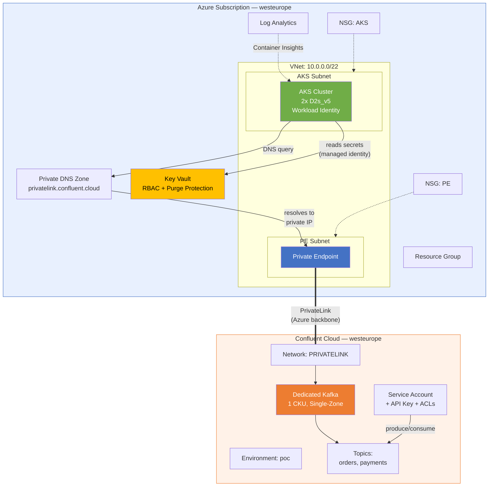
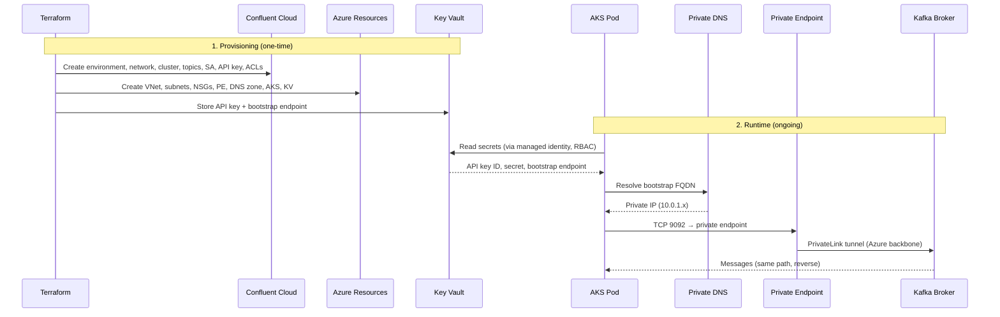

# Architecture

## High-Level Overview

<!-- DIAGRAM PLACEHOLDER: Insert the main architecture diagram here -->
<!-- Suggested: A visual showing Azure Subscription (VNet, AKS, Key Vault, PE) connected to Confluent Cloud via PrivateLink -->
<!-- Save as: docs/assets/architecture-overview.png -->
<!--  -->

---

## Components

### Confluent Cloud

| Component | Configuration | Purpose |
|-----------|--------------|---------|
| **Environment** | `poc` | Logical grouping for all POC resources |
| **Network** | PRIVATELINK, 3 AZs | Enables private connectivity from Azure |
| **Kafka Cluster** | Dedicated, 1 CKU, single-zone | Kafka broker ([why Dedicated?](02-design/decisions/001-dedicated-kafka-tier.md)) |
| **Topics** | `orders`, `payments` (3 partitions each) | Message channels for POC |
| **Service Account** | `sa-app-unpr-poc-001` | Application identity for Kafka access |
| **API Key** | Cluster-scoped, bound to SA | Authentication credentials |
| **ACLs** | WRITE+READ on topics, READ on consumer group | Least-privilege authorization |

### Azure Networking

| Component | Configuration | Purpose |
|-----------|--------------|---------|
| **Virtual Network** | `10.0.0.0/22` | Address space for all subnets |
| **PE Subnet** | `10.0.0.0/26` | Hosts PrivateLink endpoint NIC |
| **AKS Subnet** | `10.0.1.0/24` | Hosts AKS node pool (Azure CNI) |
| **Private Endpoint** | Connects to Confluent PLS | PrivateLink entry point ([why PrivateLink?](02-design/decisions/002-privatelink-connectivity.md)) |
| **Private DNS Zone** | `privatelink.confluent.cloud` | Resolves Kafka FQDN → private IP |
| **NSGs** | Applied to both subnets | Default rules (production: explicit allow-list) |

> **Deep dive:** [Network Design](02-design/network-design.md) — CIDR rationale, DNS flow, connectivity matrix

### Azure Kubernetes Service

| Component | Configuration | Purpose |
|-----------|--------------|---------|
| **Cluster** | Azure CNI, Calico, private API | Container orchestration |
| **System Pool** | 1x Standard_D2s_v5 | Core services (CriticalAddonsOnly) |
| **User Pool** | 2x Standard_D2s_v5 | Application workloads |
| **Identity** | System-assigned MI + OIDC issuer | [Workload Identity](02-design/decisions/003-workload-identity-for-secrets.md) |
| **Monitoring** | Log Analytics + Container Insights | Cluster observability |

### Azure Key Vault

| Component | Configuration | Purpose |
|-----------|--------------|---------|
| **Vault** | Standard SKU, [RBAC auth](02-design/decisions/004-keyvault-rbac-over-access-policies.md) | Secret storage |
| **Purge Protection** | Enabled (7-day retention) | Prevents accidental permanent deletion |
| **Network ACL** | Deny by default + AzureServices bypass | Restricts management access |
| **Secrets** | 3: API key ID, API key secret, bootstrap endpoint | Confluent credentials for AKS pods |
| **Access** | AKS kubelet MI → Secrets User role | Runtime secret reads |

> **Deep dive:** [Security & Permissions](02-design/security-and-permissions.md) — full identity model and permissions

---

## Data Flow

<!-- DIAGRAM PLACEHOLDER: Insert a visual data flow diagram here -->
<!-- Save as: docs/assets/data-flow.png -->

### Flow Summary

| Step | What Happens | Path |
|:----:|-------------|------|
| 1 | Terraform provisions all resources | CLI / CI → Azure ARM + Confluent API |
| 2 | Confluent cluster comes up with PrivateLink network | Confluent Cloud internal |
| 3 | Azure PE connects to Confluent PLS | Your VNet → Azure backbone → Confluent |
| 4 | Private DNS zone resolves FQDN → PE private IP | AKS CoreDNS → Azure DNS → Private DNS Zone |
| 5 | AKS pods read credentials from Key Vault | Managed identity → RBAC → Key Vault |
| 6 | AKS pods produce/consume Kafka messages | Pod → PE → PrivateLink → Kafka broker |

---

## Network Security

| Control | Implementation | Details |
|---------|---------------|---------|
| **No public Kafka endpoint** | Dedicated tier + PrivateLink only | No internet exposure |
| **Private AKS API** | `private_cluster_enabled = true` | API server not reachable from internet |
| **Traffic isolation** | Azure backbone + PrivateLink | No public internet transit |
| **Key Vault network ACL** | Deny by default | Only allowed IPs + AzureServices bypass |
| **NSGs on all subnets** | PE + AKS subnets | Default rules (restrictable in production) |
| **Secrets management** | Key Vault + RBAC | No credentials in code or pod specs |
| **Least-privilege ACLs** | Topic-level WRITE/READ only | SA cannot admin or access other topics |

> **Deep dive:** [Security & Permissions](02-design/security-and-permissions.md) — identity model, secret flow, security checklist

---

## Design Decisions

| Decision | Choice | ADR |
|----------|--------|-----|
| Kafka tier | Dedicated (PrivateLink requires it) | [ADR-001](02-design/decisions/001-dedicated-kafka-tier.md) |
| Connectivity | PrivateLink over VNet Peering | [ADR-002](02-design/decisions/002-privatelink-connectivity.md) |
| Secret access | Workload Identity (OIDC) | [ADR-003](02-design/decisions/003-workload-identity-for-secrets.md) |
| KV authorization | RBAC over Access Policies | [ADR-004](02-design/decisions/004-keyvault-rbac-over-access-policies.md) |
| Resource naming | Azure CAF via `azurecaf` provider | [ADR-005](02-design/decisions/005-azure-caf-naming.md) |

---

## Related Documents

- [Network Design](02-design/network-design.md) — VNet topology, CIDR plan, DNS flow
- [Security & Permissions](02-design/security-and-permissions.md) — IAM, RBAC, secrets
- [Terraform Modules](03-implementation/terraform-modules.md) — Module reference + dependency graph
- [Naming Conventions](01-planning/naming-conventions.md) — CAF + Confluent naming rules
