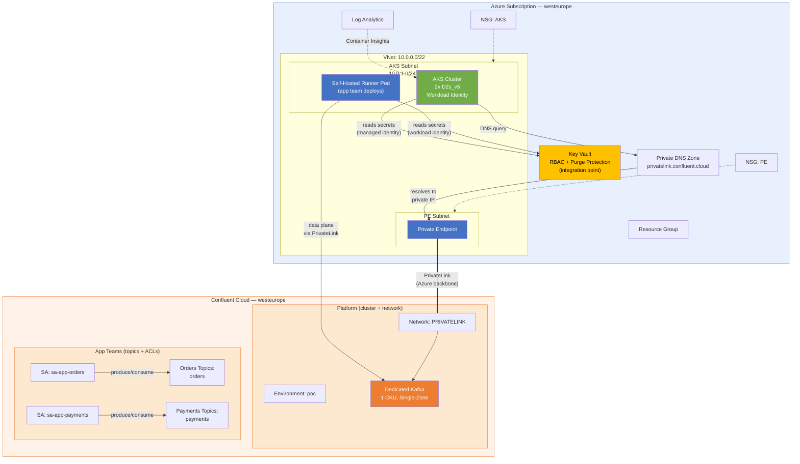
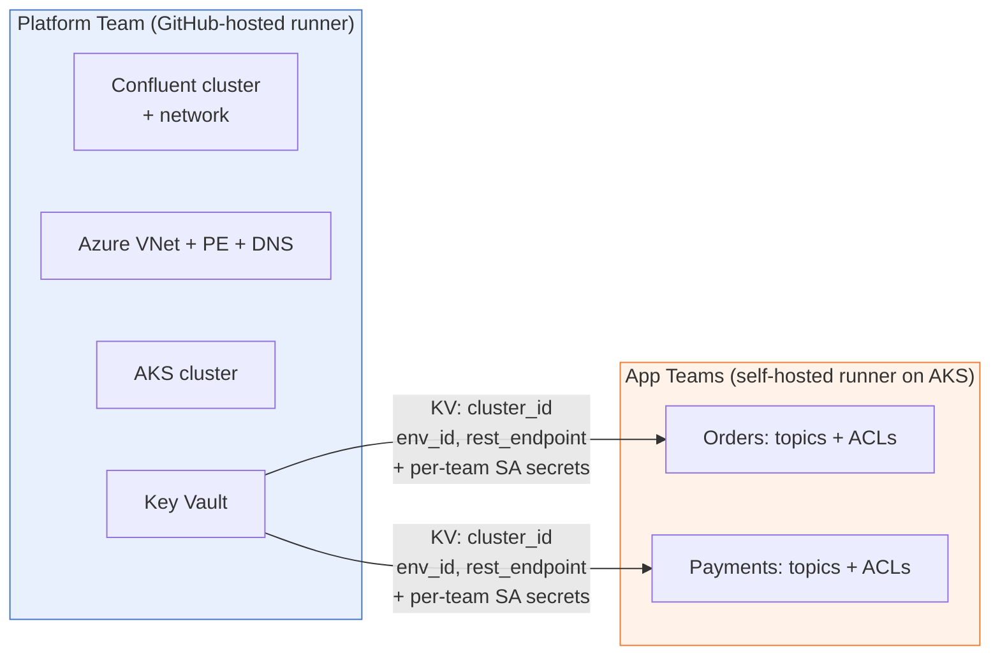
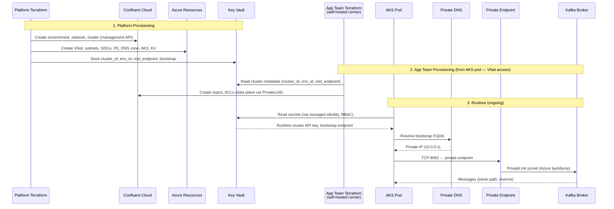

# Architecture

## High-Level Overview

<!-- DIAGRAM PLACEHOLDER: Insert the main architecture diagram here -->
<!-- Suggested: A visual showing Azure Subscription (VNet, AKS, Key Vault, PE) connected to Confluent Cloud via PrivateLink -->
<!-- Save as: docs/assets/architecture-overview.png -->
<!--  -->


```mermaid
graph TB
    subgraph Azure["Azure Subscription — westeurope"]
        RG["Resource Group"]
        subgraph VNet["VNet: 10.0.0.0/22"]
            subgraph PESubnet["PE Subnet<br>10.0.0.0/26"]
                PE["Private Endpoint"]
            end
            subgraph AKSSubnet["AKS Subnet<br>10.0.1.0/24"]
                AKS["AKS Cluster<br>2x D2s_v5<br>Workload Identity"]
                Runner["Self-Hosted Runner Pod<br>(app team deploys)"]
            end
        end
        KV["Key Vault<br>RBAC + Purge Protection<br>(integration point)"]
        DNS["Private DNS Zone<br>privatelink.confluent.cloud"]
        LOG["Log Analytics"]
        NSG1["NSG: PE"]
        NSG2["NSG: AKS"]
    end
    
    subgraph Confluent["Confluent Cloud — westeurope"]
        subgraph PlatformRes["Platform (cluster + network)"]
            ENV["Environment: poc"]
            NET["Network: PRIVATELINK"]
            KAFKA["Dedicated Kafka<br>1 CKU, Single-Zone"]
        end
        subgraph AppRes["App Teams (topics + ACLs)"]
            TOPICS_O["Orders Topics:<br>orders"]
            SA_O["SA: sa-app-orders"]
            TOPICS_P["Payments Topics:<br>payments"]
            SA_P["SA: sa-app-payments"]
        end
    end
    
    AKS -->|"reads secrets<br>(managed identity)"| KV
    Runner -->|"reads secrets<br>(workload identity)"| KV
    Runner -->|"data plane<br>via PrivateLink"| KAFKA
    AKS -->|"DNS query"| DNS
    DNS -->|"resolves to<br>private IP"| PE
    PE ===|"PrivateLink<br>(Azure backbone)"| NET
    NET --> KAFKA
    SA_O -->|"produce/consume"| TOPICS_O
    SA_P -->|"produce/consume"| TOPICS_P
    NSG1 -.-> PESubnet
    NSG2 -.-> AKSSubnet
    LOG -.->|"Container Insights"| AKS
    
    style Azure fill:#E8F0FE,stroke:#4472C4
    style Confluent fill:#FFF2E8,stroke:#ED7D31
    style PlatformRes fill:#FDE8D0,stroke:#ED7D31
    style AppRes fill:#FDE8D0,stroke:#ED7D31
    style PE fill:#4472C4,color:#fff
    style AKS fill:#70AD47,color:#fff
    style Runner fill:#4472C4,color:#fff
    style KV fill:#FFC000,color:#000
    style KAFKA fill:#ED7D31,color:#fff
```

---

## Components

### Confluent Cloud

| Component | Configuration | Owner | Purpose |
|-----------|--------------|-------|---------|
| **Environment** | `poc` | Platform | Logical grouping for all POC resources |
| **Network** | PRIVATELINK, 3 AZs | Platform | Enables private connectivity from Azure |
| **Kafka Cluster** | Dedicated, 1 CKU, single-zone | Platform | Kafka broker ([why Dedicated?](02-design/decisions/001-dedicated-kafka-tier.md)) |
| **Orders Topics** | `orders` (3 partitions) | Orders team | Message channel for orders service |
| **Payments Topics** | `payments` (3 partitions) | Payments team | Message channel for payments service |
| **Service Accounts** | `sa-app-orders-poc-001`, `sa-app-payments-poc-001` | Each team | Per-team Kafka identity |
| **API Keys** | Cluster-scoped, bound to per-team SA | Each team | Authentication credentials |
| **ACLs** | WRITE+READ on own topics, READ on own consumer group | Each team | Least-privilege, team-scoped authorization |

### Azure Networking

| Component | Configuration | Purpose |
|-----------|--------------|---------|
| **Virtual Network** | `10.0.0.0/22` | Address space for all subnets |
| **PE Subnet** | `10.0.0.0/26` | Hosts PrivateLink endpoint NIC |
| **AKS Subnet** | `10.0.1.0/24` | Hosts AKS node pool (Azure CNI) |
| **Private Endpoint** | Connects to Confluent PLS | PrivateLink entry point ([why PrivateLink?](02-design/decisions/002-privatelink-connectivity.md)) |
| **Private DNS Zone** | `privatelink.confluent.cloud` | Resolves Kafka FQDN → private IP |
| **NSGs** | Applied to both subnets | Default rules (production: explicit allow-list) |

> **Deep dive:** [Network Design](02-design/network-design.md) — CIDR rationale, DNS flow, connectivity matrix

### Azure Kubernetes Service

| Component | Configuration | Purpose |
|-----------|--------------|---------|
| **Cluster** | Azure CNI, Calico, private API | Container orchestration |
| **System Pool** | 1x Standard_D2s_v5 | Core services (CriticalAddonsOnly) |
| **User Pool** | 2x Standard_D2s_v5 | Application workloads |
| **Self-Hosted Runner** | Pod on user pool (GitHub Actions agent) | Runs app team Terraform from inside VNet (data plane access via PrivateLink) |
| **Identity** | System-assigned MI + OIDC issuer | [Workload Identity](02-design/decisions/003-workload-identity-for-secrets.md) |
| **Monitoring** | Log Analytics + Container Insights | Cluster observability |

### Azure Key Vault

| Component | Configuration | Purpose |
|-----------|--------------|---------|
| **Vault** | Standard SKU, [RBAC auth](02-design/decisions/004-keyvault-rbac-over-access-policies.md) | Secret storage |
| **Purge Protection** | Enabled (7-day retention) | Prevents accidental permanent deletion |
| **Network ACL** | Deny by default + AzureServices bypass | Restricts management access |
| **Platform Secrets** | 4: cluster ID, environment ID, REST endpoint, bootstrap | Cluster metadata for app teams |
| **App Team Secrets** | None in KV — deployer + runtime credentials stored in GitHub Environment secrets | Scoped per deployment target (e.g., `orders-poc`) |
| **Access** | Platform MI → Secrets Officer (write), AKS kubelet MI → Secrets User (read) | Deploy-time + runtime access |

> **Deep dive:** [Security & Permissions](02-design/security-and-permissions.md) — full identity model and permissions

---

## Deployment Model

The architecture uses a **split deployment** model to solve the circular dependency between topic creation (data plane) and Private Endpoint provisioning. See [ADR-009](02-design/decisions/009-monorepo-platform-teams-split.md).


```mermaid
graph LR
    subgraph Platform["Platform Team (GitHub-hosted runner)"]
        P1["Confluent cluster<br>+ network"]
        P2["Azure VNet + PE + DNS"]
        P3["AKS cluster"]
        P4["Key Vault"]
    end

    subgraph AppTeams["App Teams (self-hosted runner on AKS)"]
        A1["Orders: topics + ACLs"]
        A2["Payments: topics + ACLs"]
    end

    P4 -->|"KV: cluster_id<br>env_id, rest_endpoint<br>+ per-team SA secrets"| A1
    P4 -->|"KV: cluster_id<br>env_id, rest_endpoint<br>+ per-team SA secrets"| A2

    style Platform fill:#E8F0FE,stroke:#4472C4
    style AppTeams fill:#FFF2E8,stroke:#ED7D31
```

### Resource Ownership

| Resource | Owner | Deployed From | Runner |
|----------|-------|---------------|--------|
| Confluent environment, network, cluster | Platform team | `terraform/platform/` | `ubuntu-latest` (GitHub-hosted) |
| Azure VNet, subnets, PE, DNS zone | Platform team | `terraform/platform/` | `ubuntu-latest` |
| AKS cluster | Platform team | `terraform/platform/` | `ubuntu-latest` |
| Key Vault + platform secrets | Platform team | `terraform/platform/` | `ubuntu-latest` |
| Orders topics, ACLs | Orders team | `terraform/teams/orders/` | `self-hosted` (AKS pod) |
| Payments topics, ACLs | Payments team | `terraform/teams/payments/` | `self-hosted` (AKS pod) |
| Per-team deployer + runtime SAs + API keys | Cloud admin | Confluent Console + `az keyvault` | Manual (Runbook Step D.2) |

### Self-Hosted Runner (AKS Pod)

App teams must run from inside the VNet because topic/ACL creation uses the Kafka **data plane API**, which is only reachable via PrivateLink. The AKS cluster deployed by the platform team hosts a GitHub Actions self-hosted runner as a pod:

```
AKS Pod (self-hosted runner)
  ├── Network: VNet-routed via Azure CNI → can reach PE → PrivateLink → Kafka REST API
  ├── Identity: Workload Identity → authenticates to Azure (Key Vault read)
  ├── Confluent auth: Scoped Cloud API key from GitHub Env (ResourceOwner on team prefix)
  └── Terraform: runs terraform apply for teams/<team>/ root module
```

> **Why not run from GitHub-hosted runner?** GitHub-hosted runners are on the public internet. The Kafka REST endpoint is only accessible via PrivateLink — no public route exists.

---

## Data Flow

<!-- DIAGRAM PLACEHOLDER: Insert a visual data flow diagram here -->
<!-- Save as: docs/assets/data-flow.png -->


```mermaid
sequenceDiagram
    participant PTF as Platform Terraform
    participant CF as Confluent Cloud
    participant AZ as Azure Resources
    participant KV as Key Vault
    participant ATF as App Team Terraform<br>(self-hosted runner)
    participant AKS as AKS Pod
    participant DNS as Private DNS
    participant PE as Private Endpoint
    participant Kafka as Kafka Broker

    Note over PTF,KV: 1. Platform Provisioning
    PTF->>CF: Create environment, network, cluster (management API)
    PTF->>AZ: Create VNet, subnets, NSGs, PE, DNS zone, AKS, KV
    PTF->>KV: Store cluster_id, env_id, rest_endpoint, bootstrap

    Note over ATF,Kafka: 2. App Team Provisioning (from AKS pod — VNet access)
    ATF->>KV: Read cluster metadata (cluster_id, env_id, rest_endpoint)
    ATF->>CF: Create topics, ACLs (data plane via PrivateLink)

    Note over AKS,Kafka: 3. Runtime (ongoing)
    AKS->>KV: Read secrets (via managed identity, RBAC)
    KV-->>AKS: Runtime cluster API key, bootstrap endpoint
    AKS->>DNS: Resolve bootstrap FQDN
    DNS-->>AKS: Private IP (10.0.0.x)
    AKS->>PE: TCP 9092 → private endpoint
    PE->>Kafka: PrivateLink tunnel (Azure backbone)
    Kafka-->>AKS: Messages (same path, reverse)
```

### Flow Summary

| Step | What Happens | Path |
|:----:|-------------|------|
| 1 | Platform Terraform provisions cluster + networking | GitHub-hosted runner → Azure ARM + Confluent management API |
| 2 | Platform writes cluster metadata to Key Vault | Platform → Key Vault |
| 2b | Cloud admin creates per-team SAs + API keys, stores in GitHub Environment | Manual (Runbook Step D.2) |
| 3 | App team Terraform reads KV, creates topics + ACLs | Self-hosted runner (AKS) → KV + Confluent data plane via PrivateLink |
| 4 | Private DNS zone resolves FQDN → PE private IP | AKS CoreDNS → Azure DNS → Private DNS Zone |
| 5 | AKS pods read credentials from Key Vault | Managed identity → RBAC → Key Vault |
| 6 | AKS pods produce/consume Kafka messages | Pod → PE → PrivateLink → Kafka broker |

---

## Network Security

| Control | Implementation | Details |
|---------|---------------|---------|
| **No public Kafka endpoint** | Dedicated tier + PrivateLink only | No internet exposure |
| **Private AKS API** | `private_cluster_enabled = true` | API server not reachable from internet |
| **Traffic isolation** | Azure backbone + PrivateLink | No public internet transit |
| **Key Vault network ACL** | Deny by default | Only allowed IPs + AzureServices bypass |
| **NSGs on all subnets** | PE + AKS subnets | Default rules (restrictable in production) |
| **Secrets management** | Key Vault + RBAC | No credentials in code or pod specs |
| **Least-privilege ACLs** | Topic-level WRITE/READ only | SA cannot admin or access other topics |

> **Deep dive:** [Security & Permissions](02-design/security-and-permissions.md) — identity model, secret flow, security checklist

---

## Design Decisions

| Decision | Choice | ADR |
|----------|--------|-----|
| Kafka tier | Dedicated (PrivateLink requires it) | [ADR-001](02-design/decisions/001-dedicated-kafka-tier.md) |
| Connectivity | PrivateLink over VNet Peering | [ADR-002](02-design/decisions/002-privatelink-connectivity.md) |
| Secret access | Workload Identity (OIDC) | [ADR-003](02-design/decisions/003-workload-identity-for-secrets.md) |
| KV authorization | RBAC over Access Policies | [ADR-004](02-design/decisions/004-keyvault-rbac-over-access-policies.md) |
| Resource naming | Azure CAF via `azurecaf` provider | [ADR-005](02-design/decisions/005-azure-caf-naming.md) |
| Deployment model | Monorepo with platform/teams split | [ADR-009](02-design/decisions/009-monorepo-platform-teams-split.md) |

---

## Related Documents

- [Network Design](02-design/network-design.md) — VNet topology, CIDR plan, DNS flow
- [Security & Permissions](02-design/security-and-permissions.md) — IAM, RBAC, secrets
- [Terraform Modules](03-implementation/terraform-modules.md) — Module reference + dependency graph
- [Naming Conventions](01-planning/naming-conventions.md) — CAF + Confluent naming rules
