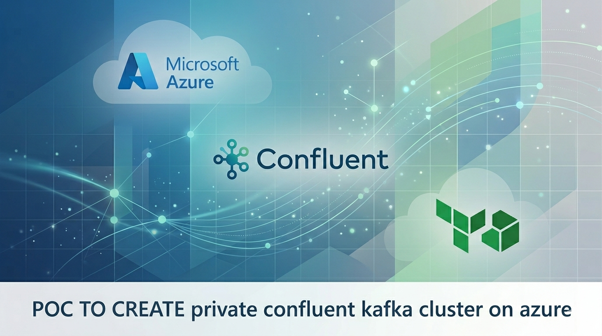
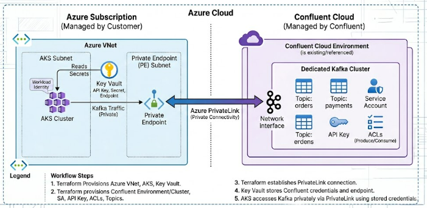
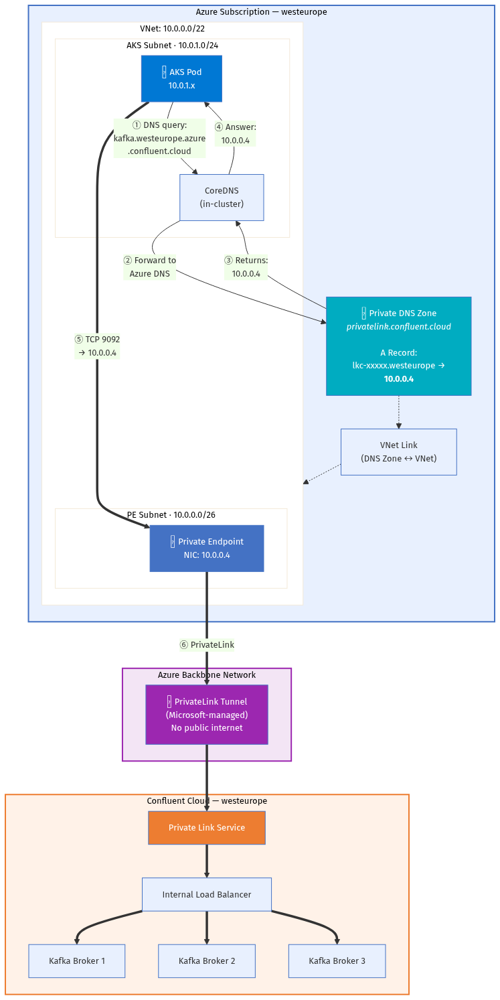
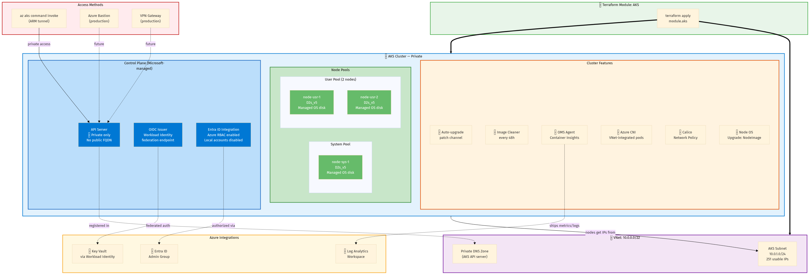
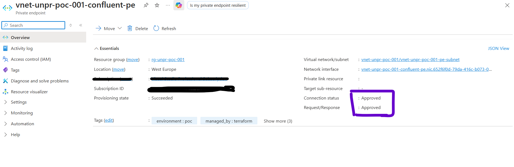

<!-- _backgroundColor: #000 -->
<!-- _color: #fff -->
<!-- _header: "" -->
<!-- _footer: "" -->
<!-- _paginate: false -->



---

# POC Objective

> **Prove** that we can provision a private Confluent Kafka cluster, create topics with proper access controls, and connect from AKS — via Terraform for infrastructure and Kafka CLI (from private network) for data-plane operations, with zero public internet exposure.

**Acceptance criteria:**

| # | Criteria |
|:-:|---------|
| 1 | Kafka cluster reachable **only** via PrivateLink (no public endpoint) |
| 2 | 2 topics created (`orders`, `payments`) with produce/consume ACLs |
| 3 | 1 service account + 1 API key — least-privilege access |
| 4 | AKS cluster provisioned and able to reach Kafka privately |
| 5 | All secrets stored securely (Key Vault — not in code) |
| 6 | Run steps and verification steps documented |

---

# Scope

| In Scope | Out of Scope |
|----------|-------------|
| Confluent environment + Dedicated Kafka cluster | Production HA / multi-zone |
| PrivateLink networking (VNet + PE + DNS) | Performance testing |
| 2 topics, 1 service account, 1 API key, ACLs | Multi-region failover |
| AKS cluster provisioning | Application deployment (Helm) |
| Key Vault for secret storage | Schema Registry, Kafka Connect |
| Run steps + verification documentation | Monitoring & alerting |

> Everything out of scope is documented as a production consideration on the final slide.

---

# Architecture Overview

<!-- Replace with your diagram: docs/assets/architecture-overview.png -->


**Single `terraform apply` creates:**

- Confluent Cloud: environment, network, Kafka cluster, SA, API key, topics, ACLs
- Azure: VNet, subnets, NSGs, Private Endpoint, Private DNS zone
- Azure: AKS cluster (private, workload identity)
- Azure: Key Vault with 3 secrets

**~25 resources total**

---

# Network Design — PrivateLink

<!-- Replace with your diagram: docs/assets/network-privatelink.png -->


**How Kafka is accessed privately:**

```
AKS Pod
  → CoreDNS
    → Azure Private DNS Zone
      → Private Endpoint (10.0.0.x)
        → PrivateLink (Azure backbone)
          → Confluent Kafka Broker
```

**Why PrivateLink:**
- Traffic **never** touches public internet
- No CIDR overlap risk (uses NAT)
- Azure-native (same pattern as SQL, Storage)
- Simpler than VNet peering

---

# Security Model


**Network layer:**
- PrivateLink — Kafka has no public endpoint
- Private AKS — API server has no public IP
- NSGs on all subnets

**Identity layer:**
- Confluent SA + cluster-scoped API key
- ACLs: topic-level produce/consume only
- AKS workload identity (OIDC — no stored creds)

**Secrets layer:**
- Key Vault with Azure RBAC
- No secrets in code, logs, or state outputs

---

# What Terraform Creates — Confluent

**Dependency chain (order matters):**

| # | Resource | Purpose |
|:-:|----------|---------|
| 1 | Environment | Logical container |
| 2 | Network | PrivateLink-enabled network |
| 3 | PL Access | Allow Azure subscription |
| 4 | Cluster | Dedicated, 1 CKU |
| 5 | Service Account | Application identity |
| 6 | API Key | Cluster-scoped credentials |

---

# What Terraform Creates — Azure

| Resource | Purpose |
|----------|---------|
| **Resource Group** | Container for all Azure resources |
| **VNet** (10.0.0.0/22) | Network boundary |
| **PE Subnet** (10.0.0.0/26) | Hosts the Private Endpoint |
| **AKS Subnet** (10.0.1.0/24) | Hosts AKS node pools |
| **NSGs** (×2) | Subnet-level traffic rules |
| **Private Endpoint** | Connects to Confluent via PrivateLink |
| **Private DNS Zone** | Resolves Kafka FQDN → PE private IP |
| **AKS Cluster** | Private cluster + workload identity |
| **Key Vault** | Stores API key, secret, bootstrap endpoint |
| **Log Analytics** | Container Insights for AKS |

---

# AKS Cluster — How It's Provisioned

<!-- AKS provisioning diagram: docs/assets/aks-provisioning.png -->


**Private AKS with full hardening:**

| Feature | Setting |
|---------|---------|
| **API server** | Private only (no public FQDN) |
| **Auth** | Entra ID + Azure RBAC |
| **Local accounts** | Disabled |
| **Node pools** | System (1) + User (2) · D2s_v5 |
| **OS disk** | Managed (default; Ephemeral for prod) |
| **CNI** | Azure CNI (VNet-integrated pods) |
| **Network policy** | Calico |
| **Workload Identity** | OIDC issuer enabled |
| **Auto-upgrade** | Patch channel |

---

# How to Run — Prerequisites

| Task | Who | Time |
|------|-----|:----:|
| Create Azure storage account for TF state | Azure Admin | 5 min |
| Create service principal or managed identity | Azure Admin | 10 min |
| Register Azure providers (ContainerService, KeyVault, Network) | Azure Admin | 2 min |
| Create Confluent service account + cloud API key | Confluent Admin | 5 min |
| Set environment variables (`TF_VAR_*`) | Engineer | 5 min |

**Total one-time setup: ~30 minutes**

> Detailed commands in `docs/runbook.md` (Steps A–D)

---

# How to Run — Execution

```bash
cd terraform/environments/poc

# 1. Initialize (downloads providers, configures backend)
terraform init

# 2. Preview what will be created (~25 resources)
terraform plan -var-file=poc.tfvars -out=tfplan

# 3. Create everything
terraform apply tfplan

# 4. Verify (private cluster — uses ARM tunnel)
az aks command invoke \
  --resource-group $(terraform output -raw resource_group_name) \
  --name $(terraform output -raw aks_cluster_name) \
  --command "kubectl get nodes"
```

**Deploy time: ~1hr to 2hr** (Dedicated cluster takes longest)

---

# Proof: Kafka Cluster Exists

<!-- Replace with actual screenshot after deployment -->


**What this proves:**
- Confluent environment created via Terraform
- Dedicated Kafka cluster (1 CKU) in westeurope
- PrivateLink networking enabled
- 2 topics created: `orders`, `payments`
- Service account + API key + ACLs configured

> Terraform output: `terraform output confluent_cluster_id`

---

# Proof: Private Endpoint Connected

<!-- Replace with actual screenshot after deployment -->


**What this proves:**
- Private Endpoint created in Azure
- Connection status: **Approved**
- PrivateLink is active — Kafka reachable via private IP
- DNS zone resolves Kafka FQDN → 10.0.0.x (not public IP)

```bash
# Verify PE status
az network private-endpoint list \
  --resource-group $(terraform output -raw resource_group_name) \
  -o table
```

---

# Proof: AKS Cluster Exists

<!-- Replace with actual screenshot after deployment -->


**What this proves:**
- AKS cluster provisioned via Terraform
- Private cluster (API server not publicly exposed)
- 2 nodes in **Ready** state
- Workload identity enabled (OIDC issuer active)
- Entra ID + Azure RBAC for access control

```bash
az aks command invoke \
  --resource-group $RG --name $AKS \
  --command "kubectl get nodes"
```

---

# Proof: AKS Pod Can Do Nslookup To Kafka Endpoint

<!-- Replace with actual screenshot after deployment -->


**What this proves:**
- AKS pod can reach Kafka **privately** (via PrivateLink)
- **No public internet involved** in the data path

This is the core success criteria of the POC.
---

# Best Practices Applied

| Practice | What We Did | ADR |
|----------|------------|:---:|
| **Azure CAF naming** | All resources follow `<prefix>-<team>-<env>-<suffix>` via `azurecaf` provider | [005](02-design/decisions/005-azure-caf-naming.md) |
| **Private AKS cluster** | API server has no public IP — access via `az aks command invoke` | [007](02-design/decisions/007-private-aks-cluster.md) |
| **Workload Identity** | AKS pods authenticate to Key Vault via OIDC — no stored secrets | [003](02-design/decisions/003-workload-identity-for-secrets.md) |
| **Key Vault RBAC** | Azure RBAC (not access policies) — auditable, consistent | [004](02-design/decisions/004-keyvault-rbac-over-access-policies.md) |
| **Azure CNI** | Every pod gets a VNet IP — direct PE routing, no NAT | [006](02-design/decisions/006-azure-cni-for-aks.md) |
| **Calico network policy** | Pod-to-pod traffic control (production-ready engine) | [008](02-design/decisions/008-calico-network-policy.md) |
| **State file** | Remote backend (Azure Storage), versioned, encrypted, TLS 1.2 | — |
| **Sensitive outputs** | 5 outputs marked `sensitive = true` — never leaked in logs | — |

> Each ADR documents context, alternatives considered, and trade-offs.

# POC Outcome

| What We Proved | Result |
|----------------|:------:|
| Private Kafka cluster provisioned via Terraform | ✅ |
| Zero public internet exposure (PrivateLink) | ✅ |
| Topics + SA + ACLs created automatically | ✅ |
| AKS cluster provisioned via Terraform | ✅ |
| AKS can do nslookup via private path  | ✅ |
| Secrets in Key Vault (not in code) | ✅ |
| Entire stack from single `terraform apply` (~20 min) | ✅ |

**All acceptance criteria met.**

> **Recommendation:** Pattern is proven. Ready for production design phase.

---

# If Approved: Production Considerations

| Area | What to Add | Priority |
|------|------------|:--------:|
| High availability | Multi-zone AKS, 3+ CKUs | P1 |
| CI/CD pipeline | GitHub Actions / Azure DevOps with OIDC | P1 |
| Disable local accounts | Enforce Entra-ID-only AKS auth | P1 |
| Observability | Confluent metrics + Azure Monitor alerts | P2 |
| Secret rotation | Key Vault + Confluent API key lifecycle | P2 |
| Policy-as-code | OPA / Sentinel for governance | P3 |
| Performance testing | Throughput baseline before go-live | P3 |

> These are all documented in `docs/` for the production design phase.

---

<!-- _header: "" -->
<!-- _footer: "" -->
<!-- _paginate: false -->

# 📂 Documentation Navigation

| 1 | [Runbook](https://github.com/GouthamKumar4/terraform-confluent-cloud-aks-poc/blob/main/docs/04-runsteps-and-verification/runbook.md) | Prerequisites, execution steps, verification (V1–V10), cleanup |
| 2 | [Architecture](https://github.com/GouthamKumar4/terraform-confluent-cloud-aks-poc/blob/main/docs/architecture.md) | Full system design + resource diagram |
| 3 | [Network Design](https://github.com/GouthamKumar4/terraform-confluent-cloud-aks-poc/blob/main/docs/02-design/network-design.md) | PrivateLink, DNS flow, IP plan, subnet sizing |
| 4 | [Security & Permissions](https://github.com/GouthamKumar4/terraform-confluent-cloud-aks-poc/blob/main/docs/02-design/security-and-permissions.md) | Identity model, RBAC, secrets |
| 5 | [ADR-001: Dedicated Kafka](https://github.com/GouthamKumar4/terraform-confluent-cloud-aks-poc/blob/main/docs/02-design/decisions/001-dedicated-kafka-tier.md) | Why Dedicated over Basic/Standard |
| 6 | [ADR-002: PrivateLink](https://github.com/GouthamKumar4/terraform-confluent-cloud-aks-poc/blob/main/docs/02-design/decisions/002-privatelink-connectivity.md) | Why PrivateLink over VNet peering |
| 7 | [ADR-003: Workload Identity](https://github.com/GouthamKumar4/terraform-confluent-cloud-aks-poc/blob/main/docs/02-design/decisions/003-workload-identity-for-secrets.md) | OIDC federation for Key Vault |
| 8 | [ADR-004: Key Vault RBAC](https://github.com/GouthamKumar4/terraform-confluent-cloud-aks-poc/blob/main/docs/02-design/decisions/004-keyvault-rbac-over-access-policies.md) | RBAC over access policies |
| 9 | [ADR-005: Azure CAF Naming](https://github.com/GouthamKumar4/terraform-confluent-cloud-aks-poc/blob/main/docs/02-design/decisions/005-azure-caf-naming.md) | Consistent naming via azurecaf |
| 10 | [ADR-006: Azure CNI](https://github.com/GouthamKumar4/terraform-confluent-cloud-aks-poc/blob/main/docs/02-design/decisions/006-azure-cni-for-aks.md) | VNet-integrated pods |
| 11 | [ADR-007: Private AKS](https://github.com/GouthamKumar4/terraform-confluent-cloud-aks-poc/blob/main/docs/02-design/decisions/007-private-aks-cluster.md) | No public API server |
| 12 | [ADR-008: Calico](https://github.com/GouthamKumar4/terraform-confluent-cloud-aks-poc/blob/main/docs/02-design/decisions/008-calico-network-policy.md) | Network policy engine |
| 13 | [Terraform Modules](https://github.com/GouthamKumar4/terraform-confluent-cloud-aks-poc/blob/main/docs/03-implementation/terraform-modules.md) | Module design, variables, validation |
| 14 | [Resource Details](https://github.com/GouthamKumar4/terraform-confluent-cloud-aks-poc/blob/main/docs/03-implementation/resource-details.md) | All provisioned resources |
| 15 | [Issues & Resolutions](https://github.com/GouthamKumar4/terraform-confluent-cloud-aks-poc/blob/main/docs/05-observations/issues-and-resolutions.md) | Problems encountered + fixes |
| 16 | [Future Improvements](https://github.com/GouthamKumar4/terraform-confluent-cloud-aks-poc/blob/main/docs/05-observations/future-improvements.md) | Production roadmap |
