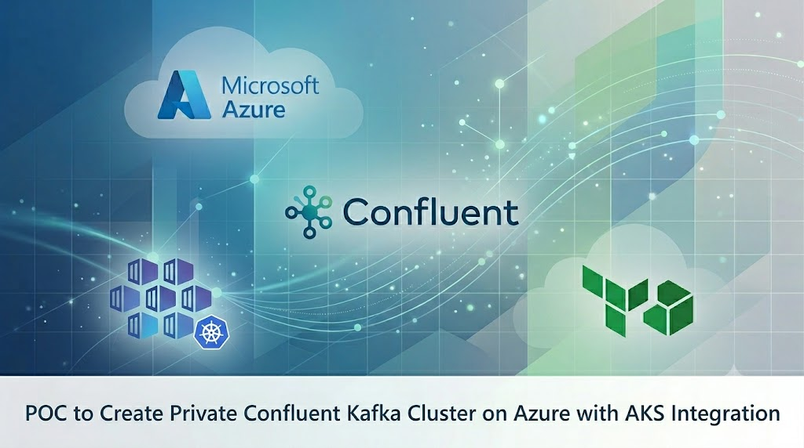
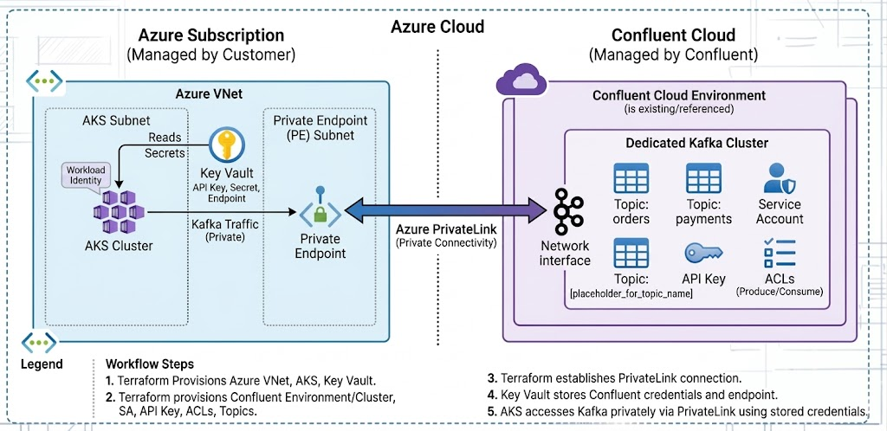
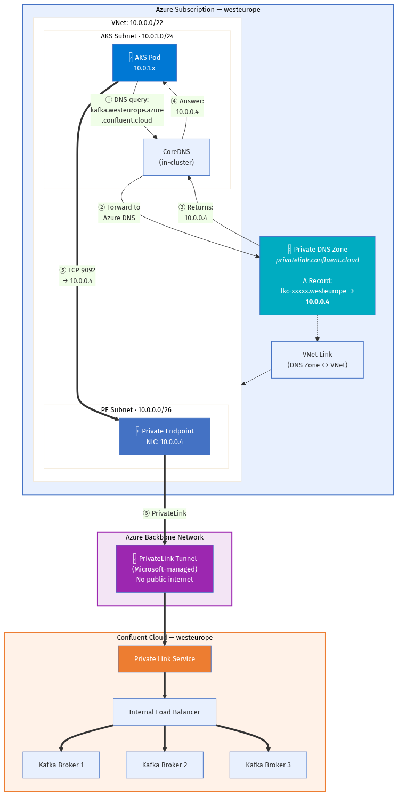
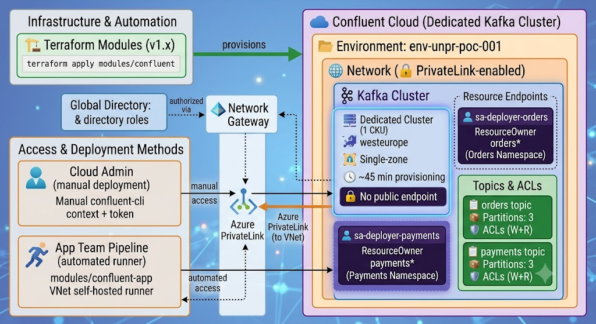
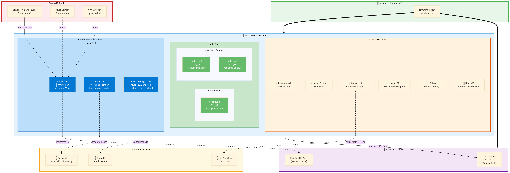
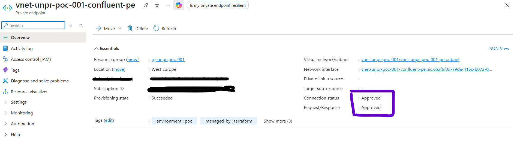
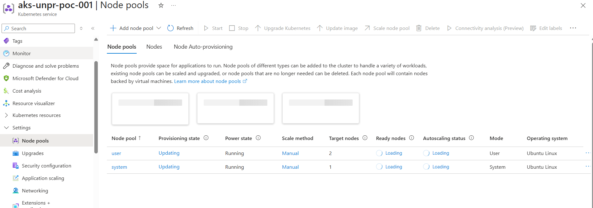
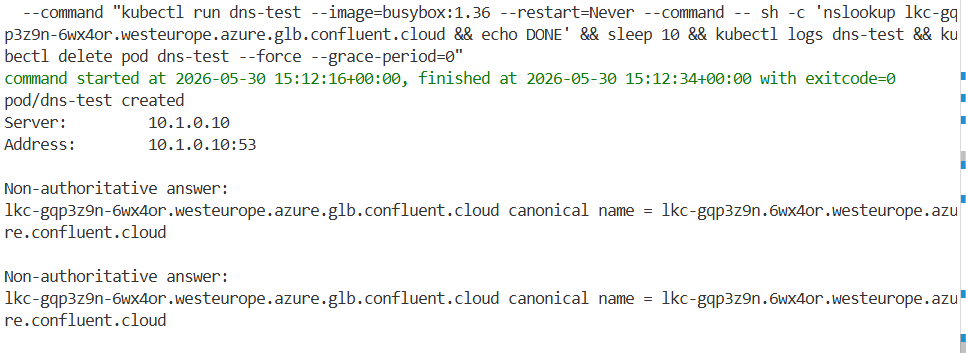

<!-- _backgroundColor: #000 -->
<!-- _color: #fff -->
<!-- _header: "" -->
<!-- _footer: "" -->
<!-- _paginate: false -->



---

# What's Covered

| # | Section | What You'll See |
|:-:|---------|----------------|
| 1 | POC Objective | Goal + acceptance criteria |
| 2 | Scope | In scope vs out of scope |
| 3 | Architecture Overview | Big-picture system design |
| 4 | Network Design | PrivateLink connectivity flow |
| 5 | Security Model | Network, identity & secrets layers |
| 6 | Deployment Approaches | 3 approaches compared |
| 7 | Why Approach 2 | Split architecture justification |
| 8 | What Terraform Creates | Platform + App team resources |
| 9 | Component Deep-Dives | Confluent Kafka & AKS modules |
| 10 | How to Run | Prerequisites + execution steps |
| 11 | Proofs | Kafka, PE, AKS, connectivity |
| 12 | Best Practices | ADRs + engineering decisions |
| 13 | POC Outcome | Results + recommendation |

---

# POC Objective

> **Prove** that we can provision a private Confluent Kafka cluster, create topics with proper access controls, and connect from AKS — via Terraform for infrastructure and Kafka CLI (from private network) for data-plane operations, with zero public internet exposure.

**Acceptance criteria:**

| # | Criteria |
|:-:|---------|
| 1 | Kafka cluster reachable **only** via PrivateLink (no public endpoint) |
| 2 | Topics created per team (`orders`, `payments`) with produce/consume ACLs |
| 3 | Per-team service accounts + API keys — least-privilege, team-scoped access |
| 4 | AKS cluster provisioned and able to reach Kafka privately |
| 5 | All secrets stored securely (Key Vault — not in code) |
| 6 | Run steps and verification steps documented |

---

# Scope

| In Scope | Out of Scope |
|----------|-------------|
| Confluent environment + Dedicated Kafka cluster | Production HA / multi-zone |
| PrivateLink networking (VNet + PE + DNS) | Performance testing |
| 2 topics, per-team SAs + API keys (cloud admin), ACLs | Multi-region failover |
| AKS cluster provisioning | Application deployment (Helm) |
| Key Vault for secret storage | Schema Registry, Kafka Connect |
| Run steps + verification documentation | Monitoring & alerting |

> Everything out of scope is documented as a production consideration on the final slide.

---

# Architecture Overview

<!-- Replace with your diagram: docs/assets/architecture-overview.png -->


**What gets created (~25 resources):**

- Confluent Cloud: Environment, Network, Kafka Cluster (Dedicated)
- Azure: VNet, Subnets, NSGs, Private Endpoint, Private DNS Zone
- Azure: AKS Cluster (private, workload identity)
- Azure: Key Vault (cluster metadata secrets)
- Confluent: Per-team Service Accounts, API Keys, Topics, ACLs

---

# Network Design — PrivateLink

<!-- Replace with your diagram: docs/assets/network-privatelink.png -->


> **Module:** `modules/networking`

**How Kafka is accessed privately:**

```
AKS Pod
  → CoreDNS
    → Azure Private DNS Zone
      → Private Endpoint (10.0.0.x)
        → PrivateLink (Azure backbone)
          → Confluent Kafka Broker
```

**Why PrivateLink:**
- Traffic **never** touches public internet
- No CIDR overlap risk (uses NAT)
- Azure-native (same pattern as SQL, Storage)
- Simpler than VNet peering

---

# Confluent Kafka



> **Module:** `modules/confluent` (platform) → Environment, Network, Cluster  · `modules/confluent-app` (app teams) → Topics, ACLs

| Feature | Setting |
|---------|--------|
| Tier | Dedicated (1 CKU) |
| Region | westeurope |
| Availability | Single-zone (POC) |
| Networking | PrivateLink only (no public endpoint) |
| Auth | SA + cluster-scoped API keys |
| RBAC | ResourceOwner per topic prefix |
| Provisioning time | ~1 hr |


---

# AKS Cluster



> **Module:** `modules/aks`

| Feature | Setting |
|---------|--------|
| API server | Private only |
| CNI | Azure CNI |
| Network policy | Calico |
| Node size | D2s_v5 |
| Workload Identity | OIDC enabled |
| Auth | Entra ID + Azure RBAC |

> Private cluster — no public endpoint.  
> Management via `az aks command invoke` (ARM tunnel).

---

# Security Model

> **Module:** `modules/keyvault` + cross-cutting config

**Network layer:**
- PrivateLink — Kafka has no public endpoint
- Private AKS — API server has no public IP
- NSGs on all subnets

**Identity layer:**
- Confluent SA + cluster-scoped API key
- ACLs: topic-level produce/consume only
- AKS workload identity (OIDC — no stored creds)

**Secrets layer:**
- Key Vault with Azure RBAC
- No secrets in code, logs, or state outputs

---

# Deployment Approaches

> 3 ways to achieve the same goal — we chose **Approach 2**.

| | 1️⃣ All-in-One | 2️⃣ Split (Platform + Teams) | 3️⃣ Existing VNet |
|--|:--:|:--:|:--:|
| **What** | One TF root creates everything. Topics via CLI from pod/VM | Platform deploys infra, each team deploys own topics via pipeline | Pre-existing VNet + VM. One TF apply creates all incl. topics |
| **Team Isolation** | ❌ None | ✅ Strong (RBAC → 403) | ❌ None |
| **New Team** | 🟡 Manual run | 🟢 Add folder + pipeline | 🟡 Re-run apply |
| **Production-Ready** | ❌ | ✅ | 🟡 |

> 📄 Full details: [approaches.md](https://github.com/GouthamKumar4/terraform-confluent-cloud-aks-poc/blob/main/docs/02-design/approaches.md)

---

# Why Approach 2 — Split Architecture

| Who | What They Do | Runner |
|-----|-------------|--------|
| 🧑‍💻 Platform team | Infra: Confluent + Azure + AKS + Key Vault | GitHub-hosted |
| 🧑‍💼 Cloud admin | Creates per-team SAs + API keys (manual) | — |
| 👥 App teams | Topics + ACLs (own prefix only) | Self-hosted (VNet) |

| Requirement | How Approach 2 Solves It |
|-------------|--------------------------|
| Team isolation | ResourceOwner RBAC → 403 on wrong prefix |
| Independent deploys | Separate pipeline + state per team |
| Secret scoping | GitHub Environments — teams can't read each other's secrets |
| Production-realistic | Same pattern scales to N teams |
| Auditability | Each team's changes = separate PR + plan |

---

# What Terraform Creates — Platform Team

**Deployed by:** Platform team (GitHub-hosted runner or local)

| # | Resource | Purpose |
|:-:|----------|----------|
| 1 | Confluent Environment | Logical container |
| 2 | Confluent Network | PrivateLink-enabled network |
| 3 | PL Access | Allow Azure subscription |
| 4 | Kafka Cluster | Dedicated, 1 CKU |
| 5 | Resource Group | Container for all Azure resources |
| 6 | VNet (10.0.0.0/22) | Network boundary |
| 7 | PE Subnet + AKS Subnet | 10.0.0.0/26 · 10.0.1.0/24 |
| 8 | NSGs (×2) | Subnet-level traffic rules |
| 9 | Private Endpoint + DNS Zone | Kafka FQDN → PE private IP |
| 10 | AKS Cluster | Private cluster + workload identity |
| 11 | Key Vault | Stores cluster metadata (4 secrets) |
| 12 | Log Analytics | Container Insights for AKS |

---

# What Terraform Creates — App Teams

> **Prerequisites (created by cloud admin — Runbook Step D.2):**
> - Deployer SA: `sa-deployer-orders-poc-001` (ResourceOwner on `orders*`)
> - Runtime SA: `sa-app-orders-poc-001` + cluster API key
> - All stored in GitHub Environment secrets (5 per team)
>
> **Isolation:** Confluent RBAC returns 403 if orders-team tries to create `payments*` topics.

**Each team deploys via own pipeline** (self-hosted runner in VNet):

| # | Resource | Orders Team | Payments Team |
|:-:|----------|------------|---------------|
| 1 | Topics | `orders` | `payments` |
| 2 | ACLs | WRITE+READ on own topics | WRITE+READ on own topics |

---

# How to Run — Prerequisites

| Task | Who | Time |
|------|-----|:----:|
| Create Azure storage account for TF state | Azure Admin | 5 min |
| Create service principal or managed identity | Azure Admin | 10 min |
| Register Azure providers (ContainerService, KeyVault, Network) | Azure Admin | 2 min |
| Create Confluent service account + cloud API key | Confluent Admin | 5 min |
| Set environment variables (`TF_VAR_*`) | Engineer | 5 min |

**Total one-time setup: ~30 minutes**

> Detailed commands in [Runbook (Steps A–D)](https://github.com/GouthamKumar4/terraform-confluent-cloud-aks-poc/blob/main/docs/04-runsteps-and-verification/runbook.md)

---

# How to Run — Execution

```bash
# === Platform (GitHub-hosted runner or local) ===
cd terraform/platform

# 1. Initialize (configure backend for target environment)
terraform init -backend-config=backend-poc.hcl

# 2. Preview what will be created (~20 resources)
terraform plan -var-file=platform-poc.tfvars -out=tfplan

# 3. Create platform infrastructure
terraform apply tfplan

# === App Team (self-hosted runner in VNet) ===
cd ../teams/orders

# 4. Deploy topics + ACLs (requires VNet access)
terraform init -backend-config=backend-poc.hcl
terraform plan -var-file=orders-poc.tfvars -out=tfplan
terraform apply tfplan

# 5. Verify (private cluster — uses ARM tunnel)
az aks command invoke \
  --resource-group rg-unpr-poc-001 \
  --name aks-unpr-poc-001 \
  --command "kubectl get nodes"
```

**Deploy time: ~1hr+** (Dedicated cluster provisioning takes ~45 min, Azure resources in parallel)

---

# Proof: Kafka Cluster Exists

<!-- Replace with actual screenshot after deployment -->


**What this proves:**
- Confluent environment created via Terraform
- Dedicated Kafka cluster (1 CKU) in westeurope
- PrivateLink networking enabled
- 2 topics created: `orders`, `payments`
- Per-team SAs + API keys created by cloud admin (stored in GitHub Environment)

> Terraform output: `terraform output confluent_cluster_id`

---

# Proof: Private Endpoint Connected

<!-- Replace with actual screenshot after deployment -->


**What this proves:**
- Private Endpoint created in Azure
- Connection status: **Approved**
- PrivateLink is active — Kafka reachable via private IP
- DNS zone resolves Kafka FQDN → 10.0.0.x (not public IP)

```bash
# Verify PE status
az network private-endpoint list \
  --resource-group $(terraform output -raw resource_group_name) \
  -o table
```

---

# Proof: AKS Cluster Exists

<!-- Replace with actual screenshot after deployment -->


**What this proves:**
- AKS cluster provisioned via Terraform
- Private cluster (API server not publicly exposed)
- 2 nodes in **Ready** state
- Workload identity enabled (OIDC issuer active)
- Entra ID + Azure RBAC for access control

```bash
az aks command invoke \
  --resource-group $RG --name $AKS \
  --command "kubectl get nodes"
```

---

# Proof: AKS Pod Can Do Nslookup To Kafka Endpoint

<!-- Replace with actual screenshot after deployment -->


**What this proves:**
- AKS pod can reach Kafka **privately** (via PrivateLink)
- **No public internet involved** in the data path

This is the core success criteria of the POC.

---

# Best Practices Applied

| Practice | What We Did | ADR |
|----------|------------|:---:|
| **Azure CAF naming** | All resources follow `<prefix>-<team>-<env>-<suffix>` via `azurecaf` provider | [005](02-design/decisions/005-azure-caf-naming.md) |
| **Private AKS cluster** | API server has no public IP — access via `az aks command invoke` | [007](02-design/decisions/007-private-aks-cluster.md) |
| **Workload Identity** | AKS pods authenticate to Key Vault via OIDC — no stored secrets | [003](02-design/decisions/003-workload-identity-for-secrets.md) |
| **Key Vault RBAC** | Azure RBAC (not access policies) — auditable, consistent | [004](02-design/decisions/004-keyvault-rbac-over-access-policies.md) |
| **Azure CNI** | Every pod gets a VNet IP — direct PE routing, no NAT | [006](02-design/decisions/006-azure-cni-for-aks.md) |
| **Calico network policy** | Pod-to-pod traffic control (production-ready engine) | [008](02-design/decisions/008-calico-network-policy.md) |
| **Split architecture** | Platform creates cluster; app teams create topics from VNet | [009](02-design/decisions/009-monorepo-platform-teams-split.md) |
| **Reusable workflows** | Single plan/apply template, thin callers per deployment | — |
| **Multi-env tfvars** | Same `.tf` code, different `*-poc.tfvars` + `backend-poc.hcl` per env | — |
| **State file** | Remote backend (Azure Storage), versioned, encrypted, TLS 1.2 | — |
| **Sensitive outputs** | 5 outputs marked `sensitive = true` — never leaked in logs | — |

> Each ADR documents context, alternatives considered, and trade-offs.

---

# POC Outcome

| What We Proved | Result |
|----------------|:------:|
| Private Kafka cluster provisioned via Terraform | ✅ |
| Zero public internet exposure (PrivateLink) | ✅ |
| Topics + ACLs created per team (SAs by cloud admin) | ✅ |
| AKS cluster provisioned via Terraform | ✅ |
| AKS can do nslookup via private path  | ✅ |
| Secrets in Key Vault (not in code) | ✅ |
| Split architecture: platform + app teams (~20 min + ~5 min) | ✅ |

**All acceptance criteria met.**

> **Recommendation:** Pattern is proven. Ready for production design phase.

---

<!-- _header: "" -->
<!-- _footer: "" -->
<!-- _paginate: false -->

# 📂 Documentation Navigation

| 1 | [Runbook](https://github.com/GouthamKumar4/terraform-confluent-cloud-aks-poc/blob/main/docs/04-runsteps-and-verification/runbook.md) | Prerequisites, execution steps, verification (V1–V10), cleanup |
| 2 | [Approaches](https://github.com/GouthamKumar4/terraform-confluent-cloud-aks-poc/blob/main/docs/02-design/approaches.md) | 3 deployment approaches + comparison matrix |
| 3 | [Architecture](https://github.com/GouthamKumar4/terraform-confluent-cloud-aks-poc/blob/main/docs/architecture.md) | Full system design + resource diagram |
| 4 | [Network Design](https://github.com/GouthamKumar4/terraform-confluent-cloud-aks-poc/blob/main/docs/02-design/network-design.md) | PrivateLink, DNS flow, IP plan, subnet sizing |
| 5 | [Security & Permissions](https://github.com/GouthamKumar4/terraform-confluent-cloud-aks-poc/blob/main/docs/02-design/security-and-permissions.md) | Identity model, RBAC, secrets |
| 5 | [ADR-001: Dedicated Kafka](https://github.com/GouthamKumar4/terraform-confluent-cloud-aks-poc/blob/main/docs/02-design/decisions/001-dedicated-kafka-tier.md) | Why Dedicated over Basic/Standard |
| 6 | [ADR-002: PrivateLink](https://github.com/GouthamKumar4/terraform-confluent-cloud-aks-poc/blob/main/docs/02-design/decisions/002-privatelink-connectivity.md) | Why PrivateLink over VNet peering |
| 7 | [ADR-003: Workload Identity](https://github.com/GouthamKumar4/terraform-confluent-cloud-aks-poc/blob/main/docs/02-design/decisions/003-workload-identity-for-secrets.md) | OIDC federation for Key Vault |
| 8 | [ADR-004: Key Vault RBAC](https://github.com/GouthamKumar4/terraform-confluent-cloud-aks-poc/blob/main/docs/02-design/decisions/004-keyvault-rbac-over-access-policies.md) | RBAC over access policies |
| 9 | [ADR-005: Azure CAF Naming](https://github.com/GouthamKumar4/terraform-confluent-cloud-aks-poc/blob/main/docs/02-design/decisions/005-azure-caf-naming.md) | Consistent naming via azurecaf |
| 10 | [ADR-006: Azure CNI](https://github.com/GouthamKumar4/terraform-confluent-cloud-aks-poc/blob/main/docs/02-design/decisions/006-azure-cni-for-aks.md) | VNet-integrated pods |
| 11 | [ADR-007: Private AKS](https://github.com/GouthamKumar4/terraform-confluent-cloud-aks-poc/blob/main/docs/02-design/decisions/007-private-aks-cluster.md) | No public API server |
| 12 | [ADR-008: Calico](https://github.com/GouthamKumar4/terraform-confluent-cloud-aks-poc/blob/main/docs/02-design/decisions/008-calico-network-policy.md) | Network policy engine |
| 13 | [ADR-009: Split Architecture](https://github.com/GouthamKumar4/terraform-confluent-cloud-aks-poc/blob/main/docs/02-design/decisions/009-monorepo-platform-teams-split.md) | Monorepo with platform/teams split |
| 14 | [Terraform Modules](https://github.com/GouthamKumar4/terraform-confluent-cloud-aks-poc/blob/main/docs/03-implementation/terraform-modules.md) | Module design, variables, validation |
| 14 | [Resource Details](https://github.com/GouthamKumar4/terraform-confluent-cloud-aks-poc/blob/main/docs/03-implementation/resource-details.md) | All provisioned resources |
| 15 | [Issues & Resolutions](https://github.com/GouthamKumar4/terraform-confluent-cloud-aks-poc/blob/main/docs/05-observations/issues-and-resolutions.md) | Problems encountered + fixes |
| 16 | [Future Improvements](https://github.com/GouthamKumar4/terraform-confluent-cloud-aks-poc/blob/main/docs/05-observations/future-improvements.md) | Production roadmap |
